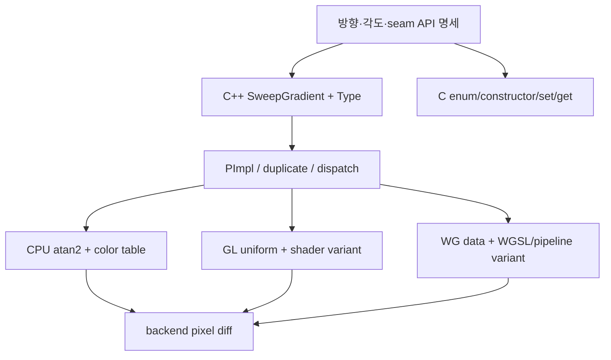

# #1216 — renderer: implement sweep gradient

- Link: https://github.com/thorvg/thorvg/issues/1216
- 난이도: 87/100
- 실현 가능성: 낮음
- 초심자 추천: 비추천
- 분석 기준: `main` working tree `f989b27892ba`
- 관련 영역: public Fill API/C ABI, CPU/GL/WG renderer, shaders
- 배울 수 있는 것: gradient stop 보간, polar angle, spread/transform, backend API 설계

## 이슈 요약

중심점, color stops, 선택적인 시작/끝 각도를 갖는 sweep(conic) gradient를 추가하자는 기능 요청이다. 수식 하나만 보면 `atan2` 기반이지만 ThorVG의 공개 C++/C 타입, duplicate/type dispatch, stroke fill, CPU color table, GL/WG shader까지 동일 의미를 구현해야 한다. seam과 방향 규약을 API로 먼저 고정하지 않으면 backend마다 다른 결과가 나올 수 있다.

## 난이도 산정

| 항목 | 점수 | 근거 |
|---|---:|---|
| 재현·증거 불확실성 (0-20) | 10 | 기능 요구는 분명하지만 angle/방향/spread/seam의 상세 명세가 미정이다. |
| 변경 범위 (0-25) | 25 | C++ API, C API, Fill PImpl, CPU, GL, WG, test와 docs를 모두 건드린다. |
| 구현 복잡도 (0-25) | 24 | polar mapping, wrap/seam, transform과 stop 보간을 세 backend에서 맞춰야 한다. |
| 교차 영향 위험 (0-20) | 19 | public enum/API와 shader/pipeline variant, gradient stroke에 영향을 준다. |
| 검증 부담 (0-10) | 9 | seam과 변환을 포함한 세 backend pixel comparison이 필요하다. |
| **합계** | **87** | **명세부터 다중 backend까지 이어지는 대형 API 기능이다.** |

## main 코드 조사

### 확인된 사실

- [`inc/thorvg.h`](https://github.com/thorvg/thorvg/blob/f989b27892bab31f224f810a54782055eba1e3bc/inc/thorvg.h)의 `Type : uint8_t`에는 `LinearGradient=10`, `RadialGradient`만 있고 공개 Fill 파생형도 두 가지뿐이다.
- [`tvgFill.h`](https://github.com/thorvg/thorvg/blob/f989b27892bab31f224f810a54782055eba1e3bc/src/renderer/tvgFill.h)는 각 gradient의 PImpl 좌표와 `duplicate()`를 별도 구현하고 [`tvgFill.cpp`](https://github.com/thorvg/thorvg/blob/f989b27892bab31f224f810a54782055eba1e3bc/src/renderer/tvgFill.cpp)는 `type()`으로 복제를 dispatch한다.
- [`tvgSwFill.cpp`](https://github.com/thorvg/thorvg/blob/f989b27892bab31f224f810a54782055eba1e3bc/src/renderer/cpu_engine/tvgSwFill.cpp)는 `_prepareLinear()`/`_prepareRadial()`로 inverse transform과 좌표 계수를 준비한다.
- GL [`tvgGlRenderer.cpp`](https://github.com/thorvg/thorvg/blob/f989b27892bab31f224f810a54782055eba1e3bc/src/renderer/gpu_engine/gl/tvgGlRenderer.cpp)는 linear/radial task·uniform block·fragment shader를 분기하며, WG [`tvgWgRenderData.cpp`](https://github.com/thorvg/thorvg/blob/f989b27892bab31f224f810a54782055eba1e3bc/src/renderer/gpu_engine/wg/tvgWgRenderData.cpp)도 두 fill type만 선택한다.
- C API [`thorvg_capi.h`](https://github.com/thorvg/thorvg/blob/f989b27892bab31f224f810a54782055eba1e3bc/src/bindings/capi/thorvg_capi.h)와 [`tvgCapi.cpp`](https://github.com/thorvg/thorvg/blob/f989b27892bab31f224f810a54782055eba1e3bc/src/bindings/capi/tvgCapi.cpp)도 linear/radial 생성·좌표 함수만 제공한다.

필요한 변화의 전파 범위는 다음과 같다.



정규화 수식의 초안은 가능하지만 이것만으로 구현이 끝나지 않는다.

```cpp
// 개념식: 실제 방향·구간 밖 처리 규약은 API 합의 대상
auto theta = atan2f(y - cy, x - cx);
auto t = wrap(theta - start) / (end - start);
```

### 아직 가설인 부분

- **가설 A:** 기본 시작점은 +X, 진행은 clockwise라는 이슈 제안을 따를 수 있다. ThorVG 좌표계와 negative transform에서의 의미를 먼저 확정해야 한다.
- **가설 B:** 기존 `FillSpread`를 angular domain에도 그대로 적용할 수 있다. `Pad`와 0/2π seam은 별도 정의가 필요할 수 있다.
- **가설 C:** CPU reference 구현부터 시작하면 shader 의미를 고정하기 쉽다. 다만 CPU만 merge 가능한 단계적 도입을 maintainer가 허용할지는 미확정이다.

## 수정 방향과 실현 가능성

1. center/start/end의 단위, 방향, 기본값, `start==end`, negative transform, spread 규약을 API proposal로 작성한다.
2. C++과 C API signature, enum numeric value와 duplicate/type test를 함께 설계한다.
3. seam/duplicate stop/transparent stop을 포함한 backend-independent 기대값 test를 만든다.
4. CPU reference로 의미를 고정한 뒤 GL과 WG shader/pipeline variant를 추가한다.
5. shape fill뿐 아니라 stroke fill, transform, opacity/blend/mask 조합의 pixel diff를 확인한다.

**판정:** 함수 하나의 구현이 아니라 public feature vertical slice다. 세 backend와 ABI를 함께 다룰 담당자가 필요해 초심자에게 적합하지 않다.

## 참고 자료

- [이슈 #1216](https://github.com/thorvg/thorvg/issues/1216)
- [이슈에 인용된 SVG Tiny 1.2 gradients](https://www.w3.org/TR/SVGTiny12/painting.html#Gradients)
- [이슈에 인용된 React Native Skia sweep gradient 예](https://shopify.github.io/react-native-skia/docs/shaders/gradients/#result-3)
- [`inc/thorvg.h`](https://github.com/thorvg/thorvg/blob/f989b27892bab31f224f810a54782055eba1e3bc/inc/thorvg.h)
- [`src/renderer/tvgFill.h`](https://github.com/thorvg/thorvg/blob/f989b27892bab31f224f810a54782055eba1e3bc/src/renderer/tvgFill.h), [`tvgFill.cpp`](https://github.com/thorvg/thorvg/blob/f989b27892bab31f224f810a54782055eba1e3bc/src/renderer/tvgFill.cpp)
- [`src/renderer/cpu_engine/tvgSwFill.cpp`](https://github.com/thorvg/thorvg/blob/f989b27892bab31f224f810a54782055eba1e3bc/src/renderer/cpu_engine/tvgSwFill.cpp)
- [`src/renderer/gpu_engine/gl/`](https://github.com/thorvg/thorvg/tree/f989b27892bab31f224f810a54782055eba1e3bc/src/renderer/gpu_engine/gl), [`src/renderer/gpu_engine/wg/`](https://github.com/thorvg/thorvg/tree/f989b27892bab31f224f810a54782055eba1e3bc/src/renderer/gpu_engine/wg)
- [`src/bindings/capi/thorvg_capi.h`](https://github.com/thorvg/thorvg/blob/f989b27892bab31f224f810a54782055eba1e3bc/src/bindings/capi/thorvg_capi.h)

