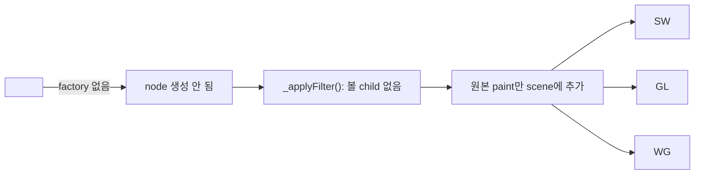

# #1262 — svg: gradients and transparency have incorrect colors

- Link: https://github.com/thorvg/thorvg/issues/1262
- 난이도: 88/100
- 실현 가능성: 낮음 (재현 자산 분류와 parser test는 중간)
- 초심자 추천: 비추천
- 분석 기준: `main` working tree `f989b27892ba`
- 관련 영역: SVG filter graph, color space, mask/compositing, CPU/GL/WG effects
- 배울 수 있는 것: `feColorMatrix`, sRGB/linearRGB, premultiplied alpha, filter region과 chaining

## 이슈 요약

Godot에서 가져온 gradient+transparency SVG가 잘못된 밝기·색으로 import된다는 보고다. 기존 문서의 댓글 조사에는 image mask 관련 일부 증상은 과거에 개선됐고 재현 자산이 `feColorMatrix`와 `color-interpolation-filters="sRGB"`를 사용한다는 정보가 있다. current main 코드는 `feColorMatrix`를 전혀 model/build하지 않으므로 강한 원인 후보지만, 원본 zip을 current main에서 다시 렌더링한 증거가 없어 모든 첨부 이미지가 같은 원인이라고 확정할 수는 없다.

## 난이도 산정

| 항목 | 점수 | 근거 |
|---|---:|---|
| 재현·증거 불확실성 (0-20) | 17 | 여러 자산·증상이 섞여 있고 current main pixel diff가 없으며 댓글 원인도 확정이 아니다. |
| 변경 범위 (0-25) | 23 | SVG parser/model/builder에서 filter graph와 renderer effect까지 연결될 수 있다. |
| 구현 복잡도 (0-25) | 22 | 4×5 matrix, filter input/output, color space와 premultiplied alpha 순서를 정해야 한다. |
| 교차 영향 위험 (0-20) | 17 | mask/gradient/filter region과 CPU/GL/WG 출력 일치에 영향이 있다. |
| 검증 부담 (0-10) | 9 | 브라우저 reference, 다양한 matrix와 backend pixel diff가 필요하다. |
| **합계** | **88** | **tag 하나 추가가 아니라 SVG filter 의미론을 도입하는 작업이다.** |

## main 코드 조사

### 확인된 사실

- [`tvgSvgCommon.h`](https://github.com/thorvg/thorvg/blob/f989b27892bab31f224f810a54782055eba1e3bc/src/loaders/svg/tvgSvgCommon.h)의 `SvgNodeType`과 node union에는 `GaussianBlur`만 있고 ColorMatrix node/20개 coefficient 구조가 없다.
- [`tvgSvgLoader.cpp`](https://github.com/thorvg/thorvg/blob/f989b27892bab31f224f810a54782055eba1e3bc/src/loaders/svg/tvgSvgLoader.cpp)의 `graphicsTags[]`는 `feGaussianBlur` factory만 등록한다. `feColorMatrix` 문자열은 SVG loader에서 검색되지 않는다.
- [`tvgSvgBuilder.cpp`](https://github.com/thorvg/thorvg/blob/f989b27892bab31f224f810a54782055eba1e3bc/src/loaders/svg/tvgSvgBuilder.cpp)의 `_applyFilter()`는 filter 자식을 순회하지만 `SvgNodeType::GaussianBlur`만 `SceneEffect::GaussianBlur`로 변환한다.
- 공개 [`SceneEffect`](https://github.com/thorvg/thorvg/blob/f989b27892bab31f224f810a54782055eba1e3bc/inc/thorvg.h)는 blur/drop-shadow 계열은 제공하지만 generic 4×5 color matrix effect는 없다.
- SW/GL/WG에는 GaussianBlur effect 경로가 각각 있으나 SVG filter primitive의 named input/output graph를 표현하는 공통 model은 확인되지 않았다.

현재 unsupported 지점은 renderer보다 앞이다.

### backend 차이 판단

| 단계 | SW | GL | WG | 해석 |
|---|---|---|---|---|
| 현행 `feColorMatrix` parse | 없음 | 없음 | 없음 | 공통 loader에서 primitive가 사라져 backend 이전 문제 |
| Gaussian blur effect | CPU post-effect | GL render task/shader | WG compositor | 기존 effect architecture 참고 가능 |
| Color matrix를 새 SceneEffect로 추가 | CPU pixel loop 필요 | fragment pass 필요 | WGSL/compositor 필요 | 세 backend 구현·검증 필요 |

### 아직 가설인 부분

- **강한 가설:** 재현 SVG의 남은 색 차이 중 적어도 일부는 `feColorMatrix`가 무시되기 때문이다. tag 부재는 확인됐지만 해당 zip의 최신 출력과 filter 제거 A/B 비교가 없으므로 증상 대응은 미확정이다.
- **가설 B:** `color-interpolation-filters="sRGB"` 처리를 빠뜨리면 matrix를 구현해도 reference와 다를 수 있다.
- **가설 C:** 첫 단계로 `type="matrix"` 한 primitive만 지원할 수 있다. 그러나 input/output chaining과 unsupported primitive 정책 없이 조용히 일부만 적용하면 더 잘못된 결과를 만들 수 있다.

## 수정 방향과 실현 가능성

1. 로컬 재현 zip의 각 SVG를 current main과 browser reference로 렌더링하고 filter 제거 A/B를 만든다.
2. `feColorMatrix type="matrix"` parser/model test로 20개 값, 기본값, 잘못된 입력 처리를 먼저 고정한다.
3. straight/premultiplied 변환 위치, sRGB/linearRGB, alpha row와 clamp 순서를 명세한다.
4. 단일 primitive CPU reference를 구현한 뒤 filter input/result chaining model이 필요한 범위를 결정한다.
5. GL/WG pass를 추가하거나 명시적인 backend limitation을 두고 mask/gradient/filter region pixel tests를 수행한다.

**판정:** 자산별 원인 분류와 parser test는 가능하다. 화면 문제를 완전히 고치려면 filter graph와 세 backend를 다루므로 전체 실현 가능성은 낮다. 별도 열린 이슈 #3366도 같은 `feColorMatrix` 기능을 직접 추적하므로 scope 중복 확인이 필요하다.

## 참고 자료

- [이슈 #1262](https://github.com/thorvg/thorvg/issues/1262)
- [이슈 본문이 복제한 Godot #65083](https://github.com/godotengine/godot/issues/65083)
- [`src/loaders/svg/tvgSvgCommon.h`](https://github.com/thorvg/thorvg/blob/f989b27892bab31f224f810a54782055eba1e3bc/src/loaders/svg/tvgSvgCommon.h)
- [`src/loaders/svg/tvgSvgLoader.cpp`](https://github.com/thorvg/thorvg/blob/f989b27892bab31f224f810a54782055eba1e3bc/src/loaders/svg/tvgSvgLoader.cpp)
- [`src/loaders/svg/tvgSvgBuilder.cpp`](https://github.com/thorvg/thorvg/blob/f989b27892bab31f224f810a54782055eba1e3bc/src/loaders/svg/tvgSvgBuilder.cpp)
- [`src/renderer/cpu_engine/tvgSwPostEffect.cpp`](https://github.com/thorvg/thorvg/blob/f989b27892bab31f224f810a54782055eba1e3bc/src/renderer/cpu_engine/tvgSwPostEffect.cpp)
- [`src/renderer/gpu_engine/gl/tvgGlEffect.cpp`](https://github.com/thorvg/thorvg/blob/f989b27892bab31f224f810a54782055eba1e3bc/src/renderer/gpu_engine/gl/tvgGlEffect.cpp)
- [`src/renderer/gpu_engine/wg/tvgWgCompositor.cpp`](https://github.com/thorvg/thorvg/blob/f989b27892bab31f224f810a54782055eba1e3bc/src/renderer/gpu_engine/wg/tvgWgCompositor.cpp)
- [같은 기능을 직접 추적하는 이슈 #3366](https://github.com/thorvg/thorvg/issues/3366)
