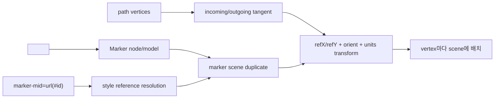

# #1460 — svg: support the `marker-mid` property

- Link: https://github.com/thorvg/thorvg/issues/1460
- 난이도: 80/100
- 실현 가능성: 낮음
- 초심자 추천: 비추천
- 분석 기준: `main` working tree `f989b27892ba`
- 관련 영역: SVG parser/model/builder, path geometry, reusable scene nodes
- 배울 수 있는 것: marker coordinate system, vertex tangent, `orient/refX/refY`, defs reference resolution

## 이슈 요약

실제 SVG 자산에서 사용되는 `marker-mid`를 지원하자는 기능 요청이다. 속성 문자열 하나를 읽는 작업처럼 보이지만 current main에는 `<marker>` node type/factory, marker style reference, vertex마다 referenced scene을 배치하는 builder 단계가 모두 없다. 즉 `marker-mid`만의 parser patch가 아니라 SVG marker 기능의 최소 vertical slice가 필요하다.

## 난이도 산정

| 항목 | 점수 | 근거 |
|---|---:|---|
| 재현·증거 불확실성 (0-20) | 12 | sample과 누락 결과는 명확하지만 최소 지원할 marker 속성 subset이 미정이다. |
| 변경 범위 (0-25) | 22 | style parser, node/model, defs resolution, path tangent, scene clone/transform이 연결된다. |
| 구현 복잡도 (0-25) | 22 | line/cubic vertex tangent, orient와 marker coordinate transform을 구현해야 한다. |
| 교차 영향 위험 (0-20) | 16 | closed path, zero-length segment, nested transform과 scene lifetime에 영향이 있다. |
| 검증 부담 (0-10) | 8 | vertex 종류와 orient/units/viewBox 조합을 reference와 비교해야 한다. |
| **합계** | **80** | **parser 기능처럼 보이지만 geometry·scene 기능까지 필요하다.** |

## main 코드 조사

### 확인된 사실

- [`tvgSvgCommon.h`](https://github.com/thorvg/thorvg/blob/f989b27892bab31f224f810a54782055eba1e3bc/src/loaders/svg/tvgSvgCommon.h)의 `SvgNodeType`에는 `Marker`가 없고 node union에도 marker data가 없다.
- [`tvgSvgLoader.cpp`](https://github.com/thorvg/thorvg/blob/f989b27892bab31f224f810a54782055eba1e3bc/src/loaders/svg/tvgSvgLoader.cpp)의 `graphicsTags[]`/`groupTags[]`에는 `<marker>` factory가 없다. `marker-mid/start/end` attribute 처리도 검색되지 않는다.
- 같은 loader의 `_toPaintOrder()`는 `paint-order` 값의 `markers` token을 건너뛰지만 fill과 stroke 순서만 bool로 반환한다. 이 코드는 marker rendering 지원의 증거가 아니다.
- [`tvgSvgBuilder.cpp`](https://github.com/thorvg/thorvg/blob/f989b27892bab31f224f810a54782055eba1e3bc/src/loaders/svg/tvgSvgBuilder.cpp)는 path를 `Shape`으로 만들지만 각 vertex에 defs paint를 duplicate/transform하여 넣는 단계가 없다.
- public [`Shape::path()`](https://github.com/thorvg/thorvg/blob/f989b27892bab31f224f810a54782055eba1e3bc/inc/thorvg.h)은 command/point 배열을 노출한다. 다만 SVG arc는 loader 과정에서 cubic으로 정규화되므로 SVG 원래 segment 정보와 tangent 규약은 별도로 다뤄야 한다.

필요한 처리 흐름은 현재 비어 있다.

### 아직 가설인 부분

- **확인된 직접 원인:** `<marker>`와 `marker-mid`를 인식·build하는 코드가 없어 marker 기반 별이 출력되지 않는 설명과 일치한다.
- **가설 A:** 이슈 sample이 쓰는 속성만 구현한 MVP가 가능하다. sample 파일 내용을 로컬에 고정해 실제 사용 속성을 먼저 열거해야 한다.
- **가설 B:** cubic 중간 vertex의 방향은 incoming/outgoing tangent의 bisector로 계산할 수 있다. cusp, zero-length와 180° 반전 규약은 spec reference와 test가 필요하다.
- **가설 C:** `marker-start/end`를 뒤로 미룰 수 있지만 공통 model을 처음부터 세 속성을 담도록 설계하는 편이 중복을 줄일 수 있다.

## 수정 방향과 실현 가능성

1. 이슈 sample을 test resource로 고정하고 `markerUnits`, size, viewBox, refX/refY, orient의 실제 subset을 추출한다.
2. Marker node와 style URL reference를 parser/model에 추가하고 defs ID resolution test를 만든다.
3. line/cubic의 중간 vertex와 tangent를 열거하는 pure geometry helper를 별도 test한다.
4. marker content를 duplicate하고 marker coordinate transform 후 scene에 삽입한다.
5. closed path, cusp, zero-length, nested transform과 ownership/leak을 검증한다.

**판정:** parser만 맡는 분할 과제는 가능하지만 화면에 marker가 나오기까지 전체를 맡는 것은 초심자에게 어렵다.

## 참고 자료

- [이슈 #1460](https://github.com/thorvg/thorvg/issues/1460)
- [이슈에 인용된 `marker-mid` 문서](https://developer.mozilla.org/en-US/docs/Web/SVG/Attribute/marker-mid)
- [이슈의 sample SVG](https://raw.githubusercontent.com/lipis/flag-icons/main/flags/4x3/us.svg)
- [관련 이력 #1451](https://github.com/thorvg/thorvg/issues/1451)
- [`src/loaders/svg/tvgSvgCommon.h`](https://github.com/thorvg/thorvg/blob/f989b27892bab31f224f810a54782055eba1e3bc/src/loaders/svg/tvgSvgCommon.h)
- [`src/loaders/svg/tvgSvgLoader.cpp`](https://github.com/thorvg/thorvg/blob/f989b27892bab31f224f810a54782055eba1e3bc/src/loaders/svg/tvgSvgLoader.cpp)
- [`src/loaders/svg/tvgSvgBuilder.cpp`](https://github.com/thorvg/thorvg/blob/f989b27892bab31f224f810a54782055eba1e3bc/src/loaders/svg/tvgSvgBuilder.cpp)
- [`inc/thorvg.h`](https://github.com/thorvg/thorvg/blob/f989b27892bab31f224f810a54782055eba1e3bc/inc/thorvg.h) — `Shape::path()`
