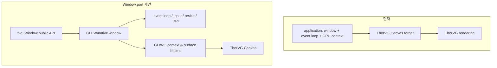

# #1605 — Introduce TVG Window port

- Link: https://github.com/thorvg/thorvg/issues/1605
- 난이도: 93/100
- 실현 가능성: 낮음
- 초심자 추천: 비추천
- 분석 기준: `main` working tree `f989b27892ba`
- 관련 영역: platform/window abstraction, GLFW dependency, public extension API
- 배울 수 있는 것: native window/event loop, GPU surface, optional dependency와 설치 ABI

## 이슈 요약

ThorVG 2.0을 염두에 둔 beta window 기능을 GLFW 기반으로 도입하자는 제안이다. current main은 application/window toolkit이 아니라 호출자가 제공한 CPU buffer 또는 GPU context/target에 그리는 renderer library다. `Window`를 core에 넣으면 rendering과 application framework의 책임 경계, 플랫폼 범위, event/input API, public 설치 header와 GLFW ABI 정책부터 결정해야 한다.

## 난이도 산정

| 항목 | 점수 | 근거 |
|---|---:|---|
| 재현·증거 불확실성 (0-20) | 18 | 기능 범위, 지원 플랫폼, GLFW 노출 방식과 core 포함 여부가 미정이다. |
| 변경 범위 (0-25) | 25 | public API, platform implementation, Meson dependency, examples/install packaging에 걸친다. |
| 구현 복잡도 (0-25) | 24 | event loop, resize, DPI, GL/WG surface와 main-thread lifetime을 다뤄야 한다. |
| 교차 영향 위험 (0-20) | 18 | desktop/mobile/WASM 차이와 optional dependency/ABI에 영향을 준다. |
| 검증 부담 (0-10) | 8 | 여러 OS의 interactive window/context lifecycle 검증이 필요하다. |
| **합계** | **93** | **구현 전에 제품·아키텍처 결정이 필요한 대형 기능이다.** |

## main 코드 조사

### 확인된 사실

- [`inc/thorvg.h`](https://github.com/thorvg/thorvg/blob/f989b27892bab31f224f810a54782055eba1e3bc/inc/thorvg.h)에는 Window/event/input API가 없다.
- `SwCanvas::target()`은 caller buffer를, `GlCanvas::target()`은 display/surface/context/FBO를, `WgCanvas::target()`은 device/instance/target을 받는다. window와 event loop는 caller 책임이다.
- [`meson_options.txt`](https://github.com/thorvg/thorvg/blob/f989b27892bab31f224f810a54782055eba1e3bc/meson_options.txt)에는 GLFW/window option이 없고 source tree에 `src/windows/` module도 없다.
- current platform-specific core 코드는 export/thread/library 차이를 처리하는 수준이며 범용 UI toolkit abstraction은 없다.
- public header는 [`inc/meson.build`](https://github.com/thorvg/thorvg/blob/f989b27892bab31f224f810a54782055eba1e3bc/inc/meson.build)에서 설치되므로 `thorvg_window.h`를 추가하면 배포 API가 된다.

현재와 제안의 ownership 경계는 다음과 같다.

### 아직 가설인 부분

- **가설 A:** examples/helper repository로 두면 core ABI와 dependency를 오염시키지 않고 사용성을 제공할 수 있다. 이슈는 core 설치 header를 제안하므로 maintainer 결정이 필요하다.
- **가설 B:** GLFW는 desktop prototype에 적합하지만 mobile/WASM과 WG surface까지 동일 abstraction으로 감쌀 수 있는지는 미확정이다.
- **가설 C:** “Windows build에서만” 활성화한다는 이슈 초안은 GLFW의 cross-platform 목적과 이름 `src/windows/`가 혼동될 수 있다. OS Windows인지 generic windows인지 명세가 필요하다.

## 수정 방향과 실현 가능성

1. core module, 별도 helper library, examples repository 중 ownership 위치를 먼저 결정한다.
2. 최소 API를 create/destroy, resize callback, event pump, native handle, Canvas 연결 중 어디까지인지 명세한다.
3. GLFW type을 public signature에 노출할지 opaque PImpl로 감출지와 shared/static ABI를 검토한다.
4. 선택 dependency disabled build를 기본으로 유지한 desktop GL prototype을 만든다.
5. WG, DPI, context loss, main-thread 파괴 순서와 설치/pkg-config 소비자를 단계적으로 검증한다.

**판정:** architecture decision 없이 coding을 시작하면 폐기 가능성이 크다. 초심자는 별도 example prototype을 도울 수 있지만 core 이슈 전체는 적합하지 않다.

## 참고 자료

- [이슈 #1605](https://github.com/thorvg/thorvg/issues/1605)
- [이슈에 연결된 과거 논의 #1244](https://github.com/thorvg/thorvg/issues/1244)
- [`inc/thorvg.h`](https://github.com/thorvg/thorvg/blob/f989b27892bab31f224f810a54782055eba1e3bc/inc/thorvg.h)
- [`src/renderer/tvgCanvas.cpp`](https://github.com/thorvg/thorvg/blob/f989b27892bab31f224f810a54782055eba1e3bc/src/renderer/tvgCanvas.cpp)
- [`meson_options.txt`](https://github.com/thorvg/thorvg/blob/f989b27892bab31f224f810a54782055eba1e3bc/meson_options.txt)
- [`inc/meson.build`](https://github.com/thorvg/thorvg/blob/f989b27892bab31f224f810a54782055eba1e3bc/inc/meson.build)

