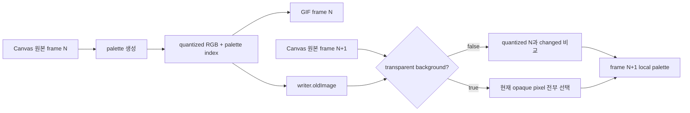

# #1758 — gif: a broken GIF conversion

- Link: https://github.com/thorvg/thorvg/issues/1758
- 난이도: 68/100
- 실현 가능성: 중간
- 초심자 추천: 조건부 (encoder buffer test부터)
- 분석 기준: `main` working tree `f989b27892ba`
- 관련 영역: GIF palette quantization, delta frame, transparency/disposal, LZW
- 배울 수 있는 것: indexed color, local palette, changed-pixel optimization, animation frame comparison

## 이슈 요약

생성 GIF의 37번 frame이 같은 시점의 Canvas capture와 다르다는 버그다. current main은 Lottie frame을 CPU Canvas에 그린 뒤 내장 encoder에 넘긴다. frame rendering과 GIF palette/delta encoding의 경계가 명확해 단계별 비교가 가능하지만, 원본 animation asset이 local test resource에 고정되어 있지 않고 encoder가 이전의 양자화 결과를 다음 frame의 기준으로 재사용해 누적 오류 가능성이 있다.

## 난이도 산정

| 항목 | 점수 | 근거 |
|---|---:|---|
| 재현·증거 불확실성 (0-20) | 14 | 잘못된 frame 이미지는 있으나 원본 asset과 최초 오류 frame의 자동 재현이 없다. |
| 변경 범위 (0-25) | 12 | GIF saver/encoder 안으로 좁힐 수 있으나 palette·delta·disposal이 연결된다. |
| 구현 복잡도 (0-25) | 18 | quantization과 changed-pixel optimization, transparent index 의미를 함께 보존해야 한다. |
| 교차 영향 위험 (0-20) | 15 | 모든 animated GIF의 색, disposal, 메모리 사용량에 영향을 줄 수 있다. |
| 검증 부담 (0-10) | 9 | 여러 decoder로 장시간 frame sequence를 decode/diff해야 한다. |
| **합계** | **68** | **코드 범위는 좁지만 재현 asset과 frame 누적 검증이 필요하다.** |

## main 코드 조사

### 확인된 사실

- [`GifSaver::run()`](https://github.com/thorvg/thorvg/blob/f989b27892bab31f224f810a54782055eba1e3bc/src/savers/gif/tvgGifSaver.cpp)은 animation을 `SwCanvas`의 `ABGR8888S` buffer로 frame마다 렌더링하고 `reinterpret_cast<uint8_t*>(buffer)`를 `gifWriteFrame()`에 전달한다.
- [`_makePalette()`](https://github.com/thorvg/thorvg/blob/f989b27892bab31f224f810a54782055eba1e3bc/src/savers/gif/tvgGifEncoder.cpp)은 첫 frame에는 전체 pixel, 이후에는 `_pickChangedPixels()`가 고른 pixel로 local palette를 만든다.
- `_thresholdImage()`은 출력 palette RGB와 palette index를 `writer->oldImage`의 네 byte에 기록한다.
- 다음 `gifWriteFrame()`은 이 `oldImage`를 이전 frame 인자로 다시 사용한다. 즉 이전 **원본 RGBA**가 아니라 이전 **양자화 RGB + index byte**가 changed-pixel 비교 기준이다.
- 단, `transparent=true`일 때 `_pickChangedPixels()`는 색 비교를 우회해 현재의 모든 불투명 pixel을 palette sample로 고른다. 따라서 이전 양자화 frame의 feedback 가설은 `transparent=false`인 background 경로에서만 직접 적용된다.
- `_swapPixels()`에서 `aB`를 `image[pixB*4+3]`가 아니라 `image[pixA*4+3]`에서 읽는 typo가 확인된다. 다만 palette split은 RGB component만 사용하므로 #1758의 직접 원인이라는 증거는 없다.
- [`testSavers.cpp`](https://github.com/thorvg/thorvg/blob/f989b27892bab31f224f810a54782055eba1e3bc/test/testSavers.cpp)는 GIF 파일 생성 성공만 확인하고 decode한 각 frame의 pixel 정확도는 검사하지 않는다.

현재 buffer feedback은 다음과 같다.



이 비교의 핵심 문제 후보는 다음과 같이 표현된다.

```text
현재: changed = original[N+1] RGB != quantized[N] RGB
의도 후보: changed = original[N+1] RGB != original[N] RGB
```

### 아직 가설인 부분

- **조건부 가설 A:** background가 있어 `transparent=false`라면 양자화 오차가 “변경된 pixel”로 오인되어 다음 local palette의 sample 분포를 오염시킬 수 있다. background가 없는 변환이라면 이 설명은 성립하지 않는다.
- **가설 B:** transparent/disposal flag(`0x09` 또는 `0x05`)와 unchanged pixel의 transparent index 처리도 37번 frame 현상에 관여할 수 있다.
- **가설 C:** `_swapPixels()` alpha typo는 명백한 코드 결함이지만 RGB palette 결과에는 직접 영향이 없을 수 있다. alpha를 쓰는 별도 case로 증명하기 전에는 원인 fix와 묶지 않는다.
- **가설 D:** `GifSaver::run()`의 시간 기반 frame sampling과 사용자가 말한 “37번 frame”이 동일한 Lottie frame인지 확인이 필요하다. encoder 입력부터 저장해야 frame 선택과 encoding 문제를 분리할 수 있다.

## 수정 방향과 실현 가능성

1. 원본 animation과 정확한 frame 37을 resource로 확보하고 Canvas PNG와 GIF decode frame을 자동 diff한다.
2. encoder 직전 buffer도 저장해 Canvas/frame 선택 오류인지 GIF encoding 오류인지 먼저 나눈다.
3. 최초로 달라지는 frame을 찾아 `transparent`, `changed count`, palette, transparent index와 disposal을 dump한다.
4. `transparent=false` 재현이면 `previousOriginalRGBA`와 `indexedOutput` buffer를 분리하는 실험으로 feedback 가설을 A/B 검증한다.
5. 메모리 증가를 피하려면 current/previous buffer ownership과 frame swap 전략을 설계한다.
6. `_swapPixels()` alpha typo는 alpha-sensitive unit test로 영향이 확인되면 독립 수정한다.

**판정:** 재현 asset만 확보하면 원인 가설을 직접 검증할 수 있어 실현 가능성은 중간이다. 단순히 giflib으로 교체하는 것은 원인 확인을 건너뛰며 이 이슈의 최소 수정이 아니다.

## 검증 체크리스트

- first frame, first erroneous frame, 100+ frame 누적
- 불투명/투명 background, changed/unchanged pixel
- 256색 이하/초과, palette가 급격히 바뀌는 frame
- disposal 방식과 여러 GIF decoder
- 분리 buffer의 peak memory 및 sanitizer

## 참고 자료

- [이슈 #1758](https://github.com/thorvg/thorvg/issues/1758)
- [`src/savers/gif/tvgGifSaver.cpp`](https://github.com/thorvg/thorvg/blob/f989b27892bab31f224f810a54782055eba1e3bc/src/savers/gif/tvgGifSaver.cpp)
- [`src/savers/gif/tvgGifEncoder.cpp`](https://github.com/thorvg/thorvg/blob/f989b27892bab31f224f810a54782055eba1e3bc/src/savers/gif/tvgGifEncoder.cpp)
- [`src/savers/gif/tvgGifEncoder.h`](https://github.com/thorvg/thorvg/blob/f989b27892bab31f224f810a54782055eba1e3bc/src/savers/gif/tvgGifEncoder.h)
- [`test/testSavers.cpp`](https://github.com/thorvg/thorvg/blob/f989b27892bab31f224f810a54782055eba1e3bc/test/testSavers.cpp)
