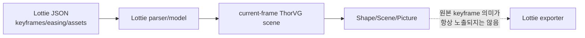

# #1762 — lottie: save Lottie feature support

- Link: https://github.com/thorvg/thorvg/issues/1762
- 난이도: 94/100
- 실현 가능성: 낮음
- 초심자 추천: 비추천
- 분석 기준: `main` working tree `f989b27892ba`
- 관련 영역: scene serialization, Lottie schema, SVG→ThorVG→Lottie pipeline
- 배울 수 있는 것: scene traversal, schema mapping, keyframe serialization과 정보 손실

## 이슈 요약

ThorVG drawing API로 만든 vector path 또는 SVG를 Lottie JSON으로 내보내 Godot/V-Sekai 등에서 사용하자는 요청이다. static Shape/Scene을 한 frame의 Lottie subset으로 직렬화하는 것과, loaded Lottie/SVG의 animation 의미를 lossless하게 역직렬화하는 것은 전혀 다른 규모다. current main은 generic `Saver` interface는 있지만 GIF backend만 있고, public `Animation`은 frame 제어 API이지 keyframe/property graph 조회 API가 아니다.

## 난이도 산정

| 항목 | 점수 | 근거 |
|---|---:|---|
| 재현·증거 불확실성 (0-20) | 17 | “enough drawing implementations”와 지원할 Lottie subset/round-trip 품질이 정의되지 않았다. |
| 변경 범위 (0-25) | 25 | Saver, scene traversal, JSON schema, path/fill/assets/text/animation과 build/test가 연결된다. |
| 구현 복잡도 (0-25) | 25 | ThorVG scene과 Lottie property/keyframe graph가 일대일 대응하지 않는다. |
| 교차 영향 위험 (0-20) | 18 | 조용한 feature 손실, ownership, async save와 schema/version 호환 위험이 있다. |
| 검증 부담 (0-10) | 9 | validator와 여러 player, round-trip pixel/timeline 비교가 필요하다. |
| **합계** | **94** | **완전한 exporter는 새 serializer subsystem 규모다.** |

## main 코드 조사

### 확인된 사실

- [`Saver`](https://github.com/thorvg/thorvg/blob/f989b27892bab31f224f810a54782055eba1e3bc/inc/thorvg.h)는 Paint/Animation save API를 제공하지만 [`tvgSaver.cpp`](https://github.com/thorvg/thorvg/blob/f989b27892bab31f224f810a54782055eba1e3bc/src/renderer/tvgSaver.cpp)의 `_find()`는 `.gif`만 dispatch한다.
- [`SaveModule`](https://github.com/thorvg/thorvg/blob/f989b27892bab31f224f810a54782055eba1e3bc/src/renderer/tvgSaveModule.h)은 Paint와 Animation save/close contract를 이미 제공하므로 새 backend 연결점은 존재한다.
- `Scene::paints()`, `Shape::path()`, fill/stroke/transform/opacity 조회 API를 통해 사용자가 직접 만든 제한된 static Scene/Shape는 순회 가능하다.
- public [`Animation`](https://github.com/thorvg/thorvg/blob/f989b27892bab31f224f810a54782055eba1e3bc/inc/thorvg.h)은 `frame`, `curFrame`, `totalFrame`, `duration`, `segment`를 제공하지만 원본 keyframe/property/easing graph를 열거하지 않는다.
- [`LottieLoader::frame()`](https://github.com/thorvg/thorvg/blob/f989b27892bab31f224f810a54782055eba1e3bc/src/loaders/lottie/tvgLottieLoader.cpp)은 loader 내부 model/builder를 현재 frame의 render scene으로 갱신한다. loader/parser/model은 JSON→scene 방향이며 serializer interface가 아니다.
- GIF saver test는 animation을 frame sampling하여 raster GIF로 저장한다. 이 방식은 vector keyframe 의미를 보존하지 않는다.

정보 손실 경계가 핵심이다.



현행 saver dispatch도 범위를 명확히 보여준다.

```cpp
static SaveModule* _find(const char* filename)
{
    auto ext = fileext(filename);
    if (ext && !strcmp(ext, "gif")) return _find(FileType::Gif);
    return nullptr;
}
```

### 아직 가설인 부분

- **가설 A:** move/line/cubic/close, solid fill/stroke와 transform만 가진 static scene을 single-frame Lottie로 내보내는 MVP는 가능하다.
- **가설 B:** loaded Lottie의 내부 model을 직접 serialize하면 일부 round-trip이 가능할 수 있으나 loader internals에 exporter가 강하게 결합하고 SVG/ThorVG-created scene에는 적용되지 않는다.
- **가설 C:** frame sampling으로 path 값을 추정하면 easing/keyframe 원형을 복원할 수 없으며 파일도 커질 수 있다. 이는 lossless exporter의 대안이 아니다.

## 수정 방향과 실현 가능성

1. v1을 “사용자가 만든 static Shape/Scene → single-frame Lottie”로 한정하고 unsupported 정책을 명시한다.
2. Lottie loader model을 재사용하지 않는 scene visitor + JSON writer 경계를 설계한다.
3. path, solid fill/stroke, opacity, affine transform을 round-trip render test로 고정한다.
4. gradient/mask/image/text를 schema mapping 표와 함께 단계적으로 추가한다.
5. animation을 요구한다면 generic ThorVG keyframe representation/API가 먼저 필요한지 별도 architecture proposal로 분리한다.

**판정:** 제한된 static prototype도 중급 이상이며, 이슈가 암시하는 animation/export 전체는 현재 public model만으로 직접 실현하기 어렵다.

## 참고 자료

- [이슈 #1762](https://github.com/thorvg/thorvg/issues/1762)
- [`inc/thorvg.h`](https://github.com/thorvg/thorvg/blob/f989b27892bab31f224f810a54782055eba1e3bc/inc/thorvg.h) — `Animation`, `Saver`, `Scene`, `Shape`
- [`src/renderer/tvgSaver.cpp`](https://github.com/thorvg/thorvg/blob/f989b27892bab31f224f810a54782055eba1e3bc/src/renderer/tvgSaver.cpp)
- [`src/renderer/tvgSaveModule.h`](https://github.com/thorvg/thorvg/blob/f989b27892bab31f224f810a54782055eba1e3bc/src/renderer/tvgSaveModule.h)
- [`src/loaders/lottie/tvgLottieLoader.cpp`](https://github.com/thorvg/thorvg/blob/f989b27892bab31f224f810a54782055eba1e3bc/src/loaders/lottie/tvgLottieLoader.cpp)
- [`src/loaders/lottie/tvgLottieParser.cpp`](https://github.com/thorvg/thorvg/blob/f989b27892bab31f224f810a54782055eba1e3bc/src/loaders/lottie/tvgLottieParser.cpp)
- [`src/loaders/lottie/tvgLottieModel.h`](https://github.com/thorvg/thorvg/blob/f989b27892bab31f224f810a54782055eba1e3bc/src/loaders/lottie/tvgLottieModel.h)
- [`test/testSavers.cpp`](https://github.com/thorvg/thorvg/blob/f989b27892bab31f224f810a54782055eba1e3bc/test/testSavers.cpp)

