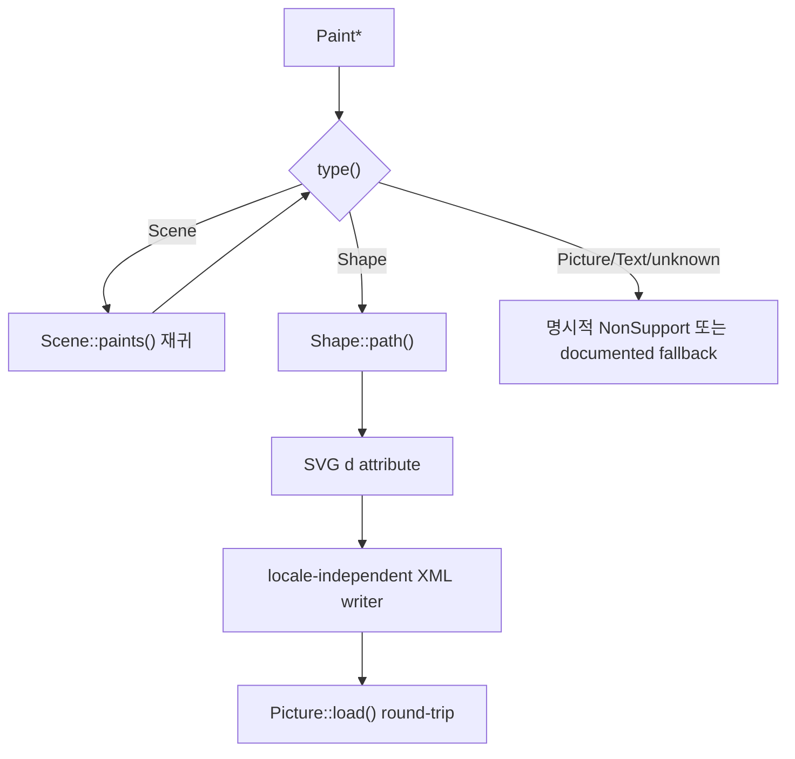

# #1861 — svg: support the SVG exporting feature

- Link: https://github.com/thorvg/thorvg/issues/1861
- 난이도: 77/100
- 실현 가능성: 중간 (제한된 static subset), 낮음 (임의 scene의 lossless export)
- 초심자 추천: 조건부
- 분석 기준: `main` working tree `f989b27892ba`
- 관련 영역: SVG serialization, scene traversal, Saver backend
- 배울 수 있는 것: XML escaping, path serialization, transform/paint mapping, round-trip test

## 이슈 요약

ThorVG Shape/Scene 데이터를 SVG로 내보낼 수 있는지와 기능 추가 가능성을 묻는 요청이다. Lottie exporter보다 static SVG subset은 현실적이지만 “ThorVG API로 만든 단순 Scene”과 “불러온 임의 SVG를 원문에 가깝게 재출력”은 구분해야 한다. loader는 SVG 문법을 ThorVG path/paint로 정규화하며 원래 element, CSS와 attribute 표현을 보존하지 않기 때문이다.

## 난이도 산정

| 항목 | 점수 | 근거 |
|---|---:|---|
| 재현·증거 불확실성 (0-20) | 11 | 기능 요청은 명확하지만 지원 대상 Paint/subset과 lossless 기준이 미정이다. |
| 변경 범위 (0-25) | 20 | Saver dispatch, serializer, scene traversal, Meson option과 test가 필요하다. |
| 구현 복잡도 (0-25) | 21 | path command/float/XML, paint inheritance, gradients/mask/text/image mapping이 필요하다. |
| 교차 영향 위험 (0-20) | 17 | unsupported feature의 조용한 손실과 Saver ownership/async 수명이 위험하다. |
| 검증 부담 (0-10) | 8 | export→reload→render pixel diff와 XML parser/validator 검증이 필요하다. |
| **합계** | **77** | **MVP는 가능하지만 전체 scene 보존 목표는 빠르게 커진다.** |

## main 코드 조사

### 확인된 사실

- public [`Saver`](https://github.com/thorvg/thorvg/blob/f989b27892bab31f224f810a54782055eba1e3bc/inc/thorvg.h)는 extension으로 backend를 고르는 범용 API다.
- [`tvgSaver.cpp`](https://github.com/thorvg/thorvg/blob/f989b27892bab31f224f810a54782055eba1e3bc/src/renderer/tvgSaver.cpp)의 filename dispatch는 `.gif`만 인식하므로 `.svg`는 `Result::NonSupport`다.
- [`SaveModule`](https://github.com/thorvg/thorvg/blob/f989b27892bab31f224f810a54782055eba1e3bc/src/renderer/tvgSaveModule.h)은 Paint/Animation save와 close를 pure virtual로 정의해 `SvgSaver` 연결점이 있다.
- `Scene::paints()`는 child list, `Shape::path()`는 command/point array를 노출한다. fill/stroke/transform/opacity 조회 API도 있어 단순 static scene은 public API만으로 순회할 수 있다.
- `FileType`에는 loader용 `Svg` 값이 이미 있지만 saver dispatch와 SVG saver source/Meson option은 없다. enum 존재만으로 export 지원을 뜻하지 않는다.
- loaded `Picture`가 원래 XML/CSS/source token을 보존해 공개하는 API는 없다. 따라서 source-preserving export는 현재 scene model에서 불가능하다.

현실적인 v1 경계는 다음과 같다.



path serializer의 최소 mapping은 명확하다.

```text
MoveTo  + 1 point  -> M x y
LineTo  + 1 point  -> L x y
CubicTo + 3 points -> C x1 y1 x2 y2 x y
Close               -> Z
```

### 아직 가설인 부분

- **가설 A:** move/line/cubic/close, solid fill/stroke, opacity와 affine transform만 지원하는 `SvgSaver` MVP는 현재 public getters로 구현 가능하다.
- **가설 B:** loaded SVG Picture 내부 vector를 `Accessor`로 순회할 수 있더라도 원본 CSS/element identity는 복원할 수 없다. semantic snapshot과 source round-trip을 구분해야 한다.
- **가설 C:** gradient/clip/mask를 추가할 때 defs ID generation과 objectBoundingBox/userSpace 의미가 가장 큰 다음 복잡도다.

## 수정 방향과 실현 가능성

1. v1 지원표를 `Scene`, `Shape`, path 4 commands, solid fill/stroke, opacity, affine transform으로 고정한다.
2. unsupported Paint/gradient/mask/effect를 `NonSupport`로 실패할지 warning+skip할지 정책을 먼저 정한다.
3. `SvgSaver : SaveModule`, `.svg` dispatch와 optional Meson saver 항목을 연결한다.
4. locale-independent finite float formatter, XML escaping과 deterministic attribute order를 구현한다.
5. export→reload→CPU render pixel diff, malformed/nonfinite input과 async ownership을 test한다.

**판정:** 작은 subset의 serializer와 test는 C++에 익숙한 초심자에게 분할 가능하다. 모든 ThorVG Paint를 lossless하게 내보내는 목표는 별도 장기 프로젝트다.

## 참고 자료

- [이슈 #1861](https://github.com/thorvg/thorvg/issues/1861)
- [`inc/thorvg.h`](https://github.com/thorvg/thorvg/blob/f989b27892bab31f224f810a54782055eba1e3bc/inc/thorvg.h) — `Saver`, `Scene::paints()`, `Shape::path()`
- [`src/renderer/tvgSaver.cpp`](https://github.com/thorvg/thorvg/blob/f989b27892bab31f224f810a54782055eba1e3bc/src/renderer/tvgSaver.cpp)
- [`src/renderer/tvgSaveModule.h`](https://github.com/thorvg/thorvg/blob/f989b27892bab31f224f810a54782055eba1e3bc/src/renderer/tvgSaveModule.h)
- [`src/renderer/tvgScene.cpp`](https://github.com/thorvg/thorvg/blob/f989b27892bab31f224f810a54782055eba1e3bc/src/renderer/tvgScene.cpp)
- [`src/renderer/tvgShape.cpp`](https://github.com/thorvg/thorvg/blob/f989b27892bab31f224f810a54782055eba1e3bc/src/renderer/tvgShape.cpp)
- [`src/savers/meson.build`](https://github.com/thorvg/thorvg/blob/f989b27892bab31f224f810a54782055eba1e3bc/src/savers/meson.build)
- [`meson_options.txt`](https://github.com/thorvg/thorvg/blob/f989b27892bab31f224f810a54782055eba1e3bc/meson_options.txt)
