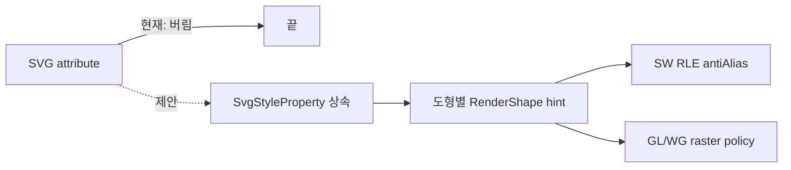

# #1869 — SVG `shape-rendering="crispEdges"` 지원

- **Link:** https://github.com/thorvg/thorvg/issues/1869
- **난이도:** 83/100
- **초심자 추천:** 비추천(파서 테스트만 분리하면 조건부)
- **관련 영역:** SVG 스타일 상속, 내부 `RenderShape`, SW·GL·WG 렌더러
- **배울 수 있는 것:** presentation attribute, coverage 안티앨리어싱, 로더와 백엔드 사이의 상태 전달
- **조사 기준:** `main@f989b27892bab31f224f810a54782055eba1e3bc`

## 이슈 요약

SVG의 개별 도형에 지정된 `shape-rendering="crispEdges"`를 읽어 그 도형만 안티앨리어싱 없이 그리자는 요청이다. `text-rendering`은 후속 희망 사항이며, 우선 범위는 shape로 보는 편이 현실적이다.

## 난이도 산정

| 항목 | 점수 | 근거 |
|---|---:|---|
| 재현·증거 불확실성 (0-20) | 11 | 예제는 명확하지만 `crispEdges`의 상속·`auto` 값과 백엔드별 기대 픽셀을 합의해야 한다. |
| 변경 범위 (0-25) | 23 | SVG parser/model, 공통 render data, SW와 두 GPU backend를 잇는다. |
| 구현 복잡도 (0-25) | 22 | SW의 전역 bool을 도형별로 분리하고 GPU 래스터 정책도 설계해야 한다. |
| 교차 영향 위험 (0-20) | 18 | clip/mask/stroke/fill 캐시와 render-data 갱신 조건에 영향을 줄 수 있다. |
| 검증 부담 (0-10) | 9 | 상속 조합 및 SW·GL·WG 픽셀 비교가 필요하다. |
| **합계** | **83** |  |

- **실현 가능성: 중간.** SW-only 최소 구현은 가능하지만, 모든 backend의 같은 의미까지 한 번에 보장하는 전체 이슈는 실현 가능성이 낮다.

## main 코드 조사

### 확인된 증거

- `src/loaders/svg/tvgSvgLoader.cpp`의 `styleTags[]`에는 `shape-rendering`과 `text-rendering`이 없다. 알 수 없는 presentation attribute는 `_parseStyleAttr()`에서 `false`로 끝난다.
- `inc/thorvg.h`의 `EngineOption::Aliased`는 canvas 생성 옵션이다. `src/renderer/cpu_engine/tvgSwRenderer.cpp`의 `SwRenderer::antiAlias`도 renderer 전역 상태다.
- SW coverage는 `src/renderer/cpu_engine/tvgSwRle.cpp`에서 `antiAlias == false`일 때 255로 강제된다. 즉 CPU에는 재사용 가능한 마지막 스위치가 있다.
- GL/WG는 `src/renderer/tvgCanvas.cpp`에서 `EngineOption::Aliased`를 지원하지 않는다고 로그를 남긴다. 따라서 기존 전역 옵션조차 GPU 구현은 없다.

```cpp
// tvgSwRle.cpp: 개별 RLE 호출까지 bool이 전달되므로 SW 연결 지점은 분명하다.
if (!rw.antiAlias) coverage = 255;

// tvgSvgLoader.cpp: 현재 목록에는 shape-rendering 항목이 없다.
STYLE_DEF(fill, Fill, SvgStyleFlags::Fill),
STYLE_DEF(stroke, Stroke, SvgStyleFlags::Stroke),
```

### 아직 확인되지 않은 부분

- 이슈 예제의 첨부 PNG를 현재 환경에서 다시 렌더해 pixel diff하지 않았다.
- SVG의 렌더링 힌트를 “무조건 coverage 255”로 해석해도 되는지, GPU에서 MSAA/coverage를 어떻게 끌지는 코드만으로 확정할 수 없다.

## 원인 가설

1. **확인됨:** loader가 속성을 보존하지 않으므로 현재 결과에 반영될 수 없다.
2. **강한 가설:** `SvgStyleProperty`와 `RenderShape` 사이에 도형별 힌트 필드가 없어서, 파싱만 추가해도 SW RLE에 도달하지 못한다.
3. **설계 가설:** 공개 `Shape` API보다 SVG loader가 만든 paint의 내부 render flag로 한정하면 ABI 변경을 피할 수 있다.



## 수정 방향과 실현 가능성

1. loader 단위 테스트로 attribute와 CSS style, 부모 상속, 명시적 `auto`/기본값을 먼저 고정한다.
2. `SvgStyleFlags`와 `SvgStyleProperty`에 값과 “명시됨” 상태를 추가하고 copy/inherit 경로를 갱신한다.
3. 공개 API를 늘리지 않는 내부 paint/render 플래그를 정한 뒤 SW의 `shapeGenRle()`·`shapeGenStrokeRle()`에 전달한다.
4. CPU golden test로 ellipse/polyline, fill/stroke, clip/mask를 검증한다.
5. GL/WG는 지원 방식이 정해지기 전 `crispEdges`를 무시할지, 해당 backend 완료를 별도 이슈로 분리할지 maintainer와 합의한다.

## 위험과 검증

- 상속되지 않아야 할 값까지 복사하거나 기본 SVG 렌더링을 바꾸면 기존 파일 전체가 달라질 수 있다.
- fill과 stroke가 같은 도형에서 서로 다른 RLE 경로를 타므로 둘 다 검사해야 한다.
- 회전·scale·subpixel translate에서 aliased 결과의 기준을 정하고 backend별 결과 차이를 기록해야 한다.

## 참고 자료

- 이슈 본문에 포함된 설명: https://developer.mozilla.org/en-US/docs/Web/SVG/Attribute/shape-rendering
- `src/loaders/svg/tvgSvgLoader.cpp` — `styleTags[]`, `_parseStyleAttr()`
- `src/loaders/svg/tvgSvgCommon.h` — `SvgStyleProperty`, `SvgStyleFlags`
- `src/renderer/cpu_engine/tvgSwRenderer.cpp` — 전역 `antiAlias`와 shape task
- `src/renderer/cpu_engine/tvgSwRle.cpp` — coverage 생성
- `src/renderer/tvgCanvas.cpp` — GL/WG aliased 옵션 처리
