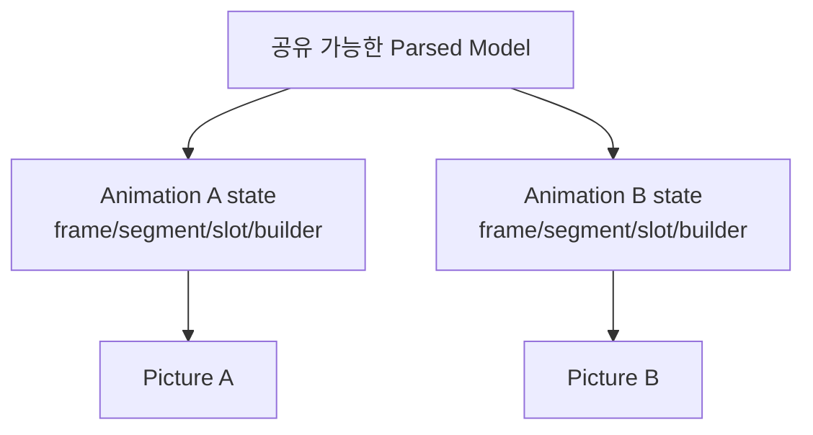

# #1936 — Animation 간 Lottie Loader 공유

- **Link:** https://github.com/thorvg/thorvg/issues/1936
- **난이도:** 85/100
- **초심자 추천:** 비추천
- **관련 영역:** Animation/Picture PImpl, loader ref count, Lottie 가변 재생 상태
- **배울 수 있는 것:** intrusive reference count, 불변 모델 공유, copy-on-write, 비동기 소유권
- **조사 기준:** `main@f989b27892bab31f224f810a54782055eba1e3bc`

## 이슈 요약

`Animation::duplicate()`를 추가하거나 여러 Animation이 같은 Lottie loader를 공유해 파싱 메모리를 줄이자는 요청이다. “동일 loader 객체 공유”와 “파싱된 불변 데이터만 공유”는 안전성이 전혀 다른 두 설계다.

## 난이도 산정

| 항목 | 점수 | 근거 |
|---|---:|---|
| 재현·증거 불확실성 (0-20) | 11 | 현재 가변 상태는 확인되지만 duplicate의 정확한 상태 복제 계약이 정의되지 않았다. |
| 변경 범위 (0-25) | 22 | public Animation API, Picture, Loader, Lottie model/builder와 C binding을 건드릴 수 있다. |
| 구현 복잡도 (0-25) | 23 | 불변 parse model과 프레임별 render state를 분리하고 수명을 재설계해야 한다. |
| 교차 영향 위험 (0-20) | 20 | async task와 ref count 오류는 UAF, data race, leak으로 이어진다. |
| 검증 부담 (0-10) | 9 | 독립 frame/slot/segment/tween 및 삭제 순서·thread 조합을 검사해야 한다. |
| **합계** | **85** |  |

- **실현 가능성: 낮음.** 단순 loader pointer 공유는 가능해 보여도 독립 재생 계약을 깨므로, 안전한 완료에는 내부 모델 분리가 필요하다.

## main 코드 조사

### 확인된 증거

- `Animation::Impl`은 생성 때 독자 `Picture`를 만들고 ref하며, 공개 `Animation`에는 `duplicate()`가 없다.
- `PictureImpl::duplicate()`는 loader 포인터를 그대로 복사하고 `loader->sharing`을 증가시킨다.
- `Loader::allowCache()`는 `FileType::Lot`를 명시적으로 거부한다. 일반 loader cache 공유가 Lottie에 안전하지 않다는 현재 정책이다.
- `LottieLoader` 자체에 `frameNo`, `segmentBegin/End`, `slots`, `curSlot`, `builder`, `comp`, `build`가 있다.
- `frame()`, `segment()`, `tween()`, slot 적용은 이 상태와 composition을 변경하고 `TaskScheduler::request(this)`를 호출한다.

```cpp
// tvgPicture.h: 일반 Picture duplicate는 loader를 얕게 공유한다.
dup->loader = loader;
++dup->loader->sharing;

// tvgLoader.h: Lottie는 cache 공유에서 제외된다.
if (type == FileType::Lot) return false;
```

### 아직 확인되지 않은 부분

- 이슈가 같은 frame을 표시하는 read-only clone만 원하는지, 완전히 독립 재생되는 Animation을 원하는지 명시돼 있지 않다.
- 실제 Lottie composition에서 어느 node까지 immutable로 만들 수 있는지는 전체 mutation write-set을 추가 추적해야 한다.

## 원인 가설

- **확인됨:** 현재 loader는 parse model과 playback/build 상태를 한 객체에 보유한다.
- **강한 가설:** loader 전체를 공유하면 A의 `frame()`/slot/tween이 B의 `comp`와 builder 결과를 바꾼다. ref count만 추가해서는 해결되지 않는다.
- **설계 가설:** JSON에서 만든 immutable model/asset만 별도 ref-count 객체로 떼고, loader별 frame/builder/render tree를 유지하는 것이 안전한 최소 구조다.



## 수정 방향과 실현 가능성

1. duplicate 계약을 “현재 frame/segment/slot을 복사하되 이후 독립”처럼 테스트 가능한 문장으로 확정한다.
2. `LottieLoader`와 `LottieComposition`의 모든 write 지점을 frame, clear, slot, expression, asset cache로 분류한다.
3. 불변 parse graph와 mutable instance state 경계를 설계하고, 불변 쪽에 atomic ref count를 둔다.
4. duplicate 중 실행 중인 task를 `done()`으로 동기화할지 snapshot할지 결정한다.
5. C++ API를 추가하면 C API와 Lottie 확장 API의 대응 및 ABI 문서를 함께 검토한다.

## 위험과 검증

- 원본 먼저 삭제, clone 먼저 삭제, 여러 clone 생성 순서에서 ref count를 확인한다.
- 두 clone에 서로 다른 frame/segment/slot/tween을 병렬 적용해 결과가 독립인지 검증한다.
- 메모리 절감은 동일 JSON을 N개 로드한 peak RSS와 parsing time으로 측정해야 한다.

## 참고 자료

- `inc/thorvg.h` — `Animation` 공개 API
- `src/renderer/tvgAnimation.h`, `tvgAnimation.cpp` — PImpl과 frame 전달
- `src/renderer/tvgPicture.h` — `PictureImpl::duplicate()`
- `src/renderer/tvgLoader.h` — `sharing`, `allowCache()`
- `src/loaders/lottie/tvgLottieLoader.h`, `tvgLottieLoader.cpp` — 가변 playback/build 상태
