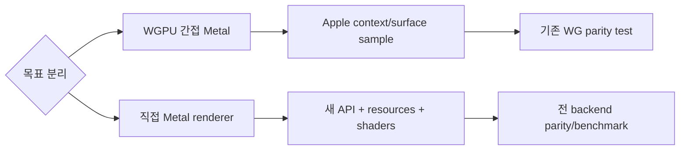

# #2039 — Apple Metal 백엔드 지원

- **Link:** https://github.com/thorvg/thorvg/issues/2039
- **난이도:** 96/100
- **초심자 추천:** 비추천(간접 WGPU 조사·문서화만 별도 분리 가능)
- **관련 영역:** WGPU/Metal, Apple surface, GPU renderer, Meson·CI
- **배울 수 있는 것:** GPU device/surface 수명, shader pipeline, native backend 추상화
- **조사 기준:** `main@f989b27892bab31f224f810a54782055eba1e3bc`

## 이슈 요약

iOS/macOS에 직접 Metal renderer를 추가하거나, wgpu-native가 선택하는 Metal backend를 통해 간접 지원하자는 요청이다. 두 경로의 작업량이 크게 다르므로 하나의 구현 이슈로 평가하면 최상급 난이도다. 이전의 “조사 보류”를 해제하고 현재 코드에서 가능한 경계까지 조사해 점수를 부여했다.

## 난이도 산정

| 항목 | 점수 | 근거 |
|---|---:|---|
| 재현·증거 불확실성 (0-20) | 18 | 저장소만으로 외부 wgpu-native의 Metal 선택과 Apple surface 동작을 실행 확인할 수 없다. |
| 변경 범위 (0-25) | 25 | backend, target API, shader/resource, Apple build, example과 CI 전반이다. |
| 구현 복잡도 (0-25) | 25 | 직접 구현은 완전한 GPU renderer이며 간접 구현도 native context/surface 수명이 필요하다. |
| 교차 영향 위험 (0-20) | 19 | GPU 자원 수명, ABI, 선택적 빌드와 플랫폼별 packaging에 영향을 준다. |
| 검증 부담 (0-10) | 9 | macOS+iOS 실기기, offscreen/surface, SW/GL/WG parity와 성능 검증이 필요하다. |
| **합계** | **96** |  |

- **실현 가능성: 낮음.** 다만 “macOS에서 기존 `WgCanvas`가 Metal-backed wgpu-native로 구동됨을 증명하는 샘플”로 범위를 줄이면 별도 중간 난이도 작업으로 실현 가능하다.

## main 코드 조사

### 확인된 증거

- `meson_options.txt`의 engine 선택지는 `cpu`, `gl`, `wg`, `all`뿐이고 Metal 전용 engine은 없다.
- `src/renderer/gpu_engine/wg/meson.build`는 비-Emscripten에서 외부 `dependency('wgpu_native')`를 요구한다. ThorVG는 wgpu-native 내부 native backend를 직접 선택하지 않는다.
- `WgCanvas::Context`는 외부 `instance`, `adapter`, `device`를 받고 target은 `WGPUSurface` 또는 `WGPUTexture`를 받는다. 즉 호출자가 Metal-backed context를 만들 수 있는 주입 지점은 이미 있다.
- `test/testWgEngine.h`에는 generic wgpu instance/adapter/device와 offscreen texture 생성 예가 있지만 Apple `CAMetalLayer`/surface 생성은 없다.
- WG renderer는 WGSL source와 WebGPU pipeline을 사용한다. 저장소에서 `MTLDevice`, `CAMetalLayer`, `.metal`/MSL shader 또는 Metal renderer 파일은 찾지 못했다.
- WG surface 설정에는 macOS에서 Immediate present mode를 선택하는 조건부 코드만 있다. 이것은 Metal backend 선택 증거가 아니라 표면 설정의 플랫폼 분기다.

```text
간접 경로(현실적인 1차 목표)
App -> wgpu-native instance/adapter/device -> [외부가 Metal 선택]
    -> WgCanvas::Context -> WGPU surface/texture -> 기존 WG renderer

직접 경로(새 renderer)
App -> MTLDevice/CAMetalLayer -> 새 MtlCanvas/MtlRenderer
    -> tessellation + pipeline + texture + mask/blend/effect + MSL
```

### 아직 확인되지 않은 부분과 외부 플랫폼 한계

- 현재 조사 환경은 Apple SDK/Xcode, iOS simulator/실기기, Metal-enabled wgpu-native artifact를 제공하지 않는다.
- 따라서 **확인할 수 없는 것**은 실제 adapter backend가 Metal인지, `CAMetalLayer` surface 생성이 현재 wgpu C header와 맞는지, iOS packaging/signing이 되는지, 성능이 SW/GL보다 나은지다.
- 이 한계는 난이도 판정을 보류할 이유가 아니라 재현 불확실성과 검증 부담을 높이는 근거다.

## 원인 가설

- **확인됨:** ThorVG core에는 direct Metal backend가 없다.
- **강한 가설:** macOS의 offscreen texture 렌더는 Metal-enabled wgpu-native만 공급되면 기존 `WgCanvas`로 상당 부분 가능하다. backend 선택은 ThorVG보다 의존성 build와 adapter request 결과에 달려 있다.
- **가설:** iOS onscreen 지원의 첫 blocker는 renderer 알고리즘보다 `CAMetalLayer`에서 `WGPUSurface`를 만들고 event/present 수명을 관리하는 integration/example일 가능성이 높다. Apple 실행 없이 확정할 수는 없다.



## 수정 방향과 실현 가능성

1. **1차 조사 PR 범위:** macOS에서 wgpu adapter/backend 정보를 기록하고 offscreen texture를 `WgCanvas`에 연결하는 최소 test/example을 만든다.
2. `CAMetalLayer` 기반 onscreen `WGPUSurface` 생성은 core가 아니라 example/platform adapter에 둘지 경계를 정한다.
3. macOS와 iOS에서 build/install/package, resize, present, device loss, 종료 순서를 검증한다.
4. 간접 경로의 기능·binary size·FPS가 목표를 충족하면 direct backend는 진행하지 않는다.
5. 간접 경로로 불가능한 요구가 측정될 때만 direct Metal RFC를 만들고 Canvas API, renderer interface, shader 변환, texture/mask/effect, CI를 하위 이슈로 분해한다.

## backend 차이

| 항목 | SW | GL | WG→Metal | 직접 Metal |
|---|---|---|---|---|
| 현재 구현 | 있음 | 있음 | WG 코드는 있음, Metal 선택은 외부 의존 | 없음 |
| target 소유자 | caller buffer | GL context/FBO | caller의 WGPU context/surface | 새 MTL context/layer 필요 |
| shader | 없음 | GLSL 계열 | WGSL, wgpu-native가 변환 | MSL 또는 변환 계층 필요 |
| Apple 검증 | CPU로 가능 | 플랫폼 GL 제약 | Xcode+wgpu-native 필요 | Xcode+대규모 구현 필요 |

## 참고 자료

- `meson_options.txt`, `meson.build` — engine 선택
- `inc/thorvg.h` — `WgCanvas::Context`, target API
- `src/renderer/gpu_engine/wg/meson.build` — 외부 wgpu-native dependency
- `src/renderer/gpu_engine/wg/tvgWgRenderer.cpp` — surface 설정과 resource 수명
- `src/renderer/gpu_engine/wg/tvgWgPipelines.cpp` — WGSL pipeline 생성
- `test/testWgEngine.h` — offscreen WGPU context/texture 예제
- `cross/ios_arm64.txt`, `cross/ios_simulator_arm64.txt` — 기존 iOS CPU build 기반
