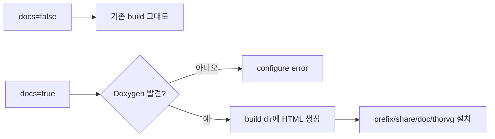

# #2075 — Meson으로 API 문서 생성·설치

- **Link:** https://github.com/thorvg/thorvg/issues/2075
- **난이도:** 30/100
- **초심자 추천:** 추천
- **관련 영역:** Meson option, Doxygen, install layout
- **배울 수 있는 것:** optional build target, tool discovery, generated artifact 설치
- **조사 기준:** `main@f989b27892bab31f224f810a54782055eba1e3bc`

## 이슈 요약

Meson에 문서 생성 옵션을 추가하고, 활성화 시 Doxygen을 필수로 찾아 API 문서를 만든 뒤 `$prefix/share/doc/thorvg`에 설치하자는 패키징 기능이다. 요구와 성공 조건이 비교적 명확하다.

## 난이도 산정

| 항목 | 점수 | 근거 |
|---|---:|---|
| 재현·증거 불확실성 (0-20) | 4 | 현재 통합 부재가 분명하고 설치 경로도 이슈에 명시돼 있다. |
| 변경 범위 (0-25) | 8 | Meson option, docs subdir/Doxyfile과 install test 정도다. |
| 구현 복잡도 (0-25) | 7 | Meson `find_program`·custom target의 표준적 조합이다. |
| 교차 영향 위험 (0-20) | 5 | 기본 false라 기존 build 영향은 작지만 release/cross build를 지켜야 한다. |
| 검증 부담 (0-10) | 6 | Doxygen 유무와 install staging 두 경우를 확인해야 한다. |
| **합계** | **30** |  |

- **실현 가능성: 높음.** 생성 대상과 설치 폴더 세부 정책만 합의하면 작은 독립 작업으로 완료 가능하다.

## main 코드 조사

### 확인된 증거

- `meson_options.txt`에는 `doc` 또는 `docs` option이 없다.
- 최상위 `meson.build`는 `inc`, `src`, `tools`, 조건부 `test`만 방문하며 `docs` subdir을 호출하지 않는다.
- 저장소에는 Doxyfile, Doxygen template, docs용 `meson.build`가 없다.
- API 입력 후보는 `inc/thorvg.h`, `src/loaders/lottie/thorvg_lottie.h`, `src/bindings/capi/thorvg_capi.h`로 분명하다.

```meson
# 구현 형태의 예시이며 아직 저장소에 존재하는 코드는 아니다.
option('docs', type: 'boolean', value: false)

if get_option('docs')
  doxygen = find_program('doxygen', required: true)
  subdir('docs')
endif
```

### 아직 확인되지 않은 부분

- 문서 대상을 public C++만으로 할지 C API와 Lottie 확장 API까지 포함할지 이슈 본문은 정하지 않는다.
- 설치 디렉터리에 버전 suffix를 넣을지, HTML 외 산출물을 만들지는 maintainer/packager 결정이다.

## 원인 가설

- **확인됨:** 문제가 되는 코드 결함이 아니라 문서 build target이 아직 정의되지 않은 상태다.
- **가설:** source list를 수동 열거하기보다 public header 디렉터리를 Doxygen input으로 지정하면 새 API header가 추가될 때 누락 위험이 낮다.



## 수정 방향과 실현 가능성

1. option 이름을 `docs` 또는 이슈가 말한 `doc` 중 프로젝트 convention에 맞춰 확정한다.
2. Doxyfile template에서 project version, input, output을 build dir 기준으로 치환한다.
3. `custom_target()` 또는 `run_target()` 중 install과 dependency 추적에 맞는 방식을 선택한다. install 대상은 생성된 HTML tree다.
4. `docs=false`, `docs=true+doxygen 없음`, `docs=true+doxygen 있음` 세 configure/build 경우를 검사한다.
5. `meson install --destdir <stage>` 결과가 `<stage>/<prefix>/share/doc/thorvg`에만 생성되는지 검증한다.

## 위험과 검증

- generated file을 source tree에 쓰지 말고 build tree에만 생성한다.
- 기본 option은 false로 두어 cross build와 배포 tarball이 Doxygen에 의존하지 않게 한다.
- Doxygen warning을 모두 error로 취급할지는 별도 정책으로 두는 편이 초기 도입 위험이 낮다.

## 참고 자료

- `meson_options.txt` — 기존 build option 형식
- `meson.build` — subdir 구성과 project version
- `inc/meson.build` — public header 설치 선례
- `inc/thorvg.h` — C++ API 문서 입력
- `src/bindings/capi/thorvg_capi.h` — C API 문서 입력 후보
- `src/loaders/lottie/thorvg_lottie.h` — Lottie 확장 API 입력 후보
