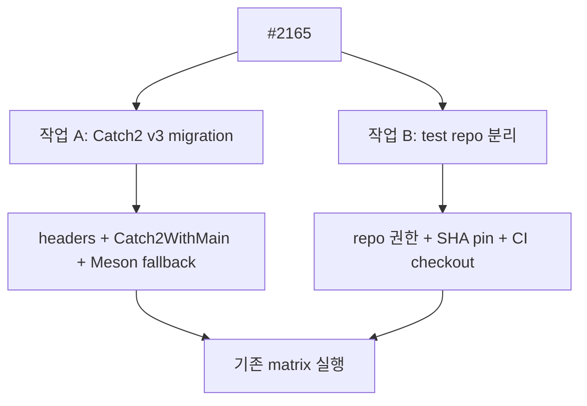

# #2165 — Catch2 업그레이드와 테스트 저장소 분리

- **Link:** https://github.com/thorvg/thorvg/issues/2165
- **난이도:** 74/100
- **초심자 추천:** 조건부(Catch2 v3 migration만 분리할 때)
- **관련 영역:** test framework, Meson dependency, CI·repository policy
- **배울 수 있는 것:** major-version migration, dependency 공급, test/CI version pinning
- **조사 기준:** `main@f989b27892bab31f224f810a54782055eba1e3bc`

## 이슈 요약

내장 Catch2 v2를 v3으로 올리는 일과, test source를 별도 저장소로 옮겨 CI에 연결하는 일을 한 이슈에 묶었다. 전자는 로컬 migration이고 후자는 repository 운영·권한·version synchronization 작업이므로 분리해야 실현 가능성이 높다.

## 난이도 산정

| 항목 | 점수 | 근거 |
|---|---:|---|
| 재현·증거 불확실성 (0-20) | 9 | 현재 v2 사용은 명확하나 v3 공급 정책과 별도 repo 계약이 미정이다. |
| 변경 범위 (0-25) | 22 | 모든 test include/main, Meson, 여러 CI와 외부 repo까지 포함한다. |
| 구현 복잡도 (0-25) | 18 | v3 link target/main 전환과 offline dependency 전략이 필요하다. |
| 교차 영향 위험 (0-20) | 17 | optional backend test와 source/version pin 불일치로 CI 전체가 깨질 수 있다. |
| 검증 부담 (0-10) | 8 | Linux/macOS/Windows, GL/WG on/off matrix를 실행해야 한다. |
| **합계** | **74** |  |

- **실현 가능성: 중간.** v3 migration은 충분히 가능하지만 별도 저장소 이전까지 한 번에 완료하는 범위의 실현 가능성은 낮다.

## main 코드 조사

### 확인된 증거

- `test/catch.hpp` 첫머리는 **Catch v2.13.10**이라고 명시한다. 이슈 본문의 `v0.2.13.10`은 현재 파일 기준 오기다.
- 모든 test translation unit이 `#include "catch.hpp"`를 사용한다.
- `test/testMain.cpp`가 `CATCH_CONFIG_MAIN`을 정의해 single-header main을 만든다.
- `test/meson.build`는 Catch dependency를 찾거나 link하지 않고 한 executable에 test source를 모은다.
- GL/WG test source는 optional dependency 발견 여부에 따라 조건부로 들어간다.

```cpp
// test/testMain.cpp — v2 single-header 방식
#define CATCH_CONFIG_MAIN
#include "catch.hpp"
```

### 아직 확인되지 않은 부분

- v3을 system package만 허용할지 vendored/fallback으로 제공할지 정책이 없다.
- 별도 test repository의 URL, owner, branch/tag pinning, release 호환 범위가 정의되지 않았다.
- 이 조사에서는 외부 release 페이지를 다시 확인하지 않았으므로 이슈에 적힌 “latest” 버전은 그대로 최신이라고 단정하지 않는다.

## 원인 가설

- **확인됨:** v2 single-header 구조에 고정돼 있어 v3 package/header/link target으로 기계적 파일 교체만 할 수 없다.
- **강한 가설:** assertion macro 대부분은 유지되므로 migration의 핵심은 include/main/dependency이며 test 본문 수정량은 상대적으로 작을 가능성이 높다.
- **운영 가설:** test repo 분리는 core commit과 test commit의 원자성이 사라져, SHA pin 또는 같은 release tag 정책 없이는 재현성이 낮아진다.



## 수정 방향과 실현 가능성

1. 먼저 별도 하위 이슈로 v3 migration만 떼고 system dependency와 offline fallback 정책을 정한다.
2. v3 header include와 `Catch2::Catch2WithMain`에 맞춰 `testMain.cpp`의 역할을 제거/변경한다.
3. CPU-only부터 GL/WG optional test까지 기존 Meson 조건을 그대로 보존한다.
4. package 미설치·network 없는 build에서 fallback이 동작하는지 확인한다.
5. repository 분리는 별도 RFC로 두고 core↔test SHA pin, release tag, contributor workflow, bisect 방법을 먼저 설계한다.

## 위험과 검증

- v3을 무조건 system dependency로 만들면 distro와 embedded/offline build가 실패할 수 있다.
- test repo 이동은 GitHub write와 운영 권한이 필요한 후속 작업이며, 이번 로컬 분석의 실행 범위가 아니다.
- Catch CLI option `--success`가 v3에서도 같은 의미로 허용되는지 migration build에서 확인해야 한다.

## 참고 자료

- 이슈 본문에 포함된 release 페이지: https://github.com/catchorg/catch2/releases
- `test/catch.hpp` — vendored Catch v2.13.10
- `test/testMain.cpp` — v2 main 생성
- `test/meson.build` — test executable 및 optional GL/WG 구성
- `.github/workflows/` — 플랫폼별 build/test 연결 검토 대상
