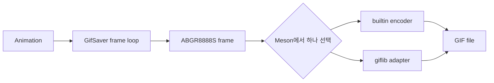

# #2166 — giflib 기반 external GIF saver

- **Link:** https://github.com/thorvg/thorvg/issues/2166
- **난이도:** 67/100
- **초심자 추천:** 조건부
- **관련 영역:** Saver task, giflib C API, Meson optional dependency, palette/animation metadata
- **배울 수 있는 것:** 외부 C library 연동, backend 선택, resource cleanup, GIF frame semantics
- **조사 기준:** `main@f989b27892bab31f224f810a54782055eba1e3bc`

## 이슈 요약

현재 소스에 포함된 GIF encoder 외에 시스템 giflib에 링크하는 saver 구현을 추가하자는 요청이다. 프레임을 RGBA로 렌더하는 부분은 기존 코드가 담당하지만, palette·투명 index·delay·loop·disposal을 giflib 형식으로 옮겨야 한다.

## 난이도 산정

| 항목 | 점수 | 근거 |
|---|---:|---|
| 재현·증거 불확실성 (0-20) | 10 | 목표는 명확하지만 builtin/external 선택 및 fallback 정책은 정해지지 않았다. |
| 변경 범위 (0-25) | 16 | Meson, saver factory/source 선택, encoder와 tests를 수정한다. |
| 구현 복잡도 (0-25) | 18 | palette, transparency, loop/delay와 오류 cleanup을 giflib API로 구현해야 한다. |
| 교차 영향 위험 (0-20) | 15 | builtin 구성, optional dependency, 비동기 saver 수명을 보존해야 한다. |
| 검증 부담 (0-10) | 8 | giflib 유무·버전과 animated GIF metadata/visual 비교가 필요하다. |
| **합계** | **67** |  |

- **실현 가능성: 중간.** 외부 dependency 선례는 있지만 encoder 결과의 동등성과 선택 정책을 정해야 한다.

## main 코드 조사

### 확인된 증거

- `src/savers/meson.build`는 `gif_saver`일 때 오직 `src/savers/gif/`만 포함한다. external saver 경로와 dependency 탐색은 없다.
- `GifSaver::run()`은 `SwCanvas`에 모든 frame을 `ABGR8888S`로 렌더하고 `gifBegin` → `gifWriteFrame` → `gifEnd`를 직접 호출한다.
- builtin `tvgGifEncoder.cpp`가 palette 생성, delta/threshold, LZW, loop extension과 파일 소유권을 모두 가진다.
- PNG/JPG/WebP loader에는 `dependency(..., required: false)` 후 external을 선택하고 없으면 builtin으로 fallback하는 Meson 선례가 있다.

```cpp
// tvgGifSaver.cpp — frame loop와 encoder API가 직접 결합되어 있다.
gifBegin(&writer, path, w, h, delay);
for (...) {
    canvas->draw(true);
    gifWriteFrame(&writer, reinterpret_cast<uint8_t*>(buffer), w, h,
                  delay, transparent);
}
gifEnd(&writer);
```

### 아직 확인되지 않은 부분

- target giflib 최소 버전과 package dependency name을 이 로컬 조사에서 실행 확인하지 않았다.
- builtin과 giflib 출력이 byte-identical할 필요가 있는지, 시각·metadata 동등성이면 되는지 정해지지 않았다.
- giflib가 요구하는 palette quantization 품질/alpha 처리 정책을 이슈가 지정하지 않는다.

## 원인 가설

- **확인됨:** saver의 frame producer는 재사용 가능하지만 encoder 호출이 concrete builtin 타입에 묶여 있다.
- **가설:** `GifEncoder` 소형 interface를 두기보다 build 시 같은 adapter 함수(`begin/write/end`) 구현 하나만 선택하면 ThorVG의 작은 binary 정책에 더 잘 맞을 수 있다.
- **가설:** external loader와 같은 “external 발견 시 선택, 없으면 builtin fallback”이 가장 일관되지만, packager가 강제로 external을 요구할 방법도 필요할 수 있다.



## 수정 방향과 실현 가능성

1. external 우선/fallback/강제 실패 정책과 option 이름을 합의한다.
2. `src/savers/external_gif/meson.build`에서 giflib를 optional 탐색하고 builtin과 두 구현이 동시에 link되지 않게 한다.
3. 기존 frame loop를 유지하면서 encoder-specific state와 `begin/write/end` adapter만 분리한다.
4. RGBA→indexed palette, transparent index, Graphics Control Extension(delay/disposal), NETSCAPE loop를 giflib 호출로 매핑한다.
5. 중간 frame 실패와 close 실패에서도 giflib handle, color map, output file, ThorVG buffer가 정확히 한 번 해제되는지 검사한다.

## 위험과 검증

- GIF는 full alpha가 없으므로 builtin과 external의 투명 threshold가 다르면 가장자리 픽셀이 달라진다.
- giflib 없는 환경, builtin 강제 구성, static/shared build가 모두 성공해야 한다.
- FPS→1/100초 변환, 무한 loop, 첫/마지막 frame 수를 metadata parser로 확인한다.

## 참고 자료

- 이슈 본문에 포함된 giflib 페이지: https://giflib.sourceforge.net/
- `src/savers/meson.build`, `src/savers/gif/meson.build` — 현재 saver 선택
- `src/savers/gif/tvgGifSaver.cpp` — frame producer와 async task
- `src/savers/gif/tvgGifEncoder.h`, `tvgGifEncoder.cpp` — builtin encoder 계약
- `src/loaders/meson.build`, `src/loaders/external_png/meson.build` — external/fallback 선례
