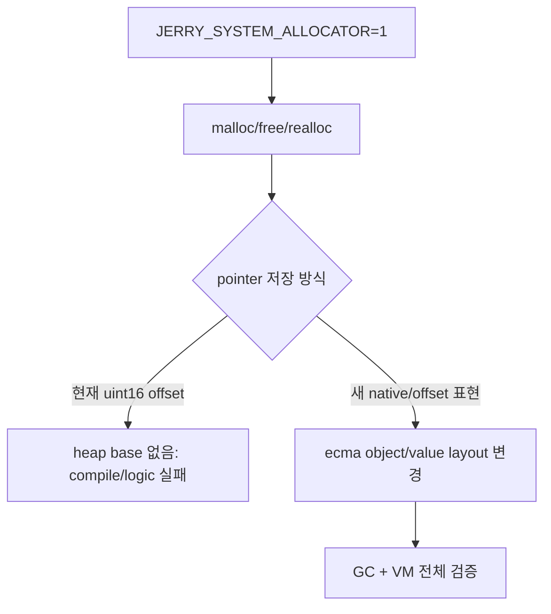

# #2250 — JerryScript system allocator 전환

- **Link:** https://github.com/thorvg/thorvg/issues/2250
- **난이도:** 93/100
- **초심자 추천:** 비추천
- **관련 영역:** vendored JerryScript, VM heap/GC, compressed pointer, Lottie expressions
- **배울 수 있는 것:** allocator와 object representation의 결합, GC accounting, third-party fork 유지보수
- **조사 기준:** `main@f989b27892bab31f224f810a54782055eba1e3bc`

## 이슈 요약

Lottie Expressions용 JerryScript의 고정 heap과 16비트 compressed pointer 체계를 정리하고 system allocator로 전환해 복잡도·binary size를 줄일 수 있는지 검토하는 이슈다. 현재 코드에는 `JERRY_SYSTEM_ALLOCATOR` 분기가 일부 있지만 pointer representation과 일관되게 완성되어 있지 않다.

## 난이도 산정

| 항목 | 점수 | 근거 |
|---|---:|---|
| 재현·증거 불확실성 (0-20) | 16 | compile blocker는 보이지만 그 뒤 VM/runtime 실패와 실제 size 이득은 미측정이다. |
| 변경 범위 (0-25) | 24 | jmem, jcontext, ecma object/value, GC, Meson과 expression tests 전반이다. |
| 구현 복잡도 (0-25) | 24 | allocator만 아니라 16비트 pointer representation을 재설계해야 한다. |
| 교차 영향 위험 (0-20) | 20 | VM memory corruption/OOM/GC 오류와 vendored fork 유지비가 크다. |
| 검증 부담 (0-10) | 9 | expression corpus, sanitizer, OOM, 32/64-bit/WASM과 size 측정이 필요하다. |
| **합계** | **93** |  |

- **실현 가능성: 낮음.** macro를 켜는 소규모 수정이 아니라 VM 메모리 모델 정리 프로젝트에 가깝다.

## main 코드 조사

### 확인된 증거

- vendored config의 `JERRY_SYSTEM_ALLOCATOR` 기본값은 0이다.
- `jmem-heap.cpp`에는 system mode의 `malloc/free/realloc` 분기가 이미 존재하고 allocation accounting/GC pressure도 갱신한다.
- 그러나 `jmem_cpointer_t`는 무조건 `uint16_t`이며 `jmem_compress_pointer()`는 고정 heap 시작 주소에서 offset을 계산한다.
- `JERRY_SYSTEM_ALLOCATOR=1`이면 `jcontext.h`가 `jmem_heap_t`와 `JERRY_HEAP_CONTEXT` 정의를 제외한다. 동시에 `jmem-allocator.cpp`의 compress/decompress 함수는 `JERRY_HEAP_CONTEXT(first)`를 계속 사용한다. 전처리 결과상 직접적인 compile blocker다.
- `JMEM_CP_GET/SET_POINTER`와 pointer-tag macro가 VM 자료구조 전반의 compressed representation을 사용한다.

```cpp
// system mode allocation 자체는 있다.
#else
return malloc(size);
#endif

// 그러나 pointer representation은 고정 heap을 계속 요구한다.
const uintptr_t heap_start = (uintptr_t)&JERRY_HEAP_CONTEXT(first);
uint_ptr -= heap_start;
return (jmem_cpointer_t)uint_ptr;  // uint16_t
```

### 아직 확인되지 않은 부분

- macro=1 이후 드러날 전체 compile error 목록은 실제 build로 수집하지 않았다.
- compressed pointer 제거가 `.text/.data/.bss`, peak RSS와 실행 시간에 주는 효과는 측정하지 않았다.
- ThorVG allocator wrapper를 사용할지 C system allocator를 유지할지 정책이 없다.

## 원인 가설

- **확인됨:** system allocation branch와 pointer encoding branch가 서로 모순되어 option이 완성된 feature가 아니다.
- **강한 가설:** pointer field를 native pointer/32-bit offset으로 바꾸면 `ecma_value_t`와 object layout 크기가 변해 binary뿐 아니라 runtime memory가 증가할 수 있다.
- **가설:** binary size 감소 목표는 fixed-heap allocator code 제거로 얻는 이득과 커진 pointer/object 처리 code의 손실이 상쇄될 수 있어 반드시 link 결과로 검증해야 한다.



## 수정 방향과 실현 가능성

1. 별도 local build 설정으로 macro=1 compile error를 목록화하고 첫 blocker와 연쇄 blocker를 분리한다.
2. allocation API 전환과 compressed pointer 제거를 별도 단계로 설계한다. 후자는 `jmem_cpointer_t` 사용처와 ABI가 아닌 내부 layout 영향을 표로 만든다.
3. native pointer, 32-bit handle table, allocator-managed arena 중 대안을 비교한다. 단순 arbitrary malloc pointer는 16-bit offset에 들어가지 않는다.
4. 최소 expression corpus와 반복 init/eval/cleanup, forced GC, OOM injection harness를 만든다.
5. before/after `.text/.data/.bss`, peak RSS, expression latency를 동일 toolchain에서 측정한 뒤 유지 가치가 있는지 판단한다.

## 위험과 검증

- VM corruption은 즉시 crash하지 않을 수 있어 ASan/UBSan과 장시간 반복 test가 필요하다.
- 32/64-bit, WASM, embedded에서 pointer 크기와 alignment가 다르다.
- vendored 코드를 광범위하게 바꾸면 upstream 동기화가 어려워지므로 patch boundary와 provenance를 문서화해야 한다.

## 참고 자료

- `src/loaders/lottie/jerryscript/jerry-core/include/jerry-config.h` — system allocator option
- `src/loaders/lottie/jerryscript/jerry-core/jmem/jmem-heap.cpp` — allocation/free/realloc 분기
- `src/loaders/lottie/jerryscript/jerry-core/jmem/jmem-allocator.cpp` — pointer 압축
- `src/loaders/lottie/jerryscript/jerry-core/jmem/jmem.h` — 16-bit type과 CP macro
- `src/loaders/lottie/jerryscript/jerry-core/jcontext/jcontext.h` — heap context 조건부 layout
- `src/loaders/lottie/jerryscript/meson.build` — vendored VM build entry
