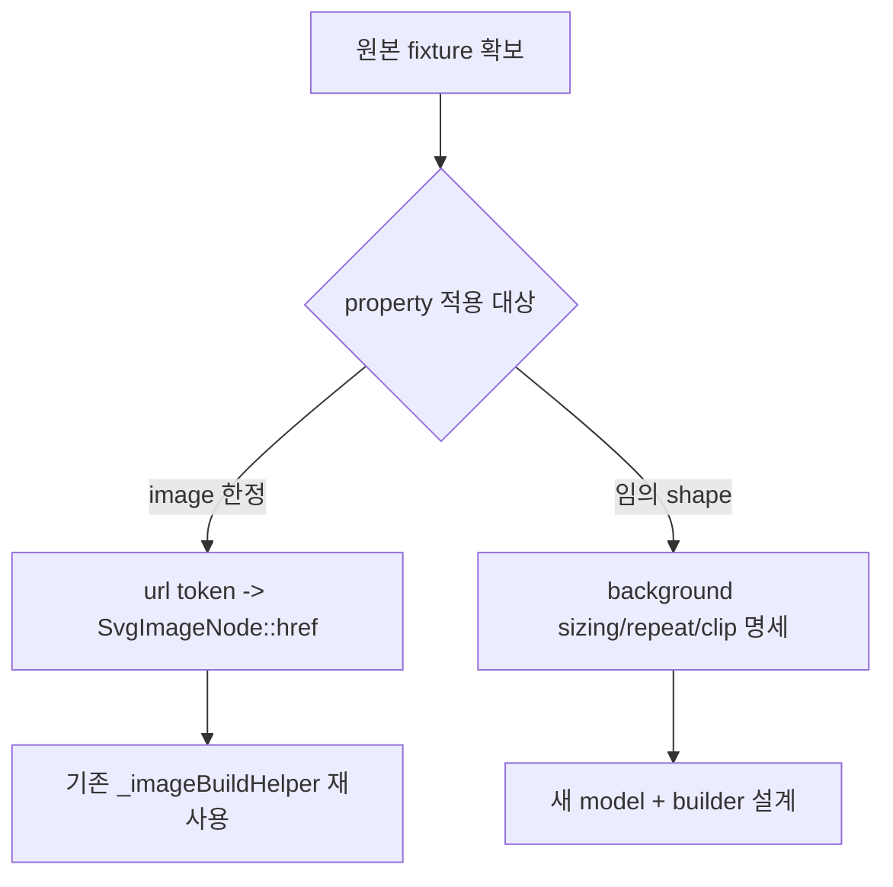

# #2273 — SVG style의 `background-image:url(...)`

- **Link:** https://github.com/thorvg/thorvg/issues/2273
- **난이도:** 77/100
- **초심자 추천:** 비추천(원본 fixture 확보 후 제한된 parser test는 조건부)
- **관련 영역:** SVG/CSS style parser, image node/model, data URI와 상대 경로
- **배울 수 있는 것:** CSS token parsing, embedded image, layout/clip 의미, 입력 보안
- **조사 기준:** `main@f989b27892bab31f224f810a54782055eba1e3bc`

## 이슈 요약

Godot가 만든 SVG에서 `style="background-image:url(...)"` 형태로 포함된 이미지를 ThorVG가 표시하지 못한다는 요청이다. 본문이 외부 discussion에 의존하고 실제 SVG fixture가 로컬에 없어서, `<image>`에 대한 제한적 alias인지 임의 shape에 CSS background layout을 구현해야 하는지 먼저 밝혀야 한다.

## 난이도 산정

| 항목 | 점수 | 근거 |
|---|---:|---|
| 재현·증거 불확실성 (0-20) | 19 | 원본 SVG·기대 출력과 적용 element/size/repeat 규칙이 로컬 이슈 본문에 없다. |
| 변경 범위 (0-25) | 17 | 제한형은 parser/model, 일반형은 layout/paint/clip까지 커진다. |
| 구현 복잡도 (0-25) | 18 | robust `url()` token과 image sizing/placement 의미를 처리해야 한다. |
| 교차 영향 위험 (0-20) | 15 | 외부 경로, recursive SVG, data lifetime과 CSS cascade에 영향을 준다. |
| 검증 부담 (0-10) | 8 | URL 문법·encoding·path와 visual test가 필요하다. |
| **합계** | **77** |  |

- **실현 가능성: 낮음.** 요구 fixture와 지원 범위를 확보한 뒤 `<image>` 한정으로 줄이면 중간 수준으로 내려갈 수 있다.

## main 코드 조사

### 확인된 증거

- `styleTags[]`에는 fill/stroke/filter 등만 있고 `background-image`가 없다. `_parseStyleAttr()`은 목록에 없으면 `false`를 반환한다.
- `_attrParseImageNode()`는 `<image>`의 `href`/`xlink:href`를 `SvgImageNode::href`에 저장하지만 style property를 href로 연결하지 않는다.
- `_imageBuildHelper()`에는 이미 `data:image/...;base64`, UTF-8 SVG data, `file://`, 상대 경로를 `Picture`로 여는 구현이 있다.
- embedded `.svg` file은 recursive loading 위험 때문에 현재 명시적으로 차단된다.

```cpp
// 기존 image node가 인식하는 직접 경로
if (STR_AS(key, "href") || STR_AS(key, "xlink:href"))
    image->href = _idFromHref(value);

// styleTags[]에는 background-image handler가 없어 여기로 오지 않는다.
STYLE_DEF(fill, Fill, SvgStyleFlags::Fill),
STYLE_DEF(filter, Filter, SvgStyleFlags::Filter),
```

### 아직 확인되지 않은 부분

- local `issues.json`에는 외부 Godot discussion URL만 있고 문제 SVG 내용은 없다. 이번 작업은 새로 크롤링하지 않았으므로 fixture를 추측하지 않았다.
- `background-image`가 `<image>` element에만 쓰였는지, `rect/g/use` 등에 쓰였는지 알 수 없다.
- size, repeat, position, clipping과 여러 background layer를 어느 수준까지 기대하는지 알 수 없다.

## 원인 가설

- **확인됨:** parser가 property를 보존하지 않으므로 현재 렌더에 도달하지 않는다.
- **조건부 가설 A:** Godot가 `<image style="background-image:url(data:...)">`처럼 제한된 형태를 만든다면 URL만 추출해 기존 `href` builder를 재사용할 수 있다.
- **조건부 가설 B:** 임의 shape background라면 `<image href>` alias가 아니며 size/repeat/position/clip을 가진 새 paint/layout 기능이 필요하다.



## 수정 방향과 실현 가능성

1. 원본 SVG와 expected PNG를 issue fixture로 먼저 확보하고 적용 element·bounds·URI 종류를 기록한다.
2. `<image>` 한정이면 CSS `url(...)` tokenizer를 추가해 quote, whitespace, `)` escape, malformed input을 처리하고 기존 href 경로에 전달한다.
3. 임의 shape이면 구현 전에 지원할 sizing/repeat/position과 cascade 범위를 설계 문서로 합의한다.
4. base64, percent encoding, relative/file URI, invalid mime와 missing resource test를 추가한다.
5. recursive SVG와 path traversal 정책을 기존 `_imageBuildHelper()` 제한과 함께 검증한다.

## 위험과 검증

- `url(`부터 마지막 `)`까지 단순 substring하는 구현은 quote/escape/malformed CSS에서 깨진다.
- 외부 파일 접근 범위를 넓히면 caller의 resource resolver와 경로 보안 계약을 따라야 한다.
- fixture 없이 일반 CSS background를 구현하면 비표준 동작을 고착할 위험이 가장 크다.

## 참고 자료

- 이슈 본문이 가리키는 원 보고: https://github.com/godotengine/godot/pull/91901#issuecomment-2107298904
- `src/loaders/svg/tvgSvgLoader.cpp` — `styleTags[]`, `_attrParseImageNode()`
- `src/loaders/svg/tvgSvgCommon.h` — `SvgImageNode`, `SvgStyleProperty`
- `src/loaders/svg/tvgSvgBuilder.cpp` — `_imageBuildHelper()`, data URI/path 처리
- `src/loaders/svg/tvgSvgUtil.cpp` — URL decode helper
