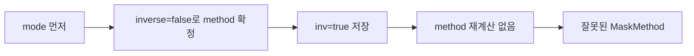

# #2402 — Lottie inverse mask 동작 불일치

- **Link:** https://github.com/thorvg/thorvg/issues/2402
- **난이도:** 43/100
- **초심자 추천:** 추천(마스크 수학 리뷰 필요)
- **관련 영역:** Lottie JSON parser, `MaskMethod`, mask builder/compositor
- **배울 수 있는 것:** JSON object key-order 독립성, enum 초기화, alpha mask chain
- **조사 기준:** `main@f989b27892bab31f224f810a54782055eba1e3bc`

## 이슈 요약

inverse mask가 After Effects, Skia, lottie-web과 다른 결과를 만드는 compliance 이슈다. 현재 parser에는 JSON object의 `mode`와 `inv` 키 순서에 따라 다른 `MaskMethod`가 저장되는 명확한 결함이 있다. 이 결함이 첨부 `invMask.json`의 모든 시각 차이를 설명하는지는 fixture 실행으로 별도 확인해야 한다.

## 난이도 산정

| 항목 | 점수 | 근거 |
|---|---:|---|
| 재현·증거 불확실성 (0-20) | 7 | 원인 후보는 강하지만 첨부 fixture와 reference image를 로컬에서 다시 실행하지 않았다. |
| 변경 범위 (0-25) | 8 | parser/model 초기화와 focused test가 중심이다. |
| 구현 복잡도 (0-25) | 10 | raw mode와 inverse를 분리 저장한 뒤 한 번 계산하면 된다. |
| 교차 영향 위험 (0-20) | 10 | 모든 mask mode 조합에 영향은 있지만 public API/ABI는 바뀌지 않는다. |
| 검증 부담 (0-10) | 8 | key-order test와 ADD/SUBTRACT/INTERSECT/DIFFERENCE golden이 필요하다. |
| **합계** | **43** |  |

- **실현 가능성: 높음.** parser order bug는 작고 독립적으로 고칠 수 있다. reference와 계속 다르면 builder 합성은 후속 조사로 분리한다.

## main 코드 조사

### 확인된 증거

- `parseMask()`는 JSON key를 입력 순서로 처리한다.
- `inv`를 만나면 `mask->inverse`만 바꾸고, `mode`를 만난 순간 현재 inverse 값으로 `mask->method`를 즉시 계산한다.
- 따라서 `{"mode":"a","inv":true}`는 `mode` 처리 시 기본 `false`를 사용하며, 뒤의 `inv`가 method를 재계산하지 않는다.
- `LottieMask::method`에는 declaration initializer가 없다. mode가 없는 malformed/partial object에서는 별도의 미초기화 위험이 있다.
- `LottieBuilder::updateMasks()`는 이미 계산된 `mask->method`를 신뢰해 first-mask shortcut과 chain composition을 선택한다.

```cpp
// 현재 구현: object key order가 결과에 영향을 준다.
if (KEY_AS("inv")) mask->inverse = getBool();
else if (KEY_AS("mode"))
    mask->method = getMaskMethod(mask->inverse);
```

### 아직 확인되지 않은 부분

- 이슈 첨부 `invMask.json`은 local test resources에 없고 이번 조사에서 새로 내려받지 않았다.
- key-order 수정 후에도 After Effects reference와 차이가 남는지, first-mask clip shortcut 또는 chain 순서가 추가 원인인지는 확인되지 않았다.

## 원인 가설

- **확인된 parser 결함:** 의미상 순서가 없는 JSON object가 key order에 따라 다른 model을 만든다.
- **강한 가설:** 첨부 파일에서 `mode`가 `inv`보다 앞선 mask는 inverse가 빠져 이슈 결과의 적어도 일부를 설명한다.
- **후속 가설:** parser를 고친 뒤 남는 차이는 `updateMasks()`의 first mask `Alpha/InvAlpha` 변환 또는 연속 mask chain 조건일 수 있다.



## 수정 방향과 실현 가능성

1. `LottieMask::method`를 `MaskMethod::None`으로 명시 초기화한다.
2. parse 중에는 raw mode 문자와 inverse bool을 각각 저장하고 object 종료 후 `MaskMethod`를 한 번만 결정한다.
3. 동일 mask의 `mode`/`inv` 순서만 바꾼 두 최소 JSON이 같은 model/render 결과인지 test한다.
4. ADD/SUBTRACT/INTERSECT/DIFFERENCE × inverse true/false mapping을 table-driven unit test로 고정한다.
5. 첨부 fixture를 확보해 reference golden과 비교하고, 남는 경우에만 `updateMasks()`를 조사한다.

| 단계 | SW | GL | WG |
|---|---|---|---|
| JSON→`MaskMethod` | 공통 parser이므로 동일 | 동일 | 동일 |
| mask 실행 | CPU RLE/compositor | GPU clip/compose | render target/pipeline compose |
| 1차 검증 | parser key-order test가 backend보다 우선 | parser 수정 후 parity | parser 수정 후 parity |

## 위험과 검증

- `getMaskMethod()`가 현재 parser stream에서 mode string을 직접 소비하므로 raw mode 변환 helper를 분리해야 한다.
- 첫 mask 하나인 경우 clip optimization을 타므로 multi-mask test만으로는 부족하다.
- malformed mode/누락 mode가 안전하게 `None`이 되는지도 확인한다.

## 참고 자료

- `src/loaders/lottie/tvgLottieParser.cpp` — `getMaskMethod()`, `parseMask()`
- `src/loaders/lottie/tvgLottieModel.h` — `LottieMask`
- `src/loaders/lottie/tvgLottieBuilder.cpp` — `updateMasks()`
- `src/renderer/tvgRender.h` — `MaskMethod`
- `test/testLottie.cpp`, `test/resources/` — regression fixture 위치
