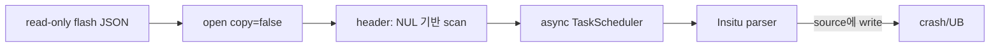

# #2647 — Lottie read-only 데이터의 무복사 로드

- **Link:** https://github.com/thorvg/thorvg/issues/2647
- **난이도:** 84/100
- **초심자 추천:** 비추천(read-only reproducer 작성은 조건부)
- **관련 영역:** borrowed buffer, RapidJSON in-situ parser, async lifetime, allocator hook
- **배울 수 있는 것:** const-correctness, zero-copy 계약, size-bounded parsing, ownership
- **조사 기준:** `main@f989b27892bab31f224f810a54782055eba1e3bc`

## 이슈 요약

임베디드 flash의 read-only Lottie JSON을 `copy=false`로 안전하게 읽고 전체 복사를 피우며, 장기적으로 LVGL allocator와 메모리 관리를 통합하고 싶다는 요청이다. 현재 main에는 `tvg::malloc/calloc/realloc/free` wrapper가 생겼지만 custom callback은 없고, Lottie의 no-copy parser는 입력을 수정하므로 read-only memory와 직접 충돌한다.

## 난이도 산정

| 항목 | 점수 | 근거 |
|---|---:|---|
| 재현·증거 불확실성 (0-20) | 11 | write-to-readonly 원인은 강하지만 원 제보의 crash stack과 OOM 비중은 미확인이다. |
| 변경 범위 (0-25) | 20 | parser stream, header scan, public lifetime docs와 allocator 논의가 포함된다. |
| 구현 복잡도 (0-25) | 24 | 진짜 zero-copy read-only parsing과 escaped string lifetime을 안전하게 처리해야 한다. |
| 교차 영향 위험 (0-20) | 20 | async UAF, const memory write, allocation pairing, C/C++ API 계약 위험이 크다. |
| 검증 부담 (0-10) | 9 | protected page, non-NUL input, thread on/off, malformed JSON과 sanitizer가 필요하다. |
| **합계** | **84** |  |

- **실현 가능성: 낮음.** 다만 allocator hook을 분리하고 “read-only no-copy Lottie parser”만 범위로 잡으면 중간 수준으로 구현 가능하다.

## main 코드 조사

### 확인된 증거

- `LottieLoader::open(data, size, ..., copy=true)`는 `size+1`을 복사하고 NUL을 붙인다. `copy=false`는 caller pointer를 그대로 저장한다.
- `LookaheadParserHandler`는 `InsituStringStream`과 `kParseInsituFlag`를 사용하고 생성자에서 `const char*`를 C-style cast로 `char*`로 바꾼다. in-situ parsing은 source string에 쓰므로 read-only flash와 양립하지 않는다.
- multi-thread `header()`는 `while (*p != '\0')`, `strstr()` 등 NUL 기반 scan을 하며 전달받은 `size`로 경계를 제한하지 않는다. public API도 `copy=false`인 non-binary data에 NUL terminator를 요구한다.
- `read()`는 `TaskScheduler::request(this)`로 parsing을 비동기로 실행할 수 있다. borrowed buffer는 최소한 `prepare()`가 끝날 때까지 살아 있어야 한다.
- `release()`가 copy-owned content를 parse/build 직후 해제하므로, 설계상 완성된 composition은 source 전체를 계속 보유하지 않는 방향이다.
- `Loader::allowCache()`는 Lottie cache를 금지한다. 따라서 일반 loader의 pointer-key cache는 현재 Lottie 공유 해결책이 아니다.
- `src/common/tvgAllocator.h`에 wrapper는 있지만 모두 `std::malloc` 계열을 직접 부르며 user callback 등록 API는 없다.

```cpp
// copy=false에서도 const를 버리고 in-situ parser에 넘긴다.
#define PARSE_FLAGS (kParseDefaultFlags | kParseInsituFlag)
InsituStringStream iss;
LookaheadParserHandler(const char* str) : iss((char*)str) {}
```

### 아직 확인되지 않은 부분

- 실제 crash가 in-situ write, NUL 누락, async lifetime 종료 중 어느 하나인지 stack trace가 없다.
- RapidJSON의 non-in-situ SAX callback에서 escape된 string의 임시 lifetime을 현재 model parser가 모두 안전하게 소비하는지 추가 write-set/lifetime 조사가 필요하다.
- 전체 OOM에서 JSON copy가 차지하는 비중과 custom allocator의 요구 ABI는 측정되지 않았다.

## 원인 가설

1. **확인된 결함:** `copy=false`가 “복사하지 않음”뿐 아니라 사실상 “수정 가능한 NUL-terminated buffer를 빌림”을 요구한다. API의 `const char*` 및 read-only 사용 기대와 충돌한다.
2. **강한 가설:** flash/`mprotect(PROT_READ)` buffer crash는 `kParseInsituFlag`의 write가 직접 원인이다.
3. **별도 강한 위험:** size 안에 NUL이 없으면 `header()`가 out-of-bounds read할 수 있다. 현재 문서는 NUL을 요구하지만 안전한 loader는 size를 이용해 실패시킬 수 있어야 한다.
4. **별도 설계:** user allocator는 no-copy parser 수정과 독립적인 전역 ABI/thread-safety 이슈이므로 같은 patch에서 다루면 안 된다.



## 수정 방향과 실현 가능성

1. page-protected, NUL-terminated const JSON으로 thread 0/1+ 양쪽 crash를 재현하고 sanitizer stack을 확보한다.
2. `header()`를 `size`-bounded scan으로 바꾸며 모든 `strstr/strncmp` 전에 remaining length를 검사한다.
3. `copy=false`에는 non-in-situ `StringStream`/Reader path를 두고, parser callback이 escape string을 model에 넘길 때 필요한 작은 문자열만 소유한다.
4. mutable no-copy fast path를 유지할 가치가 있으면 public option을 “borrowed mutable”과 “borrowed readonly”로 명시적으로 분리한다. 단일 bool 의미를 몰래 바꾸지 않는다.
5. allocator callback은 별도 이슈로 떼어 C/C++ ABI, 전역 초기화 시점, thread safety, new/delete까지의 범위를 설계한다.

```text
copy=true             : 전체 JSON 복사 + in-situ      (안전, 큰 peak memory)
copy=false mutable    : caller buffer + in-situ      (현재 암묵 계약)
copy=false read-only  : caller buffer + non-in-situ  (필요한 새 경로)
```

## 위험과 검증

- `load()` 성공 직후 caller가 buffer를 해제하면 async parse에서 UAF가 된다. 정확한 release 가능 시점을 문서화하거나 sync API를 요구해야 한다.
- escaped/unicode string을 source pointer로만 보존하면 callback 이후 dangling pointer가 될 수 있다.
- C API 문서의 data release 경고 문구도 copy 의미와 일관되는지 함께 교정해야 한다.
- 반복 load/unload, malformed/non-NUL JSON, WASM/embedded, ASan/UBSan과 peak memory를 검증한다.

## 참고 자료

- `inc/thorvg.h` — `Picture::load(data, size, ..., copy)` 계약
- `src/bindings/capi/thorvg_capi.h` — `tvg_picture_load_data()` 계약
- `src/loaders/lottie/tvgLottieLoader.cpp` — copy, header, async read, release
- `src/loaders/lottie/tvgLottieParserHandler.h` — RapidJSON in-situ stream
- `src/renderer/tvgLoader.h`, `tvgLoaderMgr.cpp` — cache/ref lifetime
- `src/common/tvgAllocator.h` — 현재 allocator wrapper
