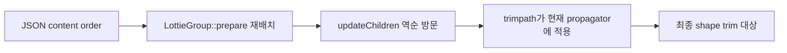

# #2693 — Lottie trim path의 shape 적용 순서

- **Link:** https://github.com/thorvg/thorvg/issues/2693
- **난이도:** 66/100
- **초심자 추천:** 조건부
- **관련 영역:** Lottie content stack, group prepare, reverse builder traversal, trim propagator
- **배울 수 있는 것:** ordering semantics, modifier scope, model→builder 데이터 흐름
- **조사 기준:** `main@f989b27892bab31f224f810a54782055eba1e3bc`

## 이슈 요약

같은 Lottie group의 여러 shape에 trim path가 잘못된 순서로 적용되는 문제다. 이슈가 지목한 `LottieGroup::prepare()`의 재배치 코드는 현재 main에도 남아 있으며, mergeable child가 3개 이상일 때 주석의 “reverse”와 다른 결과를 만든다.

## 난이도 산정

| 항목 | 점수 | 근거 |
|---|---:|---|
| 재현·증거 불확실성 (0-20) | 10 | 의심 코드가 강하지만 첨부 `order.json`을 로컬에서 다시 렌더하지 않았다. |
| 변경 범위 (0-25) | 14 | Lottie model prepare, builder traversal과 focused fixtures가 중심이다. |
| 구현 복잡도 (0-25) | 18 | modifier scope와 이미 역순인 visitor를 함께 해석해야 한다. |
| 교차 영향 위험 (0-20) | 16 | fill/stroke/repeater/rounded corner 및 merge/fragment 최적화 순서를 깨뜨릴 수 있다. |
| 검증 부담 (0-10) | 8 | 2/3/4 shape와 nested/modifier 조합의 golden이 필요하다. |
| **합계** | **66** |  |

- **실현 가능성: 중간.** 잘못될 가능성이 높은 위치는 좁지만 정답 reorder를 fixture와 traversal trace로 먼저 증명해야 한다.

## main 코드 조사

### 확인된 증거

- `LottieGroup::prepare()`는 trim path 존재를 찾으면 mergeable 인접 child를 반복 swap한다.
- 모든 child가 mergeable일 때 이 loop는 완전 reverse가 아니라 첫 항목을 끝으로 보내는 left rotation이 된다.
- `LottieBuilder::updateChildren()`은 `children.end()-1`부터 시작해 역방향으로 방문한다.
- `updateTrimpath()`는 그 시점의 shared `ctx->propagator`에 trim range를 적용하고 merging state를 끊는다. 따라서 child order가 modifier 적용 대상을 결정한다.
- local test resources에는 이슈 첨부 `order.json` 파일명이 발견되지 않았다.

```cpp
// prepare(): 인접 swap 후 i++ 하므로 A B C D -> B C D A
children[i] = child2;
children[i + 1] = child;
i++;

// builder(): 저장 순서의 뒤에서 앞으로 방문
for (auto child = ctx->begin; child >= parent->children.data; --child) {
    // update shape/fill/stroke/trimpath...
}
```

### 현재 알고리즘의 작은 예

| mergeable children | prepare 전 | 현재 prepare 후 | 완전 reverse라면 | builder 실제 방문 |
|---:|---|---|---|---|
| 2 | A B | B A | B A | A B |
| 3 | A B C | B C A | C B A | A C B |
| 4 | A B C D | B C D A | D C B A | A D C B |

이 표는 코드 loop를 기계적으로 전개한 결과다. 다만 “완전 reverse”가 곧 올바른 수정이라는 뜻은 아니다. builder가 이미 reverse 방문하므로 Lottie content stack의 정답 순서를 먼저 정의해야 한다.

### 아직 확인되지 않은 부분

- `order.json`의 원래 child 배열과 기대 trim target을 현재 local fixture에서 확인하지 못했다.
- fill/stroke/transform처럼 `mergeable()==false`이거나 특별 취급되는 child가 끼면 swap 결과가 달라진다.
- simultaneous와 individual trim의 기대 scope 차이가 이 코드 하나로 모두 설명되는지는 미확인이다.

## 원인 가설

- **확인된 불일치:** 주석은 drawing order reverse라고 하지만 3개 이상 mergeable child에서 구현은 rotation이다.
- **강한 가설:** 이 rotation과 reverse builder traversal의 조합이 shape 수에 따라 trim propagator의 대상을 바꾸어 이슈를 만든다.
- **주의 가설:** 단순 `std::reverse` 대체는 transform/fill/stroke/modifier scope를 깨뜨릴 수 있으므로 fixture 없는 즉시 수정은 위험하다.



## 수정 방향과 실현 가능성

1. 첨부 `order.json`을 fixture로 확보하고 2/3/4 path + trim만 남긴 최소 JSON으로 축소한다.
2. parse 직후 order, prepare 직후 order, builder 방문 order, trim 적용 시 propagator 내용을 test trace로 기록한다.
3. Lottie content stack에서 trim operator가 영향을 주는 연속 범위를 정의하고, 전체 배열이 아니라 그 범위만 안정적으로 재배치할지 visitor 규칙을 바꿀지 비교한다.
4. simultaneous/individual trim, fill/stroke/transform이 사이에 있는 경우, nested group을 table-driven fixture로 만든다.
5. repeater, rounded corner, offset path와 `reqFragment/allowMerge` 최적화를 회귀 검사한다.

## backend 관점

이 후보는 SW/GL/WG가 갈라지기 전 Lottie model/builder에서 발생한다. 동일한 잘못된 `Shape::trimpath()` 상태가 모든 backend에 전달될 가능성이 높으므로 model traversal test가 1차이며, 수정 후에 backend별 golden parity를 확인한다.

## 위험과 검증

- 배열 전체 reverse나 무조건 swap 제거는 다른 modifier ordering을 바꿀 수 있다.
- 포인터 비교로 역순 loop하는 `updateChildren()`과 nested context resume 동작도 함께 추적해야 한다.
- 결과 이미지뿐 아니라 어떤 shape에 어떤 trim 값이 들어갔는지 구조 test를 추가하면 원인 회귀를 더 정확히 잡을 수 있다.

## 참고 자료

- `src/loaders/lottie/tvgLottieModel.cpp` — `LottieGroup::prepare()`
- `src/loaders/lottie/tvgLottieModel.h` — group child와 mergeable 상태
- `src/loaders/lottie/tvgLottieBuilder.cpp` — `updateChildren()`, `updateTrimpath()`
- `test/testLottie.cpp`, `test/resources/` — 새 fixture 위치
