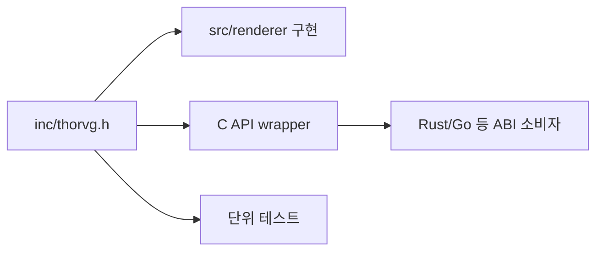

# #2753 api: Remove property getter APIs

- Link: https://github.com/thorvg/thorvg/issues/2753
- 난이도: 86/100
- 실현 가능성: 낮음
- 초심자 추천: 비추천
- 관련 영역: 공개 C++ API, C API 바인딩, ABI 호환성, 테스트
- 배울 수 있는 것: ThorVG의 fire-and-forget 설계, getter/setter 오버로드, API 폐기 정책, C/C++ 바인딩 동기화

## 이슈 요약

라이브러리 크기를 줄이고 fire-and-forget 모델을 명확히 하기 위해 `Paint`, `Fill`, `Shape`의 속성 getter를 제거하자는 제안이다. 저장된 이슈 토론에는 외부 데이터 모델이 값을 보관한다는 찬성 논리와 `Accessor`처럼 로드된 장면을 조회·편집하는 사용례가 함께 있다. 따라서 함수 몇 개를 지우는 문제가 아니라 제품 정책과 호환성 문제다.

## 난이도 산정

| 항목 | 점수 | 근거 |
|---|---:|---|
| 재현·증거 불확실성 (0-20) | 18 | 결함 재현이 아니라 제거 정책이며 크기 절감 수치와 허용할 호환성 수준이 확정되지 않았다. |
| 변경 범위 (0-25) | 24 | 공개 헤더, 구현, C API, 문서, 테스트와 외부 바인딩에 걸친다. |
| 구현 복잡도 (0-25) | 18 | 삭제 자체보다 deprecated/compact-build 대안을 일관되게 설계하는 일이 어렵다. |
| 교차 영향 위험 (0-20) | 20 | 공개 소스·바이너리 호환성과 scene introspection 사용례를 직접 깨뜨릴 수 있다. |
| 검증 부담 (0-10) | 6 | 심볼/ABI 검사, C/C++ 테스트, shared/static 조합이 필요하다. |
| **합계** | **86/100** | 정책 결정 전에는 구현 완료 조건도 고정할 수 없다. |

## main 코드 조사

분석 기준은 로컬 `main`의 `f989b27892bab31f224f810a54782055eba1e3bc`다.

**확인된 증거**

- `inc/thorvg.h`에는 `Paint::opacity()`, `Fill::colorStops()/spread()/transform()`, `LinearGradient::linear()`, `RadialGradient::radial()`와 여러 `Shape` getter가 여전히 공개되어 있다.
- `test/testFill.cpp`와 `test/testShape.cpp`는 getter 반환값을 setter 검증에 직접 사용한다.
- `src/bindings/capi/tvgCapi.cpp`에도 `tvg_shape_get_stroke_width()`처럼 대응 getter가 있다. C++ 선언만 제거하면 API 집합이 불일치한다.
- 이슈의 오래된 명칭인 `composite()`/`fillColor()`는 현재 각각 `mask()`/`fill()` 계열과 일치시켜 다시 분류해야 한다.

```cpp
// inc/thorvg.h: setter와 getter가 overload로 함께 공개된다.
Result strokeWidth(float width) noexcept;
float strokeWidth() const noexcept;
```



## 원인 가설과 확인 방법

- **확정:** 이 이슈는 특정 코드 결함이 아니라 API 축소 제안이다.
- **가설:** getter 심볼과 관련 코드가 binary size에 유의미한 비중을 차지한다. 현재 로컬 문서와 소스에는 전후 측정치가 없어 확인되지 않았다.
- **확인 방법:** 동일 옵션의 shared/static 빌드에서 getter 군별 심볼/section 크기를 비교하고, public 사용처와 `Accessor` 흐름을 먼저 목록화한다.

## 수정 방향 계획

1. 현행 이름을 기준으로 C++, CAPI, 테스트와 내부 사용처의 대응표를 만든다.
2. `즉시 제거`, `deprecated 후 제거`, `compact 빌드에서만 제외` 중 정책을 maintainer가 결정하도록 크기·호환성 자료를 제시한다.
3. compact 옵션이라면 소비자가 서로 다른 헤더/라이브러리를 섞지 못하도록 feature macro와 패키지 metadata를 설계한다.
4. 승인된 API 군 단위로 선언·구현·CAPI·문서·테스트를 함께 변경하고 exported symbol 차이를 검사한다.

## 실현 가능성 판단

기술적으로는 가능하지만 **현재 요구사항만으로는 낮음**이다. 제거 목록과 호환 정책이 결정되지 않았고 성능/크기 이득도 미측정이다. 초심자는 사용처 대응표나 binary-size baseline을 만드는 하위 작업은 맡을 수 있으나 전체 이슈를 독자적으로 닫기 어렵다.

## 위험/검증

- C++ 및 C ABI symbol 변화, header/library 옵션 불일치, `Accessor` 기반 편집 회귀를 검사한다.
- loader/engine 전체 조합보다 우선 API·CAPI 테스트, shared/static link test, symbol diff가 핵심이다.
- 크기 개선을 주장한다면 동일 compiler/옵션의 수치를 이슈에 남겨야 한다.

## 참고 자료

- `inc/thorvg.h`
- `src/renderer/tvgPaint.cpp`, `src/renderer/tvgFill.cpp`, `src/renderer/tvgShape.cpp`
- `src/bindings/capi/thorvg_capi.h`, `src/bindings/capi/tvgCapi.cpp`
- `test/testPaint.cpp`, `test/testFill.cpp`, `test/testShape.cpp`
- `CONTRIBUTING.md`의 API 변경 및 검증 지침
