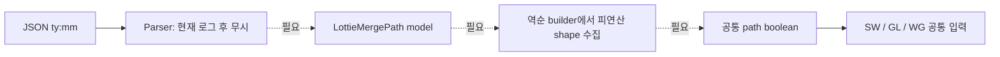

# #2769 Lottie: Support MergePath Feature

- Link: https://github.com/thorvg/thorvg/issues/2769
- 난이도: 92/100
- 실현 가능성: 낮음
- 초심자 추천: 비추천
- 관련 영역: Lottie parser/model/builder, path boolean 연산, 렌더러 공통 경로
- 배울 수 있는 것: Lottie shape 연산자, 역순 빌드, winding/fill rule, 백엔드 독립 설계

## 이슈 요약

Lottie의 `mm`(Merge Paths)을 읽어 Add, Subtract, Intersect, Exclude Intersections를 렌더링하려는 기능 요청이다. JSON 한 항목을 파싱하는 수준을 넘어 robust path boolean 연산과 애니메이션 프레임별 갱신이 필요하다.

## 난이도 산정

| 항목 | 점수 | 근거 |
|---|---:|---|
| 재현·증거 불확실성 (0-20) | 17 | 미지원 지점은 명확하지만 모드별 세부 의미와 corner case oracle이 부족하다. |
| 변경 범위 (0-25) | 23 | parser, model, builder, 공통 path 표현과 테스트를 함께 바꿔야 한다. |
| 구현 복잡도 (0-25) | 25 | cubic 교차·winding·boolean 연산은 독립적인 기하 알고리즘 과제다. |
| 교차 영향 위험 (0-20) | 19 | fill/clip과 CPU·GL·WG 결과 및 프레임 성능에 영향을 준다. |
| 검증 부담 (0-10) | 8 | 네 모드와 transform/animation/degenerate path의 golden test가 필요하다. |
| **합계** | **92/100** | parser 하위 작업과 전체 기능 사이의 난도 차이가 매우 크다. |

## main 코드 조사

**확인된 증거**

- `LottieParser::parseObject()`는 `ty == "mm"`을 만나면 로그만 남기고 `nullptr`을 반환한다.
- `LottieBuilder::updateChildren()`는 group children을 역순으로 순회하며 type별 update를 수행하지만 MergePath type/case가 없다.
- `RenderPath`에는 append, trim, bounds는 있으나 union/intersect/subtract API가 없다.
- `test/resources/slot.lot`에 `"ty":"mm","mm":1` 입력은 존재하지만, 현재는 지원 검증이 아니라 무시되는 데이터다.

```cpp
// src/loaders/lottie/tvgLottieParser.cpp
else if (!strcmp(type, "mm"))
    TVGLOG("LOTTIE", "MergePath(mm) is not supported yet");
```



## 원인 가설과 확인 방법

- **확정:** parser/model/builder에 MergePath 표현이 없고 공통 `RenderPath`에도 boolean 연산 진입점이 없다.
- **가설:** 실질적인 차단점은 parser가 아니라 곡선을 포함한 path boolean 엔진 부재다.
- **확인 방법:** 두 사각형만 있는 mode별 최소 JSON을 만들고, 기대 path topology를 먼저 고정한 뒤 기존 내부 경로만으로 표현 가능한지 prototype한다.

## 수정 방향 계획

1. `mm` 모드 값, 역순에서 소비할 sibling 범위, hidden/transform 처리 규칙을 최소 fixture로 명시한다.
2. boolean 연산을 공개 `Path` API에 둘지 내부 `RenderPath` utility로 둘지 #3121과 분리해 결정한다.
3. `LottieMergePath`와 parser만 추가하는 PR은 렌더 지원이 없는 불완전 기능이므로, feature flag 또는 전체 vertical slice와 함께 낸다.
4. 먼저 선분/닫힌 경로 Add 한 모드를 prototype하고 cubic, 나머지 모드, animated path 순으로 확장한다.

## 실현 가능성 판단

전체 이슈는 **낮음**이다. 외부 boolean 라이브러리 도입 정책도 없고 현재 내부 구현도 없다. 초심자가 할 수 있는 범위는 최소 fixture와 parser/model test 설계까지이며, 그것만으로 이슈를 완료할 수는 없다.

## 위험/검증

- 경로 방향, EvenOdd/Winding, 열린 path, self-intersection과 부동소수점 epsilon을 검증한다.
- boolean 결과가 공통 path가 되면 raster 단계는 공유되지만, SW/GL/WG golden image로 최종 일치도 확인해야 한다.
- 매 frame boolean을 다시 계산하는 애니메이션은 CPU 비용과 allocation을 별도로 측정한다.

## 참고 자료

- `src/loaders/lottie/tvgLottieParser.cpp`
- `src/loaders/lottie/tvgLottieModel.h`
- `src/loaders/lottie/tvgLottieBuilder.cpp`
- `src/renderer/tvgRender.h`
- `test/resources/slot.lot`
- 연관 로컬 문서: `docs/issue/3121-97.md`
