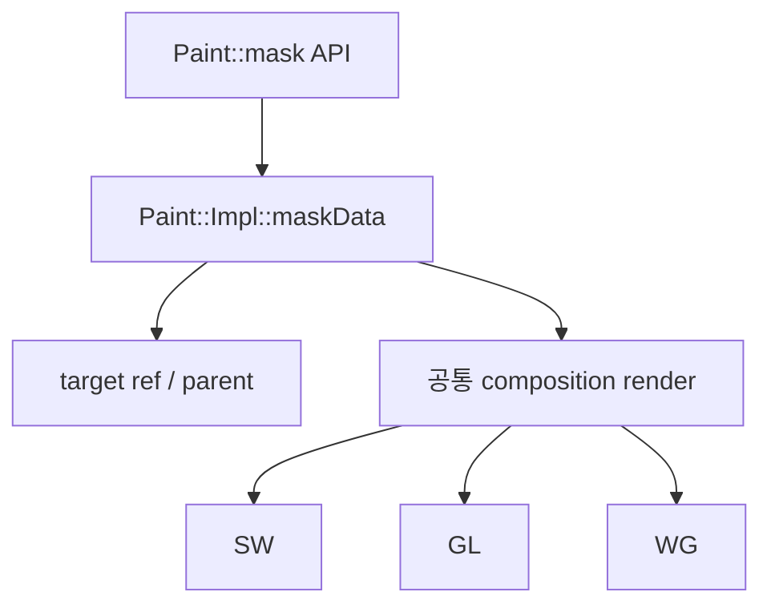

# #2831 api: promote the mask() method to Scene from Paint

- Link: https://github.com/thorvg/thorvg/issues/2831
- 난이도: 88/100
- 실현 가능성: 낮음
- 초심자 추천: 비추천
- 관련 영역: Paint/Scene 공개 API, composition, ref count, C API/ABI
- 배울 수 있는 것: 마스킹 합성, PImpl, 부모-자식 소유권, API 범위 축소

## 이슈 요약

모든 `Paint`가 제공하는 `mask()`를 `Scene`으로 제한해 구조와 리소스를 단순화하자는 리팩터링 제안이다. 현재 Shape/Picture/Text에 직접 mask를 거는 API와 테스트가 존재하므로, 단순한 멤버 이동이 아니라 공개 모델과 이행 경로를 바꾸는 일이다.

## 난이도 산정

| 항목 | 점수 | 근거 |
|---|---:|---|
| 재현·증거 불확실성 (0-20) | 17 | 결함이 아니라 최적화 제안이고 메모리/성능 이득이 측정되지 않았다. |
| 변경 범위 (0-25) | 24 | 공통 Paint PImpl, Scene, concrete paint, CAPI와 backend test에 걸친다. |
| 구현 복잡도 (0-25) | 20 | ref/unref, parent, duplicate와 composition 상태를 보존해야 한다. |
| 교차 영향 위험 (0-20) | 20 | 공개 API/ABI 및 기존 비-Scene mask 동작이 깨질 위험이 크다. |
| 검증 부담 (0-10) | 7 | 세 backend와 중첩 mask/opacity/blend 수명 테스트가 필요하다. |
| **합계** | **88/100** | 성능 근거와 이행 정책이 선행되어야 한다. |

## main 코드 조사

**확인된 증거**

- `Paint::mask()` setter/getter는 `inc/thorvg.h`의 `Paint`에 공개되어 있다.
- 모든 concrete paint가 쓰는 `Paint::Impl`에 `Mask* maskData`가 있고, setter는 target을 `ref()`, 교체/해제 시 `unref()`한다.
- `Paint::Impl::render()`는 mask target을 별도 composition target으로 렌더한다. 즉 상태만 Scene으로 옮겨도 공통 render 흐름은 재설계해야 한다.
- SW/GL/WG engine 테스트에는 Shape와 Picture에 직접 mask를 적용하는 경우가 있다.

```cpp
// src/renderer/tvgPaint.h
struct Paint::Impl {
    Mask* maskData = nullptr;
    // ... 모든 Paint 종류가 이 PImpl을 사용한다.
};
```



## 원인 가설과 확인 방법

- **확정:** mask 상태와 render 분기는 현재 Paint 공통 계층에 있고 비-Scene 사용도 테스트된다.
- **가설:** 실제 사용이 Scene 중심이라 `maskData` 포인터와 분기를 제거하면 인스턴스/코드 크기가 유의미하게 줄어든다. 측정 자료는 현재 로컬 문서에 없다.
- **확인 방법:** Paint 종류별 `sizeof(Impl)` 변화, 생성 개수, binary section과 비-Scene mask 사용처를 측정한다.

## 수정 방향 계획

1. 기존 비-Scene mask 사례를 유지/폐기/자동 Scene 래핑 중 어떤 방식으로 이행할지 결정한다.
2. 먼저 내부 실험 branch에서 mask 상태를 `SceneImpl`로 옮겨 ref/unref와 parent 규칙을 명시한다.
3. duplicate/reset/destructor와 target 교체 시 ref-count 불변식을 단위 테스트로 고정한다.
4. 공개 API를 바꾼다면 CAPI 선언·구현과 deprecation 기간을 같은 변경에서 다룬다.

## 실현 가능성 판단

기술적 prototype은 가능하지만 이슈 완료 가능성은 **낮음**이다. 호환성 정책과 측정된 이득이 없으면 현재 동작을 제거할 근거가 부족하다. 초심자는 mask ref-count 테스트 보강이나 메모리 baseline 측정을 하위 과제로 맡는 편이 안전하다.

## 위험/검증

- target 이중 소유, use-after-free, parent 충돌과 duplicate 후 aliasing을 검증한다.
- Shape/Picture/Text에 대한 기존 mask, 중첩 mask, opacity와 blend 조합을 SW/GL/WG에서 비교한다.
- 공개 header/CAPI symbol 변화와 WASM/static 빌드를 함께 확인한다.

## 참고 자료

- `inc/thorvg.h`
- `src/renderer/tvgPaint.h`, `src/renderer/tvgPaint.cpp`
- `src/renderer/tvgScene.h`, `src/renderer/tvgShape.h`, `src/renderer/tvgPicture.h`
- `src/bindings/capi/thorvg_capi.h`, `src/bindings/capi/tvgCapi.cpp`
- `test/testSwEngine.cpp`, `test/testGlEngine.cpp`, `test/testWgEngine.cpp`
