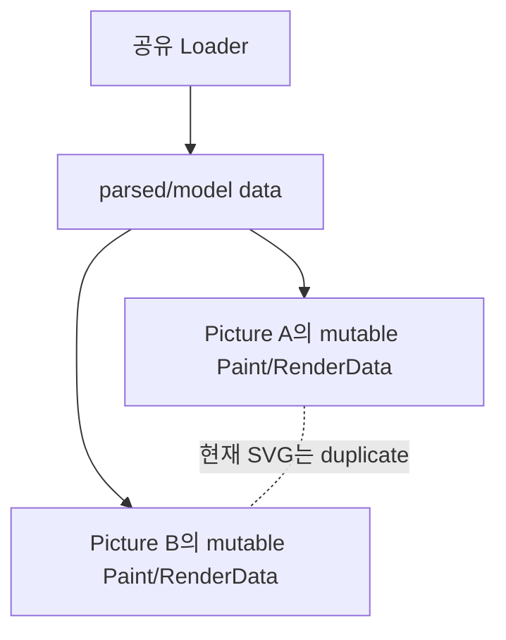

# #2896 svg/lottie: sharing the Picture resources

- Link: https://github.com/thorvg/thorvg/issues/2896
- 난이도: 93/100
- 실현 가능성: 낮음
- 초심자 추천: 비추천
- 관련 영역: Picture/LoaderMgr, SVG/Lottie scene, cache, ref count, copy-on-write
- 배울 수 있는 것: immutable model과 mutable render state 분리, ownership, 동시성

## 이슈 요약

동일 SVG/Lottie를 여러 `Picture`가 로드할 때 내부 scene을 복제하지 않고 공유해 메모리를 줄이자는 제안이다. loader 캐시는 이미 있지만 vector scene은 독립성을 위해 복제된다. resize, `Accessor` 수정과 animation frame 상태 때문에 단순 포인터 공유는 안전하지 않다.

## 난이도 산정

| 항목 | 점수 | 근거 |
|---|---:|---|
| 재현·증거 불확실성 (0-20) | 17 | 메모리 중복 위치와 기대 절감치, 허용할 공유 의미가 확정되지 않았다. |
| 변경 범위 (0-25) | 24 | LoaderMgr, Picture, SVG/Lottie model, Paint tree와 backend data에 걸친다. |
| 구현 복잡도 (0-25) | 25 | immutable/mutable 분리 또는 COW와 동시 수명 관리가 필요하다. |
| 교차 영향 위험 (0-20) | 19 | aliasing, animation state 충돌, UAF와 thread race 위험이 크다. |
| 검증 부담 (0-10) | 8 | 다중 instance 메모리 benchmark와 mutation/concurrency 검증이 필요하다. |
| **합계** | **93/100** | SVG와 Lottie도 동일한 공유 전략을 쓰기 어렵다. |

## main 코드 조사

**확인된 증거**

- `LoaderMgr`는 path/data key로 loader를 재사용하고 `Loader::sharing`을 증가시킨다.
- `Loader::allowCache()`는 `Lot`과 `Gif`를 명시적으로 제외한다.
- `SvgLoader::paint()`는 첫 사용 후 `root->duplicate()`를 반환한다.
- `PictureImpl::duplicate()`도 vector Paint tree는 deep duplicate하면서 loader와 bitmap 포인터는 공유한다.
- Lottie loader는 composition root를 돌려주고 builder가 frame마다 scene/property를 갱신하므로 SVG보다 mutable state가 많다.

```cpp
// src/loaders/svg/tvgSvgLoader.cpp
if (root->refCnt() == 1) return root;
return root->duplicate();
```



## 원인 가설과 확인 방법

- **확정:** loader 공유와 scene 공유는 별개이며 현재 SVG는 두 번째 Paint tree부터 복제한다.
- **가설:** parsed model, mutable Paint tree, backend RenderData가 충분히 분리되지 않아 안전한 공유 경계가 없다.
- **확인 방법:** 동일 SVG/Lottie N개를 로드해 bytes/model/Paint/backend allocation을 계측하고, resize/accessor/frame update 전후에 어느 층이 변하는지 추적한다.

## 수정 방향 계획

1. SVG와 Lottie를 분리해 memory profile을 만들고 가장 큰 중복 층을 확인한다.
2. SVG는 immutable parse tree + Picture별 render instance, Lottie는 immutable composition model + player별 frame state prototype을 각각 검토한다.
3. 공유 policy의 기본값, 수정 허용, COW 발생 시점과 `Accessor`가 반환하는 객체의 의미를 먼저 명세한다.
4. loader cache lock과 model lifetime을 보강한 뒤 동시 load/update/release 테스트를 추가한다.

## 실현 가능성 판단

부분적인 model 공유는 가능해 보이지만 전체 이슈는 **낮음**이다. 현재 scene graph가 mutable이며 SVG와 Lottie의 state 모델도 다르다. 초심자는 allocation profile과 duplicate 경로 test를 맡을 수 있으나 ownership 설계는 숙련자가 주도해야 한다.

## 위험/검증

- Picture A의 resize/accessor 변경이 B로 전파되지 않는지 확인한다.
- 서로 다른 frame을 재생하는 Lottie 두 instance와 동시 해제를 stress-test한다.
- SW/GL/WG RenderData가 공유 model보다 짧은 lifetime을 갖도록 보장하고 ASan/TSan을 사용한다.
- 메모리 절감과 frame/update 비용을 함께 보고해 COW로 성능이 역행하지 않는지 확인한다.

## 참고 자료

- `src/renderer/tvgLoader.h`, `src/renderer/tvgLoaderMgr.cpp`
- `src/renderer/tvgPicture.h`
- `src/loaders/svg/tvgSvgLoader.cpp`
- `src/loaders/lottie/tvgLottieLoader.cpp`, `src/loaders/lottie/tvgLottieBuilder.cpp`
- `src/renderer/tvgPaint.cpp`
