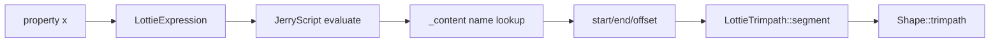

# #2989 lottie: expression issue

- Link: https://github.com/thorvg/thorvg/issues/2989
- 난이도: 67/100
- 실현 가능성: 중간
- 초심자 추천: 조건부 추천
- 관련 영역: Lottie expression, trim path, JerryScript, WASM/viewer build
- 배울 수 있는 것: named content lookup, frame evaluation, optional feature build 차이

## 이슈 요약

viewer 1.0-pre5에서 expression 기반 trim path가 잘못 보였지만 당시 local test는 정상이라는 오래된 regression 보고다. core expression 계산, viewer가 사용한 version/option, WASM 통합을 분리해야 한다. 이번 재조사는 로컬 문서와 현재 main만 사용했으며 첨부 JSON 자체는 저장소에 없다.

## 난이도 산정

| 항목 | 점수 | 근거 |
|---|---:|---|
| 재현·증거 불확실성 (0-20) | 20 | 오래된 viewer 기준이고 첨부 fixture/runtime artifact가 로컬에 없어 현재 재현을 못 했다. |
| 변경 범위 (0-25) | 9 | 재현되면 expression lookup/trimpath 또는 viewer build로 비교적 좁혀질 수 있다. |
| 구현 복잡도 (0-25) | 13 | JerryScript native pointer와 frame state를 추적해야 한다. |
| 교차 영향 위험 (0-20) | 15 | expression 전체와 native/WASM, feature-off 동작에 영향을 줄 수 있다. |
| 검증 부담 (0-10) | 10 | fixture 확보 후 native/WASM, option on/off, frame sequence 비교가 필요하다. |
| **합계** | **67/100** | 원인보다 재현 자산과 역사적 환경 복원이 가장 큰 난점이다. |

## main 코드 조사

**현재 소스에서 확인된 증거**

- parser는 property의 expression 문자열을 `LottieExpression`으로 보관한다.
- `_content()`는 name hash로 Group/Trimpath를 찾고 `_buildTrimpath()`가 `start/end/offset` 값을 JavaScript 객체로 노출한다.
- `LottieTrimpath::segment()`는 expression 결과를 0~1로 clamp하고 offset을 360으로 정규화한다.
- `lottie_exp`가 꺼지면 `LottieExpressions::result()` stub은 `false`를 반환한다. Meson 기본 extra에는 현재 `lottie_exp`가 들어 있지만 artifact가 override할 수 있다.

**기존 로컬 문서에만 남은 증거**

- 이전 분석은 첨부가 nested `content(...).content(...).start/end/offset`과 `$bm_sum/$bm_mul`을 쓴다고 기록했다. 첨부 파일이 현재 workspace에 없어 이번 조사에서 독립 재검증하지 못했다.

## 원인 가설과 확인 방법

- **가설 1:** 당시 viewer/WASM이 `lottie_exp` 없이 빌드되어 static 값으로 fallback했다.
- **가설 2:** viewer와 local test의 ThorVG commit 또는 frame seek 순서가 달랐다.
- **가설 3:** nested `_content()`가 참조한 native object/context가 특정 frame sequence에서 stale했다.
- 어느 가설도 현재 확정할 수 없다. 첨부를 정식 test resource로 확보한 뒤 option/version/frame 값을 기록해야 한다.

## 수정 방향 계획

1. maintainer가 허용한 원본 fixture를 저장소 test resource로 추가하거나 최소 JSON으로 재작성한다.
2. 같은 main으로 native `lottie_exp` on/off와 WASM on/off를 빌드해 동일 frame PNG를 비교한다.
3. expression의 start/end/offset, `segment()` 결과와 frame seek 순서를 계측해 첫 오차를 찾는다.
4. core 재현이면 최소 JSON test를 추가하고, artifact 옵션 문제면 viewer build metadata/feature 표시를 고친다.

## 실현 가능성 판단

fixture가 확보되면 **중간**이다. 현재는 코드 경로 분석은 가능하지만 실제 문제가 main에 남았는지 증명할 수 없다. 초심자는 재현 환경·최소 fixture를 맡기 좋고, JerryScript lifetime 수정은 멘토가 필요하다.

## 위험/검증

- native 성공만으로 종료하지 않고 WASM과 expression option off를 비교한다.
- 첫 frame부터 재생, seek, loop/restart에서 expression 결과가 같은지 검사한다.
- JerryScript context leak/UAF를 ASan으로 확인하고 feature-off binary가 계속 빌드되는지 검사한다.

## 참고 자료

- `docs/issue/issues.json`의 #2989 저장 본문
- `src/loaders/lottie/tvgLottieParser.cpp`
- `src/loaders/lottie/tvgLottieExpressions.cpp`, `src/loaders/lottie/tvgLottieExpressions.h`
- `src/loaders/lottie/tvgLottieModel.cpp`, `src/loaders/lottie/tvgLottieBuilder.cpp`
- `meson.build`, `meson_options.txt`, `src/loaders/lottie/meson.build`
- `test/testLottie.cpp`
