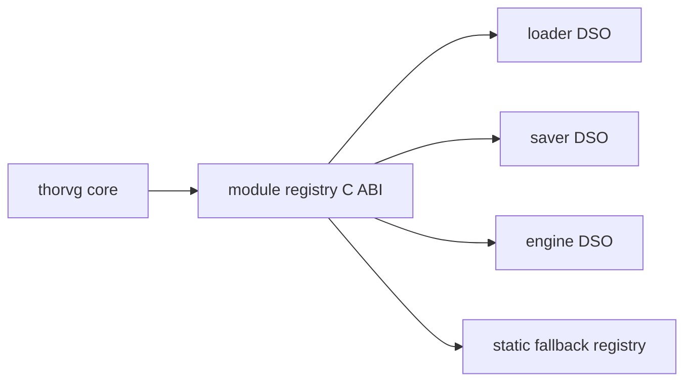

# #3096 common: support dynamic module and runtime linking

- Link: https://github.com/thorvg/thorvg/issues/3096
- 난이도: 98/100
- 실현 가능성: 낮음
- 초심자 추천: 비추천
- 관련 영역: Meson, loader/saver/engine registry, module ABI, native/WASM loader
- 배울 수 있는 것: plugin C ABI, symbol visibility, factory/lifecycle, portability

## 이슈 요약

loader/saver/renderer를 별도 모듈로 만들고 필요할 때 runtime에 로드하자는 아키텍처 과제다. 현재 compile-time 결합을 안정적인 plugin ABI로 바꾸고 Windows/Unix/Android/WASM/static fallback을 모두 다뤄야 한다.

## 난이도 산정

| 항목 | 점수 | 근거 |
|---|---:|---|
| 재현·증거 불확실성 (0-20) | 19 | startup 목표 수치, unload 요구와 플랫폼별 배포 모델이 확정되지 않았다. |
| 변경 범위 (0-25) | 25 | build/install, 모든 module category, core lifecycle과 플랫폼 loader 전체다. |
| 구현 복잡도 (0-25) | 25 | versioned ABI, factory, allocation/ownership, unload와 feature negotiation이 필요하다. |
| 교차 영향 위험 (0-20) | 20 | 모든 build target, symbol visibility, 전역 상태와 object lifetime에 영향을 준다. |
| 검증 부담 (0-10) | 9 | 여러 OS와 WASM/static/embedded 설치·실행 행렬이 필요하다. |
| **합계** | **98/100** | 저장소 전체의 packaging/runtime architecture를 바꾸는 umbrella 과제다. |

## main 코드 조사

**확인된 증거**

- Meson의 loaders/savers/engines는 compile-time 옵션이며 선택 source가 하나의 `thorvg-1` library로 묶인다.
- library는 `gnu_symbol_visibility: 'hidden'`을 사용하고 module descriptor/export ABI가 없다.
- `LoaderMgr::_find()`는 support macro 아래에서 concrete C++ loader를 직접 `new`한다.
- renderer와 initializer lifecycle도 compile-time support macro로 결합되어 있다.
- GL의 `dlopen/LoadLibrary`는 driver entry point 로딩 전용이며 재사용 가능한 ThorVG module layer가 아니다.

```cpp
// src/renderer/tvgLoaderMgr.cpp
case FileType::Svg: {
#ifdef THORVG_SVG_LOADER_SUPPORT
    return new SvgLoader;
#endif
}
```



## 원인 가설과 확인 방법

- **확정:** concrete factory와 lifecycle이 core에 compile-time 결합되어 있고 plugin ABI가 없다.
- **가설:** 모듈화가 startup과 binary memory를 유의미하게 줄인다. 현재 로컬 자료에는 baseline이 없다.
- **확인 방법:** PNG loader 하나를 prototype 대상으로 삼아 monolithic vs delayed module의 startup/RSS/file-size를 같은 build에서 측정한다.

## 수정 방향 계획

1. unload 없는 loader 하나로 최소 C ABI descriptor(version, capability, create/destroy)를 정의한다.
2. allocator/free 책임, object가 살아 있을 때 module handle을 유지하는 규칙과 error contract를 명세한다.
3. Meson에서 core/module/install directory/pkg-config metadata를 분리하고 static registry도 같은 descriptor를 쓰게 한다.
4. Unix/Windows loader를 먼저 구현하고 Android/WASM은 동일 ABI가 가능한지 별도 design gate를 둔다.
5. savers/engines와 unload는 prototype 검증 뒤 별도 단계로 나눈다.

## 실현 가능성 판단

단일 loader prototype은 가능하지만 원 이슈 전체는 **낮음**이다. ABI와 배포 정책 결정이 선행되어야 하고 WASM까지 한 번에 만족시키기 어렵다. 초심자는 Meson 산출물 조사나 size/startup baseline을 맡는 정도가 적합하다.

## 위험/검증

- module unload 후 vtable/function pointer/UAF, core-module allocator mismatch와 version mismatch를 검사한다.
- shared/static, file I/O off, 각 module 누락/손상, 설치 후 discovery를 검증한다.
- startup 개선 주장은 cold/warm과 OS loader cache를 구분해 수치로 남긴다.

## 참고 자료

- `meson.build`, `meson_options.txt`, `src/meson.build`
- `src/loaders/meson.build`, `src/renderer/meson.build`
- `src/renderer/tvgLoaderMgr.cpp`, `src/renderer/tvgInitializer.cpp`
- `src/renderer/gpu_engine/gl/tvgGl.cpp` (플랫폼 dynamic symbol 예시)
- `src/bindings/capi/thorvg_capi.h` (C ABI 설계 참고)
