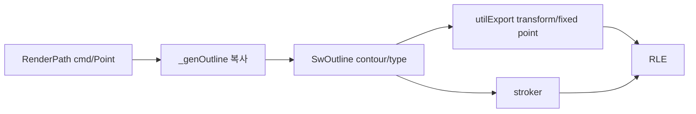

# #3100 sw_engine: optimize path copying between Renderer - SwEngine

- Link: https://github.com/thorvg/thorvg/issues/3100
- 난이도: 85/100
- 실현 가능성: 중간
- 초심자 추천: 비추천
- 관련 영역: RenderPath, SwOutline/RLE, task lifetime, memory/performance
- 배울 수 있는 것: zero-copy 한계, cache locality, async ownership, raster pipeline

## 이슈 요약

Renderer의 path를 SW rasterizer가 outline으로 다시 풀면서 생기는 복사·allocation을 줄이자는 최적화다. 현재 task에는 원본 포인터가 전달되지만 SW stroker/RLE이 요구하는 contour/fixed-point 표현 때문에 중간 배열이 다시 만들어진다.

## 난이도 산정

| 항목 | 점수 | 근거 |
|---|---:|---|
| 재현·증거 불확실성 (0-20) | 14 | copy 경로는 보이지만 실제 병목/메모리 비중과 목표 수치가 없다. |
| 변경 범위 (0-25) | 22 | 공통 RenderPath, SW outline/stroker/RLE와 async task lifetime에 걸친다. |
| 구현 복잡도 (0-25) | 23 | contour metadata와 변환을 유지하면서 allocation/copy만 제거해야 한다. |
| 교차 영향 위험 (0-20) | 18 | 모든 SW fill/stroke/dash/trim과 update/render 동시성에 영향이 있다. |
| 검증 부담 (0-10) | 8 | pixel 동일성, sanitizer와 성능/메모리 benchmark가 필요하다. |
| **합계** | **85/100** | 측정 후 좁은 optimization으로 쪼개면 실현 가능하다. |

## main 코드 조사

**확인된 증거**

- 원본은 `ShapeImpl::rs.path`의 `Array<PathCommand>`와 `Array<Point>`다.
- `SwShapeTask`는 `const RenderShape*`를 보관하므로 renderer→task 경계에서 path deep copy는 하지 않는다.
- `_genOutline()`은 command를 순회해 mpool의 `SwOutline` arrays를 다시 채우고, `utilExport()`가 transformed/fixed-point output을 만든다.
- stroke는 `strokeParseOutline()`/`strokeExportOutline()`이라는 추가 표현을 요구한다. dash/trim은 임시 path/outline도 만든다.



```cpp
// fill path: 원본 view를 받지만 outline은 다시 생성한다.
auto outline = _genOutline(rshape, mpool, tid, rshape->trimpath());
utilExport(outline, transform, bbox);
shape.rle = rleRender(shape.rle, outline, renderBox, mpool, tid, antiAlias);
```

## 원인 가설과 확인 방법

- **확정:** 중복의 중심은 task 전달이 아니라 `RenderPath -> SwOutline -> exported outline` 변환이다.
- **가설:** fill-only path에서는 command/point를 직접 소비하면 allocation 또는 한 단계 copy를 줄일 수 있다.
- **제약:** stroker와 RLE은 contour 종료, curve type과 transformed 좌표를 필요로 하므로 모든 배열을 alias하는 완전 zero-copy는 어려워 보인다.
- **확인 방법:** 각 단계의 bytes, allocation count와 시간을 fill/stroke/dash/trim별로 계측한다.

## 수정 방향 계획

1. 큰 SVG path와 작은 반복 path에서 `_genOutline`, `utilExport`, stroker, RLE 비용을 따로 측정한다.
2. fill-only affine path처럼 가장 단순한 경우에 read-only `RenderPathView`/direct exporter를 prototype한다.
3. SwTask가 끝날 때까지 source mutation/free가 없다는 lifetime 불변식을 코드와 test로 고정한다.
4. stroke/dash/trim은 이득이 증명된 뒤 별도 최적화로 분리한다.
5. allocation bytes, peak memory, frame latency와 pixel hash를 전후 비교한다.

## 실현 가능성 판단

전체 zero-copy는 어렵지만 좁은 fast path는 가능해 **중간**이다. 다만 성능 측정과 async ownership을 이해해야 해 초심자용 issue는 아니다. 초심자는 profiler instrumentation이나 benchmark fixture를 하위 작업으로 맡을 수 있다.

## 위험/검증

- source Shape 갱신과 worker read 사이 UAF/data race를 TSan/ASan으로 검사한다.
- fill/stroke/dash/trim, clipper, transform별 SW pixel이 기존과 같아야 한다.
- 성능 수치는 allocation 감소와 latency를 함께 보고하고 작은 path에서 역행하지 않는지 본다.

## 참고 자료

- `src/renderer/tvgRender.h`, `src/renderer/tvgShape.h`
- `src/renderer/cpu_engine/tvgSwRenderer.cpp`
- `src/renderer/cpu_engine/tvgSwShape.cpp`
- `src/renderer/cpu_engine/tvgSwStroke.cpp`, `src/renderer/cpu_engine/tvgSwRle.cpp`
- `src/renderer/cpu_engine/tvgSwCommon.h`의 `SwMpool`
