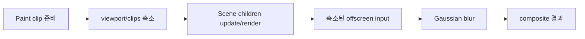

# #3125 — Scene effect와 clipping의 적용 순서

- Link: https://github.com/thorvg/thorvg/issues/3125
- 난이도: 78/100
- 실현 가능성: 중간
- 초심자 추천: 조건부 (재현·영역 계측까지)
- 분석 기준: `main` working tree `f989b27892ba`
- 관련 영역: Scene composition, clip update, CPU/GL/WG post-effect
- 배울 수 있는 것: offscreen composition, blur kernel 확장 영역, clip-before/after-effect 의미

## 이슈 요약

Gaussian blur가 있는 Scene에 작은 clip을 적용했을 때 기대한 “전체 content를 blur한 뒤 결과를 자르기”가 아니라 clip 밖 입력이 blur에 기여하지 않는 출력이 나온다는 이슈다. current main은 Paint clip을 main update보다 먼저 처리하므로 child render data와 viewport가 clip에 의해 제한되고, 그 뒤 Scene effect가 offscreen surface에 적용된다. 코드 구조는 증상과 부합하지만 public `Paint::clip()` 문서가 effect 전/후 의미를 명시하지 않아 API semantics도 함께 합의해야 한다.

## 난이도 산정

| 항목 | 점수 | 근거 |
|---|---:|---|
| 재현·증거 불확실성 (0-20) | 11 | 재현 코드는 있으나 clip이 effect 결과에 적용되어야 한다는 API 계약이 명시적이지 않다. |
| 변경 범위 (0-25) | 18 | Paint update, Scene bounds/compositor와 세 renderer의 effect 경로가 연결된다. |
| 구현 복잡도 (0-25) | 20 | blur input/output 영역과 clip을 서로 다른 pass에 배치해야 한다. |
| 교차 영향 위험 (0-20) | 20 | mask, nested Scene, blend, partial rendering과 모든 backend semantics가 영향받는다. |
| 검증 부담 (0-10) | 9 | kernel border·clip shape·backend별 pixel diff가 필요하다. |
| **합계** | **78** | **원인 경로는 보이지만 composition 순서 변경의 파급이 크다.** |

## main 코드 조사

### 확인된 사실

- [`Paint::Impl::update()`](https://github.com/thorvg/thorvg/blob/f989b27892bab31f224f810a54782055eba1e3bc/src/renderer/tvgPaint.cpp)은 `2. Clipping`에서 rectangular fast-track viewport 또는 clip render data를 준비한 다음 `3. Main Update`를 호출한다.
- [`SceneImpl::update()`](https://github.com/thorvg/thorvg/blob/f989b27892bab31f224f810a54782055eba1e3bc/src/renderer/tvgScene.h)은 그 clips/viewport 상태로 child Paint를 update한 뒤 effect를 `renderer->prepare()`한다.
- `SceneImpl::render()`는 child를 offscreen compositor에 렌더하고 effect를 적용한 뒤 `endComposite()`한다.
- `SceneImpl::bounds()`는 `renderer->region(effect)`의 `extend`를 content bounds에 더하지만 최종값을 Scene의 `vport`와 교차한다.
- SW [`effectGaussianBlur()`](https://github.com/thorvg/thorvg/blob/f989b27892bab31f224f810a54782055eba1e3bc/src/renderer/cpu_engine/tvgSwPostEffect.cpp)은 이미 정해진 compositor `bbox` 크기의 buffer만 필터링한다. clip 밖 source pixel을 나중에 복구할 수 없다.

현재 순서는 다음과 같다.

이슈의 기대 순서는 `children → blur(확장 input) → final clip`이다.

### 아직 가설인 부분

- **강한 가설:** rectangular clip fast-track이 renderer viewport를 먼저 줄여 blur kernel이 clip 밖 source를 읽지 못한다.
- **가설 B:** 일반 RLE clip에서도 child geometry 자체가 잘린 render data로 준비되어 같은 의미 차이가 발생할 수 있다.
- **가설 C:** API가 “Paint 전체의 drawing region”을 제한한다고 해석하면 현행이 의도일 가능성도 있다. post-effect 결과 clip을 요구하는 별도 Scene nesting이 올바른 사용법인지 maintainer 판단이 필요하다.

## 수정 방향과 실현 가능성

1. 이슈 코드를 current main test로 옮기고 blur-only, clip-only, blur+clip을 pixel 비교한다.
2. rectangular fast-track과 비사각 clip을 각각 실행해 viewport, Scene bounds, compositor bbox를 기록한다.
3. `clip(Scene(effect(content)))`와 `effect(Scene(clip(content)))` 두 semantics의 expected 이미지를 명시한다.
4. effect Scene에서는 expanded input을 준비하고 final output에 clip을 적용할 별도 composition layer가 필요한지 설계한다.
5. SW reference 후 GL/WG, mask/opacity/blend, nested Scene과 partial-rendering을 검증한다.

**판정:** 문제 단계 계측은 실현 가능하다. 안전한 수정에는 clip/effect API 의미 합의와 세 backend composition 변경이 필요하다.

## 참고 자료

- [이슈 #3125과 재현 코드](https://github.com/thorvg/thorvg/issues/3125)
- [`src/renderer/tvgPaint.cpp`](https://github.com/thorvg/thorvg/blob/f989b27892bab31f224f810a54782055eba1e3bc/src/renderer/tvgPaint.cpp)
- [`src/renderer/tvgScene.h`](https://github.com/thorvg/thorvg/blob/f989b27892bab31f224f810a54782055eba1e3bc/src/renderer/tvgScene.h)
- [`src/renderer/cpu_engine/tvgSwPostEffect.cpp`](https://github.com/thorvg/thorvg/blob/f989b27892bab31f224f810a54782055eba1e3bc/src/renderer/cpu_engine/tvgSwPostEffect.cpp)
- [`src/renderer/cpu_engine/tvgSwRenderer.cpp`](https://github.com/thorvg/thorvg/blob/f989b27892bab31f224f810a54782055eba1e3bc/src/renderer/cpu_engine/tvgSwRenderer.cpp)
- [`inc/thorvg.h`](https://github.com/thorvg/thorvg/blob/f989b27892bab31f224f810a54782055eba1e3bc/inc/thorvg.h) — `Paint::clip()`, `SceneEffect`

