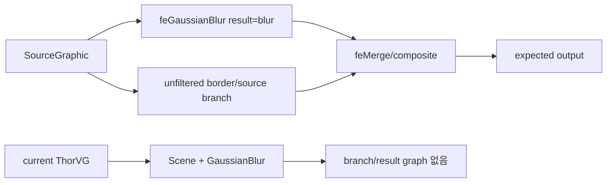

# #3144 — SVG filter 결과 합성 개선

- Link: https://github.com/thorvg/thorvg/issues/3144
- 난이도: 87/100
- 실현 가능성: 낮음 (fixture 복원과 unsupported 범위 판정은 중간)
- 초심자 추천: 비추천
- 분석 기준: `main` working tree `f989b27892ba`
- 조사 상태: 기존 보류 해제 — 재현 SVG는 없지만 current filter model의 구조적 한계를 확인해 점수화함
- 관련 영역: SVG filter graph, Scene effects, filter region/composition
- 배울 수 있는 것: filter `in/result`, SourceGraphic, `feMerge`, filter units

## 이슈 요약

필터되지 않아야 할 colored border가 사라지고 filtered content만 보인다는 compliance 제보이다. 본문에는 이미지 두 장만 있고 SVG markup은 없다. 따라서 정확한 primitive는 확정할 수 없지만 current main이 `feGaussianBlur` 단일 primitive 외의 filter graph를 표현하지 못한다는 사실은 명확하다. 기대 자산이 blurred result와 SourceGraphic/border를 `feMerge` 등으로 합성한다면 현 구조에서 border가 사라지는 것이 자연스럽다.

## 난이도 산정

| 항목 | 점수 | 근거 |
|---|---:|---|
| 재현·증거 불확실성 (0-20) | 20 | 원본 SVG/filter markup이 없어 누락 primitive와 정확한 graph를 특정할 수 없다. |
| 변경 범위 (0-25) | 23 | parser/model/builder, intermediate surfaces와 세 renderer effect가 연결된다. |
| 구현 복잡도 (0-25) | 21 | named input/result와 DAG evaluation, region/units 의미를 구현해야 한다. |
| 교차 영향 위험 (0-20) | 15 | 기존 단일 blur, mask/clip과 offscreen memory에 영향을 준다. |
| 검증 부담 (0-10) | 8 | browser reference와 graph/region/backend 조합 test가 필요하다. |
| **합계** | **87** | **증상보다 필요한 filter architecture의 범위가 큰 이슈다.** |

## main 코드 조사

### 확인된 사실

- [`SvgNodeType`](https://github.com/thorvg/thorvg/blob/f989b27892bab31f224f810a54782055eba1e3bc/src/loaders/svg/tvgSvgCommon.h)의 filter primitive는 `GaussianBlur`뿐이며 node data에도 Gaussian blur와 filter region만 있다.
- [`graphicsTags[]`](https://github.com/thorvg/thorvg/blob/f989b27892bab31f224f810a54782055eba1e3bc/src/loaders/svg/tvgSvgLoader.cpp)은 `feGaussianBlur`만 factory에 등록한다. `feMerge`, `feMergeNode`, `feComposite` 등은 인식하지 않는다.
- [`_applyFilter()`](https://github.com/thorvg/thorvg/blob/f989b27892bab31f224f810a54782055eba1e3bc/src/loaders/svg/tvgSvgBuilder.cpp)은 filter child가 GaussianBlur이면 Scene effect를 추가한 뒤 원본 Paint를 그 Scene에 넣고 filter region Shape로 clip한다.
- primitive의 `in`, `in2`, `result` 이름과 intermediate image DAG를 저장·조회하는 model은 없다.
- 따라서 current main은 “SourceGraphic blur 하나” 형태만 표현할 수 있고 filtered/unfiltered branch 재합성은 할 수 없다.

### 아직 가설인 부분

- **확인된 구조적 한계:** current parser/builder는 filter branch와 result 합성을 표현할 수 없다.
- **가설 A:** 이슈 자산이 `feMerge`/`result`로 unfiltered border를 되합성해 current output에서 border가 빠진다.
- **가설 B:** 자산이 단일 GaussianBlur만 쓴다면 filter region clip 또는 effect/clip 순서(#3125 계열)가 원인일 수 있다. markup 없이는 둘을 구분할 수 없다.

## 수정 방향과 실현 가능성

1. issue author가 사용한 SVG 또는 최소 filter markup을 확보해 primitive, `in/in2/result`, units를 표로 만든다.
2. 단일 blur+작은 region fixture와 SourceGraphic+blur+merge fixture를 분리한다.
3. 필요한 primitive만 ad-hoc Scene으로 변환할지 일반 filter DAG를 도입할지 acceptance criterion을 정한다.
4. DAG라면 named surface lifetime, filter/primitive subregion과 memory pooling을 먼저 설계한다.
5. CPU reference 후 GL/WG와 기존 GaussianBlur regression을 비교한다.

**판정:** 더 이상 “난이도 미정”은 아니다. fixture 부재는 불확실성 점수에 반영했고, 전체 해결은 filter graph subsystem 규모라 실현 가능성이 낮다.

## 참고 자료

- [이슈 #3144](https://github.com/thorvg/thorvg/issues/3144)
- [`src/loaders/svg/tvgSvgCommon.h`](https://github.com/thorvg/thorvg/blob/f989b27892bab31f224f810a54782055eba1e3bc/src/loaders/svg/tvgSvgCommon.h)
- [`src/loaders/svg/tvgSvgLoader.cpp`](https://github.com/thorvg/thorvg/blob/f989b27892bab31f224f810a54782055eba1e3bc/src/loaders/svg/tvgSvgLoader.cpp)
- [`src/loaders/svg/tvgSvgBuilder.cpp`](https://github.com/thorvg/thorvg/blob/f989b27892bab31f224f810a54782055eba1e3bc/src/loaders/svg/tvgSvgBuilder.cpp)
- [`src/renderer/tvgScene.h`](https://github.com/thorvg/thorvg/blob/f989b27892bab31f224f810a54782055eba1e3bc/src/renderer/tvgScene.h)
- [관련 effect/clip 이슈 #3125](https://github.com/thorvg/thorvg/issues/3125)
- [직접적인 `feColorMatrix` 지원 이슈 #3366](https://github.com/thorvg/thorvg/issues/3366)
