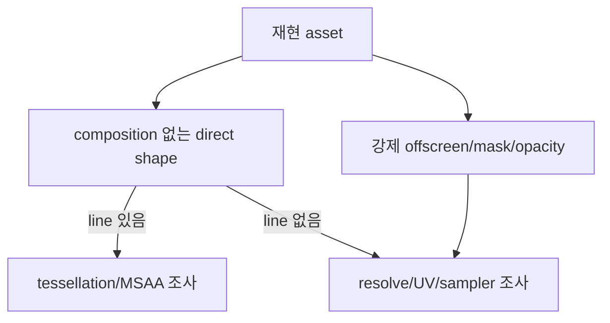

# #3189 — GPU 출력에 보이는 잘못된 border line

- Link: https://github.com/thorvg/thorvg/issues/3189
- 난이도: 75/100
- 실현 가능성: 중간 (원인 분리), 낮음 (asset 없는 상태의 수정)
- 초심자 추천: 조건부
- 분석 기준: `main` working tree `f989b27892ba`
- 조사 상태: 기존 보류 해제 — 재현 asset 부재를 불확실성에 반영하고 GPU pass별 진단 가능성을 점수화함
- 관련 영역: GL/WG tessellation, MSAA resolve, offscreen texture sampling
- 배울 수 있는 것: geometry seam, multisampling, sampler address mode, framebuffer edge

## 이슈 요약

GL과 WebGPU 결과에 reference에는 없는 border line이 나타난다는 시각 이슈다. 본문에는 이미지뿐이라 선이 shape 경계인지 offscreen rectangle 경계인지 알 수 없다. 그러나 current main의 GL/WG는 4x MSAA와 유사한 tessellator를 공유하는 반면 render-target sampler는 서로 다르다. 이 차이를 이용해 geometry/MSAA와 texture seam 가설을 체계적으로 분리할 수 있으므로 조사 보류 대신 실제 난이도를 부여했다.

## 난이도 산정

| 항목 | 점수 | 근거 |
|---|---:|---|
| 재현·증거 불확실성 (0-20) | 20 | asset, transform, composition 여부와 문제 pixel 위치가 전혀 없다. |
| 변경 범위 (0-25) | 13 | 원인 확정 시 tessellator, MSAA 또는 compositor 한 영역으로 좁힐 수 있다. |
| 구현 복잡도 (0-25) | 18 | GPU geometry와 resolve/texture sampling을 capture로 구분해야 한다. |
| 교차 영향 위험 (0-20) | 15 | GPU shape·offscreen composition 전반에 회귀 가능성이 있다. |
| 검증 부담 (0-10) | 9 | 두 API, GPU vendor, DPR/transform과 pixel diff가 필요하다. |
| **합계** | **75** | **입력 부재가 크지만 진단 축은 코드에서 정할 수 있다.** |

## main 코드 조사

### 확인된 사실

- GL [`Stroker/BWTessellator`](https://github.com/thorvg/thorvg/blob/f989b27892bab31f224f810a54782055eba1e3bc/src/renderer/gpu_engine/gl/tvgGlTessellator.cpp)와 WG [`WgStroker/WgBWTessellator`](https://github.com/thorvg/thorvg/blob/f989b27892bab31f224f810a54782055eba1e3bc/src/renderer/gpu_engine/wg/tvgWgTessellator.cpp)는 매우 유사한 path/stroke mesh 코드를 별도로 가진다.
- GL render target은 4-sample color/depth-stencil renderbuffer를 만들고 resolved texture는 `GL_LINEAR + GL_CLAMP_TO_EDGE`다.
- WG pipeline도 shape에 4 samples를 사용하며 render target은 4-sample attachment를 single-sample texture로 resolve한다.
- WG offscreen `bindGroupTexture`는 `samplerNearestRepeat`, GL offscreen resolved texture는 clamp다. 따라서 sampler address mode는 두 backend에 공통인 원인이 아니다.
- CPU reference가 정상인지, 두 GPU의 선 위치가 동일 geometry edge인지 본문만으로 확인할 수 없다.

### backend 비교

| 후보 | GL | WG | 두 출력에 같은 선이면 |
|---|---|---|---|
| stroke/fill mesh | 유사한 copied tessellator | 유사한 copied tessellator | 강한 공통 후보 |
| MSAA | 4x renderbuffer + blit/resolve | 4x attachment + resolve target | 강한 공통 후보 |
| offscreen sampler | linear clamp | nearest repeat | 동일 증상의 단독 원인 가능성은 낮음 |
| shader/compositor | GLSL/pass | WGSL/pass | 별도 구현의 같은 수식/좌표 오류 가능 |

### 아직 가설인 부분

- **가설 A:** 두 copied tessellator가 같은 degenerate edge/close tolerance를 만들어 선이 생긴다.
- **가설 B:** 4x MSAA cover/resolve와 premultiplied edge가 투명 배경에서 border처럼 보인다.
- **가설 C:** 선이 offscreen bbox에 정확히 일치하면 half-texel UV 또는 resolve texture 밖 sample이 후보지만 GL/WG sampler 차이를 함께 설명해야 한다.

## 수정 방향과 실현 가능성

1. 원본 vector/Lottie, viewport, transform, background와 CPU/GL/WG 출력을 확보한다.
2. line의 pixel 좌표를 shape edge와 offscreen bbox에 겹쳐 어느 경계인지 분류한다.
3. direct solid/no-composition, forced opacity/mask, scale/rotation 조합으로 pass를 줄인다.
4. GPU capture에서 generated vertices, MSAA attachment, resolved texture, final pass를 순서대로 확인한다.
5. 최초 잘못된 pass만 수정하고 GL ES/WASM/WG 및 vendor matrix를 pixel test한다.

**판정:** 수정 코드를 추측할 단계는 아니지만 조사 절차와 난이도는 확정 가능하다. asset 확보 전 patch는 실현 가능성이 낮다.

## 참고 자료

- [이슈 #3189](https://github.com/thorvg/thorvg/issues/3189)
- [`src/renderer/gpu_engine/gl/tvgGlTessellator.cpp`](https://github.com/thorvg/thorvg/blob/f989b27892bab31f224f810a54782055eba1e3bc/src/renderer/gpu_engine/gl/tvgGlTessellator.cpp)
- [`src/renderer/gpu_engine/wg/tvgWgTessellator.cpp`](https://github.com/thorvg/thorvg/blob/f989b27892bab31f224f810a54782055eba1e3bc/src/renderer/gpu_engine/wg/tvgWgTessellator.cpp)
- [`src/renderer/gpu_engine/gl/tvgGlRenderTarget.cpp`](https://github.com/thorvg/thorvg/blob/f989b27892bab31f224f810a54782055eba1e3bc/src/renderer/gpu_engine/gl/tvgGlRenderTarget.cpp)
- [`src/renderer/gpu_engine/wg/tvgWgRenderTarget.cpp`](https://github.com/thorvg/thorvg/blob/f989b27892bab31f224f810a54782055eba1e3bc/src/renderer/gpu_engine/wg/tvgWgRenderTarget.cpp)
- [`src/renderer/gpu_engine/wg/tvgWgPipelines.cpp`](https://github.com/thorvg/thorvg/blob/f989b27892bab31f224f810a54782055eba1e3bc/src/renderer/gpu_engine/wg/tvgWgPipelines.cpp)

