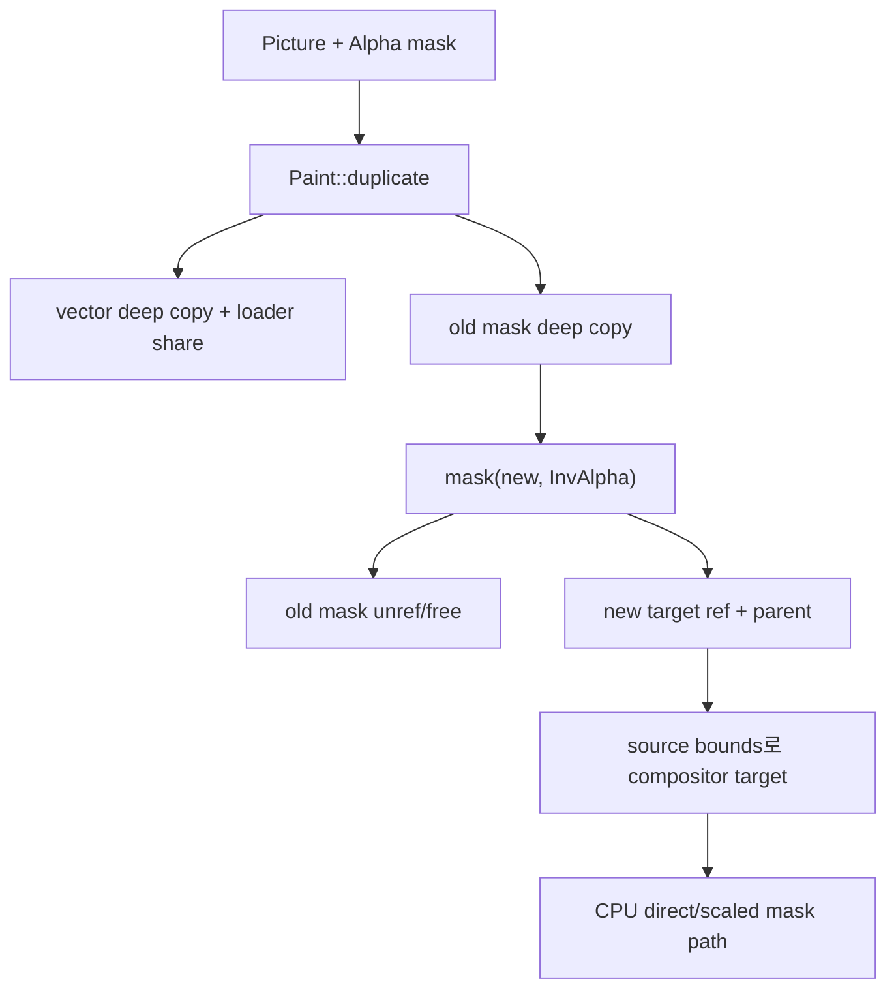

# #3263 — Picture duplicate 후 CPU masking 불일치

- Link: https://github.com/thorvg/thorvg/issues/3263
- 난이도: 69/100
- 실현 가능성: 중간
- 초심자 추천: 조건부 (단색 fixture와 ref-count 검사부터)
- 분석 기준: `main` working tree `f989b27892ba`
- 관련 영역: Paint/Picture duplicate, mask ownership, CPU compositor
- 배울 수 있는 것: deep copy, mask replacement, bounds, Alpha/InvAlpha composition

## 이슈 요약

Alpha mask를 가진 SVG Picture를 duplicate한 뒤 복제본의 transform과 mask를 InvAlpha로 교체했을 때 CPU 결과가 잘못된다는 사례다. current duplicate/mask ownership 코드를 보면 mask deep copy와 교체 자체는 지원된다. 따라서 “duplicate가 old mask를 유지한다”는 단순 원인보다 복제된 vector/loader 상태, source/mask bounds, transform 후 CPU compositor 경로를 최소 fixture로 나눠야 한다.

## 난이도 산정

| 항목 | 점수 | 근거 |
|---|---:|---|
| 재현·증거 불확실성 (0-20) | 15 | sample은 있지만 expected pixel 설명과 local tiger asset/backend 비교가 없다. |
| 변경 범위 (0-25) | 13 | duplicate/mask/bounds/CPU raster 안으로 제한 가능하다. |
| 구현 복잡도 (0-25) | 18 | nested vector transform과 offscreen mask composition을 추적해야 한다. |
| 교차 영향 위험 (0-20) | 15 | ref-count/parent 변경은 leak/UAF, mask 변경은 전체 composition에 영향이 있다. |
| 검증 부담 (0-10) | 8 | mask method/duplicate/transform matrix와 sanitizer가 필요하다. |
| **합계** | **69** | **범위는 중간이지만 소유권과 raster를 동시에 배제해야 한다.** |

## main 코드 조사

### 확인된 사실

- [`Paint::Impl::duplicate()`](https://github.com/thorvg/thorvg/blob/f989b27892bab31f224f810a54782055eba1e3bc/src/renderer/tvgPaint.cpp)은 concrete Paint를 duplicate한 후 기존 mask target도 `duplicate()`하여 같은 method로 붙이고 clip/transform/opacity를 복사한다.
- [`PictureImpl::duplicate()`](https://github.com/thorvg/thorvg/blob/f989b27892bab31f224f810a54782055eba1e3bc/src/renderer/tvgPicture.h)은 loaded vector를 deep duplicate하고 loader sharing을 늘리며 bitmap pointer/size 상태를 복사한다.
- 복제본에서 `mask(newTarget, InvAlpha)`를 부르면 [`Paint::Impl::mask()`](https://github.com/thorvg/thorvg/blob/f989b27892bab31f224f810a54782055eba1e3bc/src/renderer/tvgPaint.h)이 기존 mask target을 unref하고 `Mask` record를 free한 뒤 새 target을 ref한다. mask replacement는 명시적 지원 경로다.
- render 시 Alpha/InvAlpha는 source bounds를 mask bounds와 union하지 않는 `MASK_REGION_MERGING=false` 경로다. compositor region은 source bounds에서 시작한다.
- CPU raster는 rect/RLE/image와 direct/scaled/matted에 따라 다수의 mask 함수로 분기한다. Picture transform이 달라지면 선택 경로도 달라질 수 있다.

### 아직 가설인 부분

- **배제된 단순 가설:** 새 `mask()` 호출이 old mask와 chain되는 구조는 아니다. current code는 old record를 제거한다.
- **가설 A:** duplicate된 Picture의 outer transform과 nested vector bounds가 새 mask의 좌표계와 다르게 계산된다.
- **가설 B:** `MASK_REGION_MERGING=false`인 InvAlpha에서 source/compositor bbox 밖 의미가 기대와 다를 수 있다.
- **가설 C:** duplicate 없이 같은 Picture를 새로 load한 control이 정상이라면 loader/vector duplicate state가, 둘 다 틀리면 mask raster가 우선 후보다.

## 수정 방향과 실현 가능성

1. tiger를 단색 rect Picture/Scene으로 대체해 duplicate 유무 × Alpha/InvAlpha × translate 조합을 만든다.
2. duplicate 대신 같은 source를 새로 구성한 control과 exact pixel diff한다.
3. old/new mask refCnt·parent와 source/mask/compositor bbox를 기록한다.
4. CPU가 direct/scaled, rect/RLE/image 중 어느 mask 함수를 선택하는지 좁힌다.
5. GL/WG 결과와 비교하고 ASan/UBSan으로 replacement lifetime을 검증한다.

**판정:** fixture를 단순화하면 실현 가능성이 중간이다. ownership 코드를 근거 없이 바꾸기보다 bbox와 raster 분기를 먼저 확정해야 한다.

## 참고 자료

- [이슈 #3263과 재현 코드](https://github.com/thorvg/thorvg/issues/3263)
- [`src/renderer/tvgPaint.cpp`](https://github.com/thorvg/thorvg/blob/f989b27892bab31f224f810a54782055eba1e3bc/src/renderer/tvgPaint.cpp)
- [`src/renderer/tvgPaint.h`](https://github.com/thorvg/thorvg/blob/f989b27892bab31f224f810a54782055eba1e3bc/src/renderer/tvgPaint.h)
- [`src/renderer/tvgPicture.h`](https://github.com/thorvg/thorvg/blob/f989b27892bab31f224f810a54782055eba1e3bc/src/renderer/tvgPicture.h)
- [`src/renderer/tvgRender.h`](https://github.com/thorvg/thorvg/blob/f989b27892bab31f224f810a54782055eba1e3bc/src/renderer/tvgRender.h)
- [`src/renderer/cpu_engine/tvgSwRaster.cpp`](https://github.com/thorvg/thorvg/blob/f989b27892bab31f224f810a54782055eba1e3bc/src/renderer/cpu_engine/tvgSwRaster.cpp)
- [`src/renderer/cpu_engine/tvgSwRenderer.cpp`](https://github.com/thorvg/thorvg/blob/f989b27892bab31f224f810a54782055eba1e3bc/src/renderer/cpu_engine/tvgSwRenderer.cpp)

