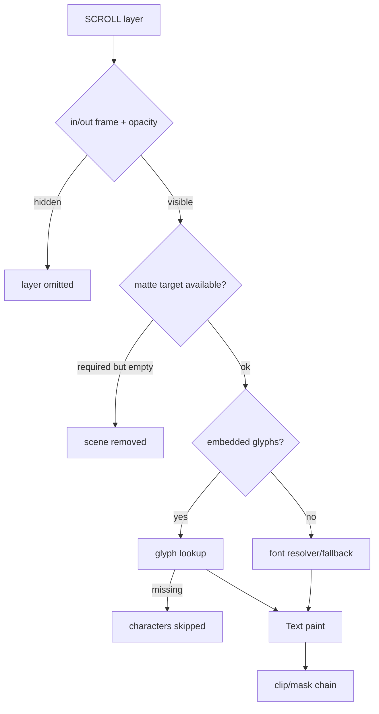

# #3302 — Lottie mask 장면에서 `SCROLL` 텍스트 누락

- Link: https://github.com/thorvg/thorvg/issues/3302
- 난이도: 77/100
- 실현 가능성: 중간 (attachment 확보 후 진단), 낮음 (현재 정보만으로 수정)
- 초심자 추천: 조건부
- 분석 기준: `main` working tree `f989b27892ba`
- 조사 상태: 기존 보류 해제 — font/glyph, layer matte, mask의 세 분기를 current builder 순서로 구체화해 점수화함
- 관련 영역: Lottie text, masks/mattes, layer visibility
- 배울 수 있는 것: Lottie layer stack, embedded glyph/font fallback, mask chaining

## 이슈 요약

첨부 Lottie에서 `SCROLL` 텍스트가 ThorVG 출력에서 빠지는 compliance 이슈다. JSON attachment가 local tree에 없어 어느 layer/property인지 직접 열거할 수 없지만 current code상 텍스트가 사라질 수 있는 세 경로는 구체적이다: layer visibility/opacity에서 조기 return, embedded glyph 또는 fallback font 실패, matte/mask 결과가 zero alpha가 되는 경우다. 이 분기들을 독립적으로 검증하는 계획으로 조사 보류를 해제한다.

## 난이도 산정

| 항목 | 점수 | 근거 |
|---|---:|---|
| 재현·증거 불확실성 (0-20) | 20 | JSON이 local에 없어 SCROLL layer/font/mask/matte metadata를 확인하지 못했다. |
| 변경 범위 (0-25) | 15 | 원인에 따라 text loader 또는 Lottie layer/mask builder 한 영역으로 좁혀진다. |
| 구현 복잡도 (0-25) | 18 | layer stack과 matte source ownership, glyph fallback을 추적해야 한다. |
| 교차 영향 위험 (0-20) | 16 | Lottie mask/matte나 font fallback 변경은 많은 asset에 영향을 준다. |
| 검증 부담 (0-10) | 8 | font 유무·mask/matte 변형과 세 backend golden test가 필요하다. |
| **합계** | **77** | **asset 부재가 크지만 실패 분기와 진단 계획은 코드로 확정 가능하다.** |

## main 코드 조사

### 확인된 사실

- [`updateLayer()`](https://github.com/thorvg/thorvg/blob/f989b27892bab31f224f810a54782055eba1e3bc/src/loaders/lottie/tvgLottieBuilder.cpp)은 in/out frame과 opacity를 검사하고 Scene을 만든 뒤 `updateMatte()`, layer type별 content build, `updateMasks()` 순서로 처리한다.
- text는 local embedded glyph가 있으면 `updateLocalFont()`, 아니면 `updateURLFont()`를 사용한다.
- local glyph 검색에 실패하면 해당 UTF-8 byte를 건너뛰며 shape를 생성하지 않는다. URL font가 이름/asset resolver에서 실패하면 `font(nullptr)` fallback을 시도한다.
- `updateMatte()`는 target layer를 먼저 update하여 current layer Scene에 mask로 붙인다. Alpha/Luma matte target Scene이 없으면 current Scene을 없애고 false를 반환한다.
- 단일 additive mask는 effect가 없을 때 actual mask 대신 clip fast path가 될 수 있고, 여러 mask는 Paint mask chain으로 구성된다.

### 아직 가설인 부분

- **가설 A:** SCROLL glyph가 embedded font `chars`에 없거나 font association이 잘못되어 local glyph branch에서 조용히 skip된다.
- **가설 B:** SCROLL layer가 matte source로 표시되어 top-level scene에 직접 add되지 않거나 잘못된 matte target에 소비된다.
- **가설 C:** 단일-mask clip fast path 또는 composed mask alpha가 text bounds를 제외한다.
- 세 가설의 우선순위는 JSON의 `ty`, `fonts/chars`, `tt/td/tp`, `masksProperties`, `ip/op`를 보지 않고 정할 수 없다.

## 수정 방향과 실현 가능성

1. attachment를 local fixture로 확보하고 SCROLL layer의 type/index/parent/in-out/font/masks/matte를 표로 만든다.
2. mask/matte 제거, text를 solid Shape로 대체, font를 known fixture로 대체한 세 변형을 만든다.
3. layer Scene 생성 여부, glyph hit count, matte target와 최종 bounds/opacity를 trace한다.
4. 최초 실패가 font, layer stack, mask 중 어디인지 확정한 뒤 최소 JSON으로 줄인다.
5. CPU reference와 GL/WG, font present/absent 및 matte method matrix를 regression test한다.

**판정:** 수정 방향을 추측할 수는 없지만 실제 난이도는 산정 가능하다. attachment 확보 후 원인 분리는 실현 가능성이 중간이다.

## 참고 자료

- [이슈 #3302과 `28035.json` 링크](https://github.com/thorvg/thorvg/issues/3302)
- [`src/loaders/lottie/tvgLottieBuilder.cpp`](https://github.com/thorvg/thorvg/blob/f989b27892bab31f224f810a54782055eba1e3bc/src/loaders/lottie/tvgLottieBuilder.cpp)
- [`src/loaders/lottie/tvgLottieModel.h`](https://github.com/thorvg/thorvg/blob/f989b27892bab31f224f810a54782055eba1e3bc/src/loaders/lottie/tvgLottieModel.h)
- [`src/loaders/lottie/tvgLottieParser.cpp`](https://github.com/thorvg/thorvg/blob/f989b27892bab31f224f810a54782055eba1e3bc/src/loaders/lottie/tvgLottieParser.cpp)
- [`src/renderer/tvgText.h`](https://github.com/thorvg/thorvg/blob/f989b27892bab31f224f810a54782055eba1e3bc/src/renderer/tvgText.h)
- [`src/renderer/tvgPaint.cpp`](https://github.com/thorvg/thorvg/blob/f989b27892bab31f224f810a54782055eba1e3bc/src/renderer/tvgPaint.cpp)
