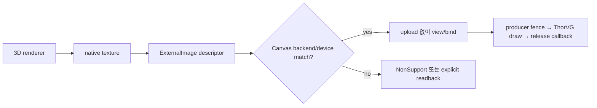

# #3365 — GPU native texture를 Picture source로 사용

- Link: https://github.com/thorvg/thorvg/issues/3365
- 난이도: 91/100
- 실현 가능성: 낮음
- 초심자 추천: 비추천
- 분석 기준: `main` working tree `f989b27892ba`
- 관련 영역: Picture C++/C API, GL/WG texture ownership, GPU synchronization
- 배울 수 있는 것: zero-copy interop, device/context identity, resource lifetime와 format

## 이슈 요약

3D renderer가 만든 GL/WebGPU native texture를 CPU copy 없이 ThorVG Picture로 합성하려는 기능 요청이다. current Picture source는 encoded bytes 또는 CPU `uint32_t` pixels이고 GPU backend는 이를 자체 texture로 upload한다. external texture를 참조하려면 public descriptor, backend-specific prepare, ownership/synchronization 계약과 unsupported CPU behavior를 새로 설계해야 한다.

## 난이도 산정

| 항목 | 점수 | 근거 |
|---|---:|---|
| 재현·증거 불확실성 (0-20) | 12 | use case는 분명하지만 handle/format/ownership/sync API 계약이 없다. |
| 변경 범위 (0-25) | 25 | Picture/C API, RenderSurface/RenderMethod, GL/WG render data와 tests에 걸친다. |
| 구현 복잡도 (0-25) | 24 | 서로 다른 native handle과 context/device, state transition을 안전하게 추상화해야 한다. |
| 교차 영향 위험 (0-20) | 20 | UAF, wrong device/context, GPU race와 public ABI 위험이 크다. |
| 검증 부담 (0-10) | 10 | GL/GLES/WG, format, destruction order와 fence matrix가 필요하다. |
| **합계** | **91** | **zero-copy API와 GPU resource protocol을 동시에 추가하는 대형 기능이다.** |

## main 코드 조사

### 확인된 사실

- [`Picture::load()`](https://github.com/thorvg/thorvg/blob/f989b27892bab31f224f810a54782055eba1e3bc/inc/thorvg.h)은 file, encoded memory, raw `uint32_t*`만 받으며 native texture overload가 없다.
- `RenderMethod::prepare()`의 image 입력은 `RenderSurface*`이고 current `RenderSurface`는 CPU data pointer/size/stride/colorspace를 담는다.
- GL [`TextureMgr::upload()`](https://github.com/thorvg/thorvg/blob/f989b27892bab31f224f810a54782055eba1e3bc/src/renderer/gpu_engine/gl/tvgGlTextureMgr.cpp)은 `glGenTextures/glTexImage2D`로 자체 texture를 만든다.
- WG [`WgTextureMgr::upload()`](https://github.com/thorvg/thorvg/blob/f989b27892bab31f224f810a54782055eba1e3bc/src/renderer/gpu_engine/wg/tvgWgTextureMgr.cpp)도 CPU data로 자체 WGPUTexture/view/bind group을 allocate한다.
- WgCanvas가 external WGPUTexture를 받을 수 있는 API는 **output target**용이며 Picture source와 연결되지 않는다.
- managers는 자신이 만든 texture를 ref-count 후 release/delete한다. external-owned texture를 같은 규칙으로 삭제하면 안 된다.

### 필요한 계약

| 항목 | GL source | WG source | 공통 API가 답해야 할 것 |
|---|---|---|---|
| handle | `GLuint` + current/shared context | `WGPUTexture/View` + device | backend tag와 device/context identity |
| format | GL internal/external format | `WGPUTextureFormat` | ABGR/ARGB, sRGB, premultiplied alpha |
| state | binding/context synchronization | usage/layout/queue submission | producer 완료와 consumer 시작 barrier |
| lifetime | 누가 `glDeleteTextures`? | retain/release callback? | borrow/retain/release 시점 |
| fallback | CPU readback 필요 | CPU readback 필요 | unsupported 반환 또는 explicit copy |

### 아직 가설인 부분

- **가설 A:** backend-neutral `ExternalImage` descriptor + backend union이 raw overload 여러 개보다 확장 가능하다. public ABI 설계가 선행되어야 한다.
- **가설 B:** borrowed lifetime을 `Canvas::sync()`까지 요구하는 계약이 가장 단순하지만 async update/render와 producer reuse를 충분히 표현하지 못할 수 있다.
- **가설 C:** GL과 WG를 한 patch에서 노출하되 backend mismatch는 `NonSupport`로 처리할 수 있다. CPU fallback readback은 zero-copy 목적과 충돌한다.

## 수정 방향과 실현 가능성

1. backend tag, native handle, device/context, size/format, alpha, ownership callback과 sync token을 포함한 API proposal을 작성한다.
2. C++/C ABI와 object lifetime을 먼저 review하고 CPU/backend mismatch result를 정한다.
3. GL 한 vertical slice에서 existing texture를 borrow해 upload를 건너뛰고 `Canvas::sync()`/destroy 순서를 test한다.
4. WG에서는 same-device validation, texture usage/view/bind group과 queue synchronization을 구현한다.
5. context/device mismatch, producer deletion/reuse, resize와 all formats를 validation/debug layer로 검증한다.

**판정:** GPU interop 경험과 public API review가 필요한 작업이다. 초심자에게는 적합하지 않다.

## 참고 자료

- [이슈 #3365](https://github.com/thorvg/thorvg/issues/3365)
- [`inc/thorvg.h`](https://github.com/thorvg/thorvg/blob/f989b27892bab31f224f810a54782055eba1e3bc/inc/thorvg.h) — `Picture`, `WgCanvas`
- [`src/renderer/tvgRender.h`](https://github.com/thorvg/thorvg/blob/f989b27892bab31f224f810a54782055eba1e3bc/src/renderer/tvgRender.h)
- [`src/renderer/gpu_engine/gl/tvgGlTextureMgr.cpp`](https://github.com/thorvg/thorvg/blob/f989b27892bab31f224f810a54782055eba1e3bc/src/renderer/gpu_engine/gl/tvgGlTextureMgr.cpp)
- [`src/renderer/gpu_engine/wg/tvgWgTextureMgr.cpp`](https://github.com/thorvg/thorvg/blob/f989b27892bab31f224f810a54782055eba1e3bc/src/renderer/gpu_engine/wg/tvgWgTextureMgr.cpp)
- [`src/renderer/gpu_engine/wg/tvgWgRenderData.cpp`](https://github.com/thorvg/thorvg/blob/f989b27892bab31f224f810a54782055eba1e3bc/src/renderer/gpu_engine/wg/tvgWgRenderData.cpp)

