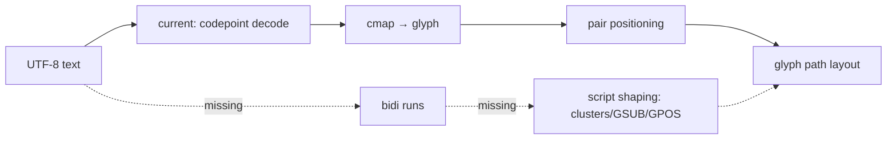

# #3397 — Text 고급 기능 umbrella

- Link: https://github.com/thorvg/thorvg/issues/3397
- 난이도: 97/100
- 실현 가능성: 낮음 (umbrella 전체 기준)
- 초심자 추천: 비추천 — 반드시 독립 하위 이슈로 선택
- 분석 기준: `main` working tree `f989b27892ba`
- 조사 상태: 기존 보류 해제 — 하나의 umbrella 전체 난이도를 점수화하고 하위 항목별 범위를 분리함
- 관련 영역: Text/C API, SFNT parser, Unicode layout/shaping, font containers
- 배울 수 있는 것: glyph metrics, bidi/shaping, font tables, decoration과 layout

## 이슈 요약

font-name list, underline/strikethrough, TTC/OTC/WOFF, bidi, complex shaping, rich/vertical text와 hinting을 한데 추적하는 roadmap umbrella다. acceptance criterion 하나가 없는 점 자체가 높은 불확실성과 범위다. 하지만 “점수화 불가”는 아니다. 전체를 한 작업으로 본 난이도는 최고 수준이며, 초심자는 별도 하위 이슈 하나를 선택해야 한다.

## 난이도 산정

| 항목 | 점수 | 근거 |
|---|---:|---|
| 재현·증거 불확실성 (0-20) | 20 | 서로 독립적인 기능 묶음이며 완료 조건과 우선순위가 하나로 정의되지 않았다. |
| 변경 범위 (0-25) | 25 | public C++/C API, layout, binary font parser, cache와 rendering 전반에 걸친다. |
| 구현 복잡도 (0-25) | 25 | Unicode bidi/shaping부터 WOFF/container/hinting까지 전문 분야가 다수다. |
| 교차 영향 위험 (0-20) | 18 | ABI, glyph metrics/cursor, binary size와 기존 Latin layout에 영향이 있다. |
| 검증 부담 (0-10) | 9 | scripts/languages/fonts/platform과 reference shaping matrix가 필요하다. |
| **합계** | **97** | **한 이슈로 구현할 수 없는 장기 roadmap 규모다.** |

## main 코드 조사

### 확인된 사실

- public [`Text`](https://github.com/thorvg/thorvg/blob/f989b27892bab31f224f810a54782055eba1e3bc/inc/thorvg.h)는 font, size, UTF-8 text, align/layout/wrap/lines, italic, outline, fill, spacing과 text/glyph metrics를 제공한다.
- [`SfntLoader`](https://github.com/thorvg/thorvg/blob/f989b27892bab31f224f810a54782055eba1e3bc/src/loaders/sfnt/tvgSfntLoader.cpp)은 UTF-8 codepoint를 순서대로 glyph로 매핑하고 adjacent glyph positioning을 적용한다. bidi run reorder나 GSUB/GPOS shaping pipeline은 없다.
- TTF/OTF readers와 glyph cache가 있지만 HarfBuzz 같은 external shaping engine dependency는 없다.
- LoaderMgr는 `.ttc/.otc` extension을 SFNT로 보내지만 `SfntLoader::gen()`은 `0x00010000/true/OTTO`만 허용하고 `ttcf` collection header는 처리하지 않는다.
- public font list enumeration, underline/strikethrough, vertical mode API는 없다. glyph metrics 문서도 horizontal layout만 지원한다고 명시한다.
- font file 내부 name table을 public registry로 열거하는 경로는 없다. 현재 filename 또는 caller-provided name 중심이다.

### 하위 기능 현실성 표

| 하위 기능 | current gap | 예상 난도 | 초심자 적합성 |
|---|---|---:|---|
| Font Name List | LoaderMgr registry 공개/수명/API 없음 | 55–70 | 조건부 |
| Underline/Strikethrough | API·font decoration metrics·line Shape 없음 | 45–60 | 가장 적합 |
| TTC/OTC | `ttcf` header/face offset·face 선택 없음 | 55–75 | first-face subset 조건부 |
| WOFF/WOFF2 | container decompression/validation 없음 | 75–90 | 비추천 |
| Bidi | paragraph direction/run reorder 없음 | 85–95 | 비추천 |
| Complex shaping | GSUB/GPOS clusters/ligatures 없음 | 95+ | 비추천 |
| Rich/vertical text | span model/API·layout 방향 없음 | 90+ | 비추천 |
| Hinting | instruction/raster integration 없음 | 90+ | 비추천 |

### 아직 가설인 부분

- **확인된 판단:** umbrella 전체는 하나의 수정 계획으로 실현 가능하지 않으며 독립 specs/issues로 쪼개야 한다.
- **가설 A:** underline/strikethrough는 current Text metrics와 extra Shape로 시작할 수 있지만 font별 position/thickness table 지원 여부를 확인해야 한다.
- **가설 B:** complex shaping은 직접 구현보다 shaping library integration이 현실적일 수 있으나 ThorVG binary-size/dependency 정책과 충돌할 수 있다.
- **가설 C:** TTC first-face-only는 작은 parser patch지만 올바른 family 선택 API 없이 사용자 기대를 만족하지 못할 수 있다.

## 수정 방향과 실현 가능성

1. unchecked 항목을 각각 독립 issue/spec으로 나누고 별도 score/acceptance criterion을 둔다.
2. 각 기능마다 C++/C API, ownership, font/reference fixtures와 unsupported policy를 작성한다.
3. 초심자 track은 underline/strikethrough 또는 TTC container header test처럼 좁은 항목으로 시작한다.
4. bidi/shaping은 Unicode/script conformance corpus와 external dependency/binary-size proposal을 먼저 만든다.
5. umbrella는 하위 이슈 링크와 상태만 추적하고 코드 PR 하나로 close하려 하지 않는다.

**판정:** 전체 실현 가능성은 낮다. 다만 하위 항목으로 나누면 45점대부터 95점 이상까지 별개의 기여 기회가 된다.

## 참고 자료

- [이슈 #3397](https://github.com/thorvg/thorvg/issues/3397)
- [`inc/thorvg.h`](https://github.com/thorvg/thorvg/blob/f989b27892bab31f224f810a54782055eba1e3bc/inc/thorvg.h) — `Text`, `TextMetrics`, `GlyphMetrics`
- [`src/renderer/tvgText.h`](https://github.com/thorvg/thorvg/blob/f989b27892bab31f224f810a54782055eba1e3bc/src/renderer/tvgText.h)
- [`src/loaders/sfnt/tvgSfntLoader.cpp`](https://github.com/thorvg/thorvg/blob/f989b27892bab31f224f810a54782055eba1e3bc/src/loaders/sfnt/tvgSfntLoader.cpp)
- [`src/loaders/sfnt/tvgSfntReader.cpp`](https://github.com/thorvg/thorvg/blob/f989b27892bab31f224f810a54782055eba1e3bc/src/loaders/sfnt/tvgSfntReader.cpp)
- [`src/renderer/tvgLoaderMgr.cpp`](https://github.com/thorvg/thorvg/blob/f989b27892bab31f224f810a54782055eba1e3bc/src/renderer/tvgLoaderMgr.cpp)
- [관련 font-name 이슈 #4174](https://github.com/thorvg/thorvg/issues/4174)
- [관련 TTC 이슈 #3788](https://github.com/thorvg/thorvg/issues/3788)

