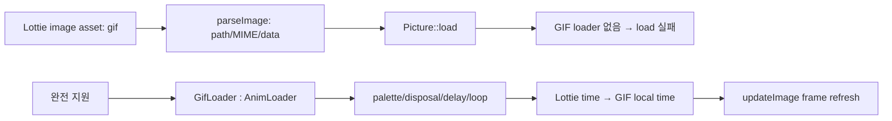

# #3446 — Lottie image asset의 GIF 지원

- Link: https://github.com/thorvg/thorvg/issues/3446
- 난이도: 88/100
- 실현 가능성: 낮음 (static first-frame scope는 중간)
- 초심자 추천: 비추천
- 분석 기준: `main` working tree `f989b27892ba`
- 관련 영역: GIF loader, Lottie image asset, nested animation timing
- 배울 수 있는 것: decoder/disposal, asset resolver, nested timeline와 loader lifetime

## 이슈 요약

Lottie image asset이 `.gif` 또는 embedded `image/gif`를 참조할 때 지원되는지 묻는 요청이다. current main에는 GIF **saver**만 있고 GIF decode loader는 없다. 정적 첫 frame 표시만 요구하는지 GIF animation까지 Lottie timeline과 동기화할지에 따라 범위가 크게 다르다. 완전 지원은 독립 GIF AnimLoader와 nested animation update가 모두 필요하다.

## 난이도 산정

| 항목 | 점수 | 근거 |
|---|---:|---|
| 재현·증거 불확실성 (0-20) | 12 | sample은 있으나 spec/consumer가 first frame과 animation 중 무엇을 기대하는지 미정이다. |
| 변경 범위 (0-25) | 24 | LoaderMgr/Meson, GIF decoder, Lottie model/builder와 timeline에 걸친다. |
| 구현 복잡도 (0-25) | 23 | palette, transparency/disposal/loop와 nested frame mapping을 구현해야 한다. |
| 교차 영향 위험 (0-20) | 19 | untrusted decoder, async loader ownership과 animation cache에 영향이 있다. |
| 검증 부담 (0-10) | 10 | malformed corpus, disposal, embedded/external, timing과 platform matrix가 필요하다. |
| **합계** | **88** | **새 image decoder와 nested animation 기능의 결합이다.** |

## main 코드 조사

### 확인된 사실

- `src/loaders/`에 GIF directory/decoder가 없고 [`LoaderMgr::_find()`](https://github.com/thorvg/thorvg/blob/f989b27892bab31f224f810a54782055eba1e3bc/src/renderer/tvgLoaderMgr.cpp)은 `FileType::Gif` loader를 생성하지 않는다.
- path dispatch는 `.gif`를 인식하지 않고 MIME `_convert()`도 `gif`를 매핑하지 않는다. `FileType::Gif` enum과 cache 제외 코드는 있으나 구현 존재를 뜻하지 않는다.
- [`LottieParser::parseImage()`](https://github.com/thorvg/thorvg/blob/f989b27892bab31f224f810a54782055eba1e3bc/src/loaders/lottie/tvgLottieParser.cpp)은 embedded `data:image/*`의 MIME/data 또는 external path를 `LottieImage`에 저장한다.
- [`LottieImage::prepare()`](https://github.com/thorvg/thorvg/blob/f989b27892bab31f224f810a54782055eba1e3bc/src/loaders/lottie/tvgLottieModel.cpp)은 embedded data/path를 일반 `Picture::load()`에 넘긴다. GIF는 여기서 loader를 찾지 못한다.
- [`updateImage()`](https://github.com/thorvg/thorvg/blob/f989b27892bab31f224f810a54782055eba1e3bc/src/loaders/lottie/tvgLottieBuilder.cpp)은 준비된 Picture를 Scene에 add할 뿐 nested `AnimLoader::frame()`을 Lottie frame에 맞추는 코드는 없다.
- current GIF code는 [`src/savers/gif/`](https://github.com/thorvg/thorvg/tree/f989b27892bab31f224f810a54782055eba1e3bc/src/savers/gif)에 있는 output encoder이며 decoder로 재사용할 수 없다.

### 범위별 현실성

| 범위 | 필요한 작업 | 실현 가능성 |
|---|---|---|
| static first frame | secure GIF parse/decode + Picture loader | 중간, 그래도 신규 decoder 규모 |
| standalone animated GIF | `AnimLoader`, frame/duration/disposal | 낮음 |
| Lottie nested GIF animation | 위 전부 + parent/local timeline mapping | 매우 낮음 |

### 아직 가설인 부분

- **확인된 직접 원인:** current main에는 GIF decode dispatch/backend가 없어 embedded/external GIF image를 load할 수 없다.
- **가설 A:** Lottie asset spec/consumer가 static image만 기대한다면 first-frame-only로 scope를 크게 줄일 수 있다.
- **가설 B:** animation을 지원할 경우 Lottie frame rate가 아니라 GIF frame별 delay와 loop를 time 단위로 mapping해야 한다.
- **가설 C:** generic animated Picture update API가 먼저 필요할 수 있다. 현재 `LottieImage`는 `Animation` handle을 보관하지 않는다.

## 수정 방향과 실현 가능성

1. 이슈에 인용된 Lottie Assets spec과 target consumer에서 GIF의 static/animated 기대를 확정한다.
2. Lottie와 분리해 standalone GIF Picture/Animation loader issue로 decoder, Meson option과 security tests를 설계한다.
3. first-frame-only면 명시적으로 문서화하고 embedded/path MIME dispatch를 연결한다.
4. animation이면 GIF local timestamp API와 Lottie frame time mapping, loop/reset semantics를 정의한다.
5. malformed GIF, large dimensions, disposal/transparency, async destruction와 WASM/embedded build를 검증한다.

**판정:** first-frame subset도 decoder 경험이 필요하며, 이슈 전체를 animated asset으로 해석하면 초심자 범위를 넘는다.

## 참고 자료

- [이슈 #3446과 sample](https://github.com/thorvg/thorvg/issues/3446)
- [이슈에 인용된 Lottie Assets spec](https://lottie.github.io/lottie-spec/latest/specs/assets/#image)
- [`src/renderer/tvgLoaderMgr.cpp`](https://github.com/thorvg/thorvg/blob/f989b27892bab31f224f810a54782055eba1e3bc/src/renderer/tvgLoaderMgr.cpp)
- [`src/renderer/tvgLoader.h`](https://github.com/thorvg/thorvg/blob/f989b27892bab31f224f810a54782055eba1e3bc/src/renderer/tvgLoader.h)
- [`src/loaders/lottie/tvgLottieParser.cpp`](https://github.com/thorvg/thorvg/blob/f989b27892bab31f224f810a54782055eba1e3bc/src/loaders/lottie/tvgLottieParser.cpp)
- [`src/loaders/lottie/tvgLottieModel.cpp`](https://github.com/thorvg/thorvg/blob/f989b27892bab31f224f810a54782055eba1e3bc/src/loaders/lottie/tvgLottieModel.cpp)
- [`src/loaders/lottie/tvgLottieBuilder.cpp`](https://github.com/thorvg/thorvg/blob/f989b27892bab31f224f810a54782055eba1e3bc/src/loaders/lottie/tvgLottieBuilder.cpp)
- [`src/savers/gif/`](https://github.com/thorvg/thorvg/tree/f989b27892bab31f224f810a54782055eba1e3bc/src/savers/gif)
