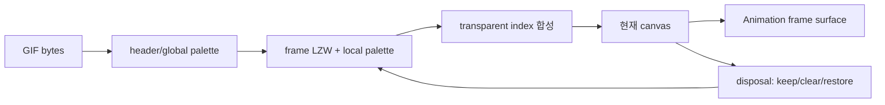

# #3453 — ThorVG 기본 GIF animation loader

- **Link:** https://github.com/thorvg/thorvg/issues/3453
- **난이도:** 82/100
- **초심자 추천:** 비추천(metadata parser test는 조건부)
- **관련 영역:** GIF decoder, `AnimLoader`, frame composition, LoaderMgr/Meson
- **배울 수 있는 것:** indexed palette, LZW, disposal, delta frame, animation lifetime
- **조사 기준:** `main@f989b27892bab31f224f810a54782055eba1e3bc`

## 이슈 요약

GIF의 frame·duration·loop·disposal을 복원해 `Animation`으로 재생할 read-only loader를 추가하는 요청이다. 현재 GIF 코드는 saver뿐이며 decode 경로는 없다. “기본 지원”이어도 delta frame 합성의 의미를 틀리면 대부분의 실제 animation이 깨진다.

## 난이도 산정

| 항목 | 점수 | 근거 |
|---|---:|---|
| 재현·증거 불확실성 (0-20) | 10 | 목표는 명확하지만 decoder 선택, seek와 지원 extension 범위가 미정이다. |
| 변경 범위 (0-25) | 21 | FileType dispatch, Meson, async loader, Animation timeline과 C API 입력을 잇는다. |
| 구현 복잡도 (0-25) | 23 | LZW보다 palette/transparency/disposal/restore 합성이 어렵다. |
| 교차 영향 위험 (0-20) | 18 | 손상 입력, task lifetime, embedded memory와 random seek가 얽힌다. |
| 검증 부담 (0-10) | 10 | disposal/interlace/loop/seek/fuzz 및 thread on/off를 검사해야 한다. |
| **합계** | **82** |  |

- **실현 가능성: 중간.** 검증된 외부 decoder와 sequential playback으로 범위를 제한하면 가능하지만 custom decoder+random seek까지 한 번에 구현하기는 어렵다.

## main 코드 조사

### 확인된 증거

- `FileType::Gif` enum과 `Loader::allowCache()`의 GIF 제외는 이미 있으나 `LoaderMgr::_find()`, 확장자/MIME dispatch에는 GIF loader case가 없다.
- `meson_options.txt`의 `gif`는 **savers** choice일 뿐 loaders choice에는 없다. `src/loaders/`에도 GIF 구현이 없다.
- `AnimLoader`는 `frame`, `totalFrame`, `curFrame`, `duration`, `segment`의 추상 계약을 제공하고 `Animation`은 이 interface만 사용한다.
- `src/savers/gif/`의 encoder는 출력 전용이며 decoder로 재사용할 수 없다.

```cpp
struct AnimLoader : ImageLoader {
    virtual bool frame(float no) = 0;
    virtual float totalFrame() = 0;
    virtual float curFrame() = 0;
    virtual float duration() = 0;
    virtual Result segment(float begin, float end) = 0;
};
```

### 아직 확인되지 않은 부분

- giflib/stb/custom 중 어느 dependency와 license·binary-size 정책을 택할지 정해지지 않았다.
- `Animation::frame()` random access를 이전 frame부터 재합성할지 key snapshot을 둘지 메모리 계약이 없다.
- 이 로컬 조사에서는 외부 GIF corpus나 decoder를 가져오지 않았다.

## 원인 가설

- **확인됨:** loader 등록과 구현 자체가 없으므로 현재 `.gif`/GIF MIME은 Picture load에 연결되지 않는다.
- **강한 설계 가설:** 한 composited canvas와 disposal=3용 restore buffer를 필요할 때만 유지하는 sequential decoder가 embedded 목표에 가장 가깝다.
- **위험 가설:** 모든 frame을 RGBA로 선해제하면 seek는 쉽지만 압축 GIF보다 수십 배 큰 peak memory가 될 수 있다.



## 수정 방향과 실현 가능성

1. still+animated, loop extension, disposal 0~3, sequential playback을 최소 계약으로 확정한다.
2. decoder dependency를 고르고 size limit·bounds check·license를 문서화한다.
3. `GifLoader : AnimLoader, Task`에서 header/frame metadata test를 먼저 만든다.
4. 한 composited surface와 선택적 previous snapshot으로 disposal을 구현하고 backward seek 정책을 정한다.
5. LoaderMgr 확장자/MIME, Meson `loaders=['gif']`, C/C++ Picture load와 Animation test를 연결한다.

## 위험과 검증

- local/global palette, interlace, transparent index, zero delay, Netscape loop와 truncated LZW를 검사한다.
- dimension/frame count overflow와 decompression bomb에 제한을 둔다.
- thread=0/다중 thread, forward/backward frame, repeated load/unload를 ASan/fuzz로 검증한다.

## 참고 자료

- `src/common/tvgCommon.h` — `FileType::Gif`
- `src/renderer/tvgLoader.h` — `ImageLoader`, `AnimLoader`, cache 정책
- `src/renderer/tvgLoaderMgr.cpp` — format dispatch
- `src/loaders/lottie/tvgLottieLoader.*` — 기존 animation loader 수명 선례
- `src/savers/gif/` — GIF output만 제공하는 현재 구현
- `meson_options.txt`, `src/loaders/meson.build` — optional loader 연결
