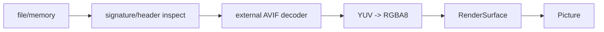

# #3471 — AVIF image loader 지원 제안

- **Link:** https://github.com/thorvg/thorvg/issues/3471
- **난이도:** 74/100
- **초심자 추천:** 조건부(Meson skeleton·still fixture부터)
- **관련 영역:** optional codec, AVIF color conversion, LoaderMgr, async decode
- **배울 수 있는 것:** external dependency, YUV/chroma, alpha·bit depth·color profile
- **조사 기준:** `main@f989b27892bab31f224f810a54782055eba1e3bc`

## 이슈 요약

AVIF 입력 지원 가능성을 논의하는 짧은 제안이다. still/animation, 8/10/12-bit, HDR/ICC와 decoder가 정해지지 않아 전체 format 지원으로 읽으면 큰 작업이다. 현실적인 첫 버전은 external decoder를 통한 still 8-bit RGBA 출력이다.

## 난이도 산정

| 항목 | 점수 | 근거 |
|---|---:|---|
| 재현·증거 불확실성 (0-20) | 16 | 이슈가 지원 수준, decoder, HDR/animation 계약을 지정하지 않는다. |
| 변경 범위 (0-25) | 16 | 새 loader, dispatch/Meson, surface 변환과 tests가 필요하다. |
| 구현 복잡도 (0-25) | 18 | external API와 YUV/chroma/alpha/orientation 변환을 정확히 매핑해야 한다. |
| 교차 영향 위험 (0-20) | 15 | codec ABI/license, WASM/static build, malformed media가 위험하다. |
| 검증 부담 (0-10) | 9 | subsampling·bit depth·profile·alpha와 fuzz corpus가 필요하다. |
| **합계** | **74** |  |

- **실현 가능성: 중간.** still-only 8-bit와 하나의 decoder로 제한하면 가능하며 animated AVIF/HDR는 후속 이슈가 적절하다.

## main 코드 조사

### 확인된 증거

- `FileType`, `LoaderMgr`, loader Meson choice에 AVIF가 전혀 없다.
- PNG/JPG/WebP는 system external dependency를 우선 사용하고 일부는 builtin fallback하는 선례가 있다.
- `PngLoader : ImageLoader, Task`는 header inspect 후 async decode하고 `RenderSurface`의 stride/size/ColorSpace/channelSize를 채운다.
- public output은 실질적으로 8-bit 32-bit ABGR/ARGB surface 중심이며 AVIF HDR metadata를 보존하는 surface/API는 없다.

```text
AVIF container -> decoder -> YUV(+alpha, 8/10/12 bit)
                         -> 1차 범위: 8-bit RGBA -> RenderSurface::ABGR8888S
                         -> 범위 밖: HDR/profile 보존, animated AVIF
```

### 아직 확인되지 않은 부분

- local tree에 AVIF decoder dependency 또는 fixture가 없으며 이번 조사에서 외부 package를 조회하지 않았다.
- image orientation, ICC/CICP와 premultiply 처리의 첫 버전 계약이 없다.
- animated sequence를 `Animation`으로 연결해야 하는지 이슈가 말하지 않는다.

## 원인 가설

- **확인됨:** 현재 증상은 codec bug가 아니라 format loader 부재다.
- **설계 가설:** external decoder의 RGBA conversion을 사용하고 ThorVG surface를 straight alpha로 표시하는 경로가 가장 작은 vertical slice다.
- **위험 가설:** decoder가 BGRA/RGBA와 premultiplied 여부를 다르게 내놓으면 채널은 맞아 보여도 alpha edge가 오염될 수 있다.



## 수정 방향과 실현 가능성

1. still-only, 8-bit RGBA, alpha 지원과 최대 dimension을 최소 사양으로 합의한다.
2. decoder/library 및 minimum version, static/shared/WASM 지원과 license를 결정한다.
3. `AvifLoader`의 file/memory inspect, ownership, Task decode를 기존 image loader 패턴으로 구현한다.
4. `ColorSpace`, channel order, premultiplied flag와 orientation 적용을 test로 고정한다.
5. Meson disabled/missing/found, LoaderMgr extension/MIME와 invalid input/fuzz test를 연결한다.

## 위험과 검증

- 4:2:0/4:2:2/4:4:4, odd dimensions, limited/full range, alpha와 8/10/12-bit input을 검사한다.
- HDR를 조용히 잘못 tone-map하지 말고 미지원이면 명확히 down-convert 정책을 적는다.
- codec allocation 실패와 huge dimension을 engine surface 할당 전에 검증한다.

## 참고 자료

- `src/common/tvgCommon.h` — format enum
- `src/renderer/tvgLoaderMgr.cpp` — extension/MIME dispatch
- `src/renderer/tvgLoader.h` — `ImageLoader`
- `src/loaders/png/tvgPngLoader.*` — async still-image loader 선례
- `src/loaders/meson.build`, `src/loaders/external_png/meson.build` — external/fallback 선례
- `src/renderer/tvgRender.h` — `RenderSurface`
