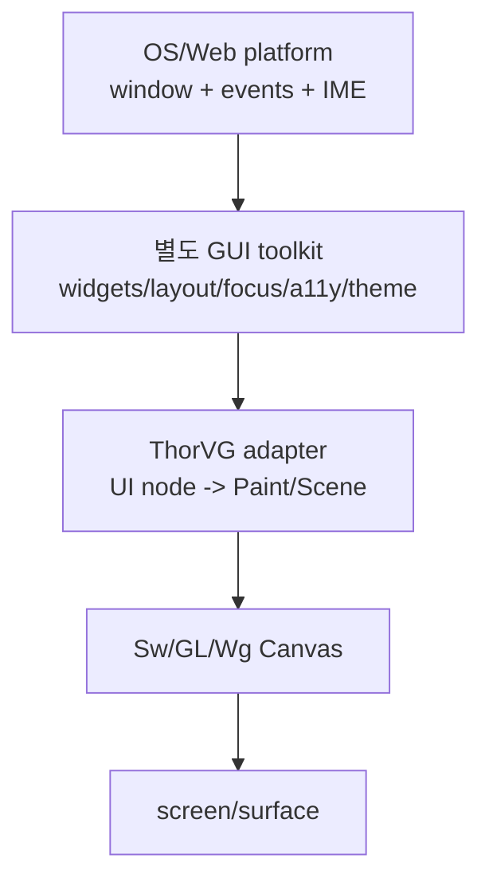

# #3487 — ThorVG 기반 새 GUI toolkit 제안

- **Link:** https://github.com/thorvg/thorvg/issues/3487
- **난이도:** 99/100
- **초심자 추천:** 비추천(설계 spike만 별도 분리 가능)
- **관련 영역:** UI tree, input/layout, accessibility, window/platform integration
- **배울 수 있는 것:** renderer와 toolkit의 책임 경계, retained state, portability
- **조사 기준:** `main@f989b27892bab31f224f810a54782055eba1e3bc`

## 이슈 요약

ThorVG를 시각 backend로 사용하는 공식 GUI toolkit을 만들자는 제품·architecture 아이디어다. 이전 “조사 보류”를 해제하고 현재 main과 요구 간 간극으로 점수화했다. 단일 코드 결함이 아니라 별도 framework를 정의하고 유지하는 범위라 사실상 최고 난이도다.

## 난이도 산정

| 항목 | 점수 | 근거 |
|---|---:|---|
| 재현·증거 불확실성 (0-20) | 20 | widget/API/플랫폼/완료 조건과 차별점이 아직 질문 형태다. |
| 변경 범위 (0-25) | 25 | input, layout, text editing, accessibility, theme, window와 배포를 포함한다. |
| 구현 복잡도 (0-25) | 25 | 여러 OS/web의 event·IME·focus·lifecycle을 하나의 toolkit으로 설계해야 한다. |
| 교차 영향 위험 (0-20) | 19 | ThorVG의 경량 core/API 철학과 유지보수·release 책임에 큰 영향을 준다. |
| 검증 부담 (0-10) | 10 | 플랫폼 matrix, accessibility, interaction, rendering, 성능을 장기 검증해야 한다. |
| **합계** | **99** |  |

- **실현 가능성: 낮음.** core 이슈로 바로 구현할 수 없으며 별도 repository의 단일-platform prototype으로 범위를 재정의해야 한다.

## main 코드 조사

### 확인된 증거

- public API는 `Paint/Shape/Scene/Picture/Text/Canvas`와 renderer target/update/draw/sync를 제공한다.
- `Text::layout()`은 text wrapping/layout box 기능이지 widget layout engine이 아니다.
- `Picture::accessible`은 vector asset ID 접근 최적화이며 screen-reader accessibility tree가 아니다.
- input event, focus traversal, pointer capture, widget state, clipboard, IME, window lifecycle API는 core에서 발견되지 않는다.
- `Canvas`는 render list를 관리하지만 hit-test→event routing→state update의 UI loop를 소유하지 않는다.



### 아직 확인되지 않은 부분과 외부 결정 한계

- target platform, maintainer, repository, license, compatibility와 binary budget이 정해지지 않았다.
- 공식 toolkit이 ThorVG core project의 책임인지 별도 community project인지 코드로 결정할 수 없다.
- 이번 조사는 외부 toolkit 비교나 사용자 조사를 수행하지 않았다.

## 원인 가설

- **확인됨:** 현재 main은 렌더러이며 GUI interaction framework가 아니다.
- **설계 가설:** core에 widget을 넣기보다 별도 library에서 ThorVG Paint tree로 변환하는 adapter 구조가 경량성과 backend 독립성을 가장 잘 보존한다.
- **제품 가설:** Lottie/TVG asset-driven skinning은 차별점 후보지만 접근성·입력·layout 비용을 대체하지 않는다.

## 수정 방향과 실현 가능성

1. 이 이슈를 구현 ticket이 아니라 RFC로 바꾸고 대상 사용 사례, 플랫폼 하나, non-goals를 적는다.
2. 별도 repository에서 `Button` 하나로 pointer input→state→layout→ThorVG Scene을 연결하는 vertical prototype을 만든다.
3. core에 정말 부족한 primitive와 toolkit 전용 기능을 목록으로 분리한다.
4. binary size, frame time, allocation, keyboard/focus 접근성의 acceptance criteria를 정의한다.
5. 이후 text input, scrolling, theme, accessibility, platform adapter를 독립 roadmap으로 쪼갠다.

```text
초기 완료 단위: Window 1 + Button 1 + pointer/keyboard + focus + render
전체 toolkit:     위 단위 × widgets/layout/a11y/IME/platform/release 생태계
```

## 위험과 검증

- renderer core에 platform/widget 책임을 넣으면 optionality와 binary size가 훼손될 수 있다.
- visual demo만으로 GUI toolkit 완료를 판단할 수 없고 keyboard, IME, a11y가 최소 품질에 포함돼야 한다.
- 승인된 scope 전에는 초심자가 코드를 고칠 “문제 지점”이 없다.

## 참고 자료

- `inc/thorvg.h` — public Paint/Canvas/Text 계층
- `src/renderer/tvgCanvas.h`, `tvgCanvas.cpp` — render lifecycle
- `src/renderer/tvgScene.h` — retained paint composition
- `src/renderer/tvgText.*` — text layout이 제공하는 현재 범위
- `src/renderer/tvgPicture.*` — asset access와 `accessible` 의미
- `docs/issue/1605-93.md` — window abstraction 관련 기존 분석
