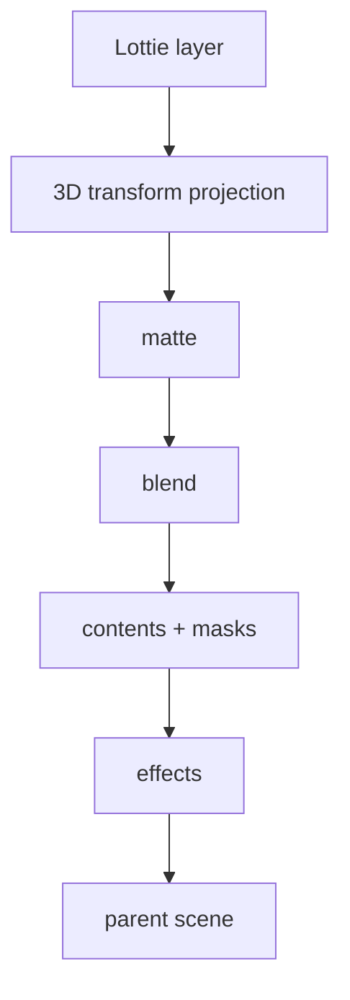

# #3497 — dotLottie animation의 transform/composition 불일치

- **Link:** https://github.com/thorvg/thorvg/issues/3497
- **난이도:** 89/100
- **초심자 추천:** 비추천
- **관련 영역:** Lottie 3D transform, parent hierarchy, matte/effect/blend 순서
- **배울 수 있는 것:** 3D→2D projection, scene composition, delta debugging
- **조사 기준:** `main@f989b27892bab31f224f810a54782055eba1e3bc`

## 이슈 요약

첨부 Lottie가 reference와 다르고 blending/transform이 의심되는 compliance 문제다. 기존 문서는 sample에 3D layer와 matte/effect/blend가 함께 있다고 기록했지만 첨부 JSON 자체는 local tree에 없어 이번 재조사에서 그 수치를 독립 검증하지 못했다.

## 난이도 산정

| 항목 | 점수 | 근거 |
|---|---:|---|
| 재현·증거 불확실성 (0-20) | 17 | attachment가 로컬에 없고 3D와 composition 문제를 분리하지 못했다. |
| 변경 범위 (0-25) | 21 | parser/model, hierarchy transform, matte/effect/blend와 Scene까지 이어진다. |
| 구현 복잡도 (0-25) | 24 | 3D orientation/projection과 composition order를 reference 의미에 맞춰야 한다. |
| 교차 영향 위험 (0-20) | 18 | layer update 순서 변경은 광범위한 Lottie 회귀를 낼 수 있다. |
| 검증 부담 (0-10) | 9 | 축소 fixture, frame별 matrix와 3 backend golden이 필요하다. |
| **합계** | **89** |  |

- **실현 가능성: 낮음.** attachment를 복구하고 3D-only와 matte/effect-only 문제로 분리하면 각각은 조사 가능하다.

## main 코드 조사

### 확인된 증거

- `parseTransform(ddd)`는 3D property를 읽지만 `3D transform(ddd) is not totally compatible` 로그를 명시한다.
- builder는 `Dimension3`의 rx/ry/orient를 2D `Matrix`로 투영하고 parent transform을 재귀 결합한다.
- `updateLayer()`의 순서는 transform/opacity scene 설정 → matte → blend → contents → masks → effects → parent scene add다.
- `Scene` renderer는 mask/blend/effect에 intermediate composition을 사용하므로 이 순서 변경은 단순 loader field 수정이 아니다.

```cpp
updateTransform(layer, frameNo);
layer->scene->opacity(layer->cache.opacity);
layer->scene->transform(layer->cache.matrix);
updateMatte(...);
layer->scene->blend(layer->blendMethod);
// contents -> masks -> effects -> parent add
```

### 아직 확인되지 않은 부분

- issue attachment와 축소 sample이 local test resources에 없어 frame별 결과를 재현하지 않았다.
- 차이가 3D transform, opacity 위치, matte/effect 순서 중 어느 하나 또는 복합인지 확정되지 않았다.
- reference player의 matrix/composition trace가 없다.

## 원인 가설

- **확인된 제한:** main 스스로 3D transform이 완전 호환되지 않는다고 표시한다.
- **가설 A:** parent/null의 3D orientation을 affine 2D로 축약하는 과정에서 matrix 또는 anchor 순서가 달라진다.
- **가설 B:** matte 대상의 opacity/effect가 reference와 다른 intermediate scene 단계에 적용된다.
- 두 가설을 한 patch에서 고치면 원인과 회귀를 구분할 수 없다.



## 수정 방향과 실현 가능성

1. attachment를 fixture로 확보하고 한 failing frame을 고정한다.
2. 3D-only, parent-only, matte-only, effect+opacity-only JSON으로 delta-debug한다.
3. transform 문제는 reference matrix와 `layer->cache.matrix/opacity`를 frame별 비교한다.
4. composition 문제는 intermediate scene/mask/effect 순서를 구조 test와 golden으로 분리한다.
5. SW에서 의미를 고정한 뒤 GL/WG effect+mask parity를 검사한다.

| 층 | 공통 여부 | 확인 방법 |
|---|---|---|
| Lottie matrix/model | backend 공통 | frame별 numeric trace |
| Scene mask/effect order | backend 공통 API | scene tree/operation trace |
| 최종 raster | SW/GL/WG 분기 | backend golden diff |

## 위험과 검증

- parented 3D, anchor, matte 종류, partial opacity, blend/effect와 여러 frame을 검사한다.
- 3D 지원 범위를 넘어서는 값은 조용히 틀리게 그리기보다 limitation을 명시해야 한다.
- 전체 sample 기준 “비슷해 보임”이 아니라 축소 fixture별 reference를 완료 조건으로 둔다.

## 참고 자료

- `src/loaders/lottie/tvgLottieParser.cpp` — `parseTransform(bool ddd)`
- `src/loaders/lottie/tvgLottieModel.h` — `Dimension3`, layer 관계
- `src/loaders/lottie/tvgLottieBuilder.cpp` — transform/matte/effect/layer update
- `src/renderer/tvgScene.h` — mask/blend/post-effect composition
- `test/testLottie.cpp`, `test/resources/` — fixture 위치
