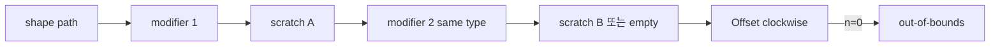

# #3539 — 같은 타입의 Lottie modifier 여러 개 지원

- **Link:** https://github.com/thorvg/thorvg/issues/3539
- **난이도:** 65/100
- **초심자 추천:** 조건부(empty-path crash test부터)
- **관련 영역:** modifier decorator chain, scratch path, empty geometry
- **배울 수 있는 것:** decorator ownership, temporary buffer alias, geometry pipeline invariant
- **조사 기준:** `main@f989b27892bab31f224f810a54782055eba1e3bc`

## 이슈 요약

동일 modifier를 연속 적용할 때 결과가 깨지거나 과거 cyclic-chain 방지 로그가 발생한 문제다. 현재 main에서는 해당 로그 문자열이 사라지고 fresh node를 연결하는 `decorate()`가 있지만, empty path의 Offset crash와 scratch buffer 재사용 위험은 남아 있다.

## 난이도 산정

| 항목 | 점수 | 근거 |
|---|---:|---|
| 재현·증거 불확실성 (0-20) | 10 | attachment는 로컬에 없지만 empty-path unsafe access는 코드로 확인된다. |
| 변경 범위 (0-25) | 14 | Lottie modifier chain, RenderPath scratch와 focused fixtures다. |
| 구현 복잡도 (0-25) | 18 | 중복 순서·alias·empty 결과의 계약을 네 modifier에 맞춰야 한다. |
| 교차 영향 위험 (0-20) | 15 | modifier reorder와 context copy/destructor ownership 회귀가 가능하다. |
| 검증 부담 (0-10) | 8 | modifier 순열, animated/repeated frame과 ASan이 필요하다. |
| **합계** | **65** |  |

- **실현 가능성: 중간.** crash guard는 작지만 동일 타입의 올바른 시각 결과까지 완료하려면 chain/scratch 검증이 필요하다.

## main 코드 조사

### 확인된 증거

- `LottieModifier`는 `next`를 소유하고 destructor가 재귀 delete한다.
- `decorate()`는 Offset을 chain 끝에 두는 특수 규칙과 다른 modifier를 head에 prepend하는 규칙을 쓴다. 동일 type 자체를 금지하지 않는다.
- 과거 issue가 언급한 `Decoration skipped...` 문자열은 current source에서 발견되지 않는다.
- `LottieOffsetModifier::modify()`의 `clockwise` lambda는 `n-1`과 `pts[n-1]`를 사용하지만 `n==0` guard가 없다.
- `RenderPath::scratch()`는 thread-local buffer 세 개를 순환·clear한다. 긴 modifier chain은 아직 사용 중인 scratch를 다시 받을 가능성을 검증해야 한다.

```cpp
auto clockwise = [](Point* pts, uint32_t n) {
    for (uint32_t i = 0; i < n - 1; i++) { /* n==0이면 underflow */ }
    area += cross(pts[n - 1], pts[0]);
};

static thread_local RenderPath dbuffers[3];
```

### 아직 확인되지 않은 부분

- `sample_1/2.json`은 local resources에 없어 current visual과 modifier sequence를 재생하지 않았다.
- 앞 modifier가 왜 empty path를 내는지, 혹은 scratch alias가 직접 empty를 만드는지 미확정이다.
- chain length 4+에서 triple buffer alias가 실제 input을 clear하는지 구조 test가 없다.

## 원인 가설

- **확인된 crash 전제:** empty path가 Offset에 들어오면 `clockwise()`가 범위 밖을 읽는다.
- **강한 가설:** 앞 modifier 결과 empty 또는 scratch alias가 이 직접 crash를 유발한다.
- **현재 상태 추론:** cycle 방지 방식은 과거 이후 변경됐을 가능성이 있으므로 old log 재현과 current visual correctness를 별도로 평가해야 한다.



## 수정 방향과 실현 가능성

1. fixture에서 modifier type/order와 단계별 command/point count를 구조 test로 기록한다.
2. 모든 modifier entry에 empty input→empty output/no crash 계약을 정하고 Offset에 우선 guard를 둔다.
3. 1~6 modifier chain으로 scratch input/output 주소와 count를 검사해 active buffer alias를 검출한다.
4. `decorate()`가 Lottie 순서를 보존하는지, Offset 특수 reorder가 동일 Offset에서도 맞는지 명세와 비교한다.
5. context copy/destructor, repeated animation frame을 ASan/UBSan으로 검증한다.

## 위험과 검증

- guard만 추가하면 crash는 사라져도 시각 결과가 빈 채로 남을 수 있다.
- Offset+Offset, Roundness+Roundness뿐 아니라 모든 순열과 rect/ellipse/polystar/path를 검사한다.
- scratch buffer 수를 늘리는 것만으로 근본 수명 계약을 숨기지 말고 active depth를 보장한다.

## 참고 자료

- `src/loaders/lottie/tvgLottieModifier.h`, `tvgLottieModifier.cpp` — chain과 modifier 구현
- `src/loaders/lottie/tvgLottieBuilder.h` — context copy/update
- `src/renderer/tvgRender.cpp` — `RenderPath::scratch()`
- `test/testLottie.cpp`, `test/resources/` — fixture 위치
