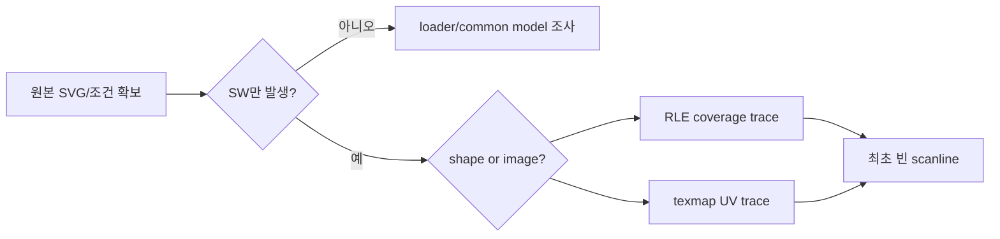

# #3571 — SW renderer의 한 scanline gap 품질 문제

- **Link:** https://github.com/thorvg/thorvg/issues/3571
- **난이도:** 87/100
- **초심자 추천:** 비추천(원본 case 식별 작업만 조건부)
- **관련 영역:** 미확정 — SW shape RLE/image texmap/clip-mask 후보
- **배울 수 있는 것:** 증거 기반 triage, pixel diff, 최소 재현 축소
- **조사 기준:** `main@f989b27892bab31f224f810a54782055eba1e3bc`

## 이슈 요약

`thorvg.test-suites/svg` 출력에 빈 한 줄 gap이 보인다는 스크린샷만 있는 보고다. 이전 “조사 보류”를 해제하고, 재현 입력 부재 자체를 높은 불확실성 점수로 반영했다. 특정 코드 fix 난이도보다 현재 issue가 실행 가능한 task로 정의되지 않은 점이 핵심이다.

## 난이도 산정

| 항목 | 점수 | 근거 |
|---|---:|---|
| 재현·증거 불확실성 (0-20) | 20 | SVG 이름, content, output size, transform와 비교 backend가 모두 없다. |
| 변경 범위 (0-25) | 18 | 원인에 따라 RLE, image texmap, clip/mask/gradient 중 범위가 달라진다. |
| 구현 복잡도 (0-25) | 22 | scanline seam은 rounding/coverage/composition 중 하나일 수 있어 현재 특정 불가다. |
| 교차 영향 위험 (0-20) | 18 | 근거 없는 bbox/epsilon 수정은 전체 SW 품질을 바꾼다. |
| 검증 부담 (0-10) | 9 | 원본 확보 후 backend/size/transform sweep와 pixel trace가 필요하다. |
| **합계** | **87** |  |

- **실현 가능성: 낮음.** 원본 test-suite case와 실행 조건이 확보되기 전에는 수정 실현 가능성이 없고, 확보 후 다시 점수를 낮출 수 있다.

## main 코드 조사

### 확인된 증거

- local `test/resources`와 문서 tree에 이슈 번호 또는 설명으로 연결되는 SVG asset이 없다.
- SW shape는 `tvgSwRle.cpp`의 band/cell scan conversion, transformed image는 `tvgSwRasterTexmap.h`의 scanline sampling을 사용한다.
- clip/mask는 별도 compositor surface와 RLE intersection을 사용하므로 스크린샷 외형만으로 shape/image/mask를 구분할 수 없다.
- GL/WG는 다른 tessellation/sampling 경로를 쓰므로 backend 비교가 가장 먼저 필요한 분류 정보다.

```text
빈 한 줄 외형
  ├─ shape edge? -> SwRle band/cell
  ├─ bitmap seam? -> SwRasterTexmap scanline/UV
  ├─ clip/mask? -> RLE/compositor bounds
  └─ gradient? -> fill sampling
현재 증거로 어느 branch도 선택할 수 없음
```

### 아직 확인되지 않은 부분과 외부 입력 한계

- issue attachment는 screenshot뿐이며 이번 작업은 새로 다운로드/크롤링하지 않았다.
- 원본 SVG, expected renderer, pixel 좌표와 scale을 current main에서 실행할 수 없다.
- 따라서 특정 symbol을 “문제 지점”으로 부르는 것은 아직 가설조차 약하다.

## 원인 가설

- **확인된 원인 없음.** 위 후보는 코드 architecture상 가능한 분류일 뿐 이슈 원인 증거가 아니다.
- screenshot의 한 줄은 band boundary, polygon rounding, source seam, clip bbox 모두 만들 수 있다.
- 현재 가장 강한 결론은 “재현 정보 부족으로 수정 계획을 함수 수준까지 좁힐 수 없다”는 것이다.



## 수정 방향과 실현 가능성

1. issue에 exact test-suite path, SVG, output dimension, transform, commit/backend 정보를 보완한다.
2. 동일 입력을 SW/GL/WG/reference로 렌더해 common loader 문제와 SW-only 문제를 나눈다.
3. SVG element를 제거하며 최소 shape/image/mask fixture로 축소한다.
4. 최초 잘못된 scanline의 coverage 또는 UV/bbox를 dump한 뒤에만 함수 수준 수정 계획을 만든다.
5. 수정은 원본+축소 fixture 두 golden을 완료 조건으로 한다.

## 위험과 검증

- 현재 단계에서 threshold, floor/ceil, band boundary를 바꾸는 것은 증거 없는 광범위 회귀다.
- 재현 자료 확보는 초심자가 도울 수 있지만 C++ fix 후보로 추천해서는 안 된다.
- 이 점수는 코드가 반드시 복잡하다는 뜻보다 issue 정의 불확실성의 비용을 반영한다.

## 참고 자료

- `src/renderer/cpu_engine/tvgSwRle.cpp` — shape scan conversion 후보
- `src/renderer/cpu_engine/tvgSwRasterTexmap.h` — transformed image 후보
- `src/renderer/cpu_engine/tvgSwRenderer.cpp` — clip/compositor와 dispatch
- `src/renderer/cpu_engine/tvgSwShape.cpp` — shape outline→RLE
- `test/resources/` — 재현 asset이 현재 없는 위치
