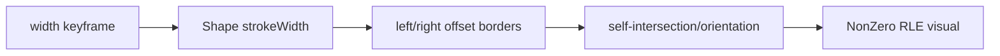

# #3575 — animated wide stroke의 SW visual 파손

- **Link:** https://github.com/thorvg/thorvg/issues/3575
- **난이도:** 75/100
- **초심자 추천:** 조건부(정적 Shape 축소 재현부터)
- **관련 영역:** Lottie stroke keyframe, SW cubic offset border, wide-stroke geometry
- **배울 수 있는 것:** keyframe 분리, offset curve, curvature/self-intersection
- **조사 기준:** `main@f989b27892bab31f224f810a54782055eba1e3bc`

## 이슈 요약

오래된 Lottie visual 오류이며 기존 문서는 축소 sample이 stroke width 1→9, round cap/join이라고 기록했다. attachment는 local tree에 없어 이번 조사에서 그 fixture를 재검증하지 못했지만 current SW wide-stroke 경로의 제한 지점은 확인할 수 있다.

## 난이도 산정

| 항목 | 점수 | 근거 |
|---|---:|---|
| 재현·증거 불확실성 (0-20) | 14 | 축소 정보는 있으나 fixture/최초 failing frame과 current output이 로컬에 없다. |
| 변경 범위 (0-25) | 14 | Lottie를 배제하면 SW stroke geometry와 tests로 좁힐 수 있다. |
| 구현 복잡도 (0-25) | 20 | curve보다 큰 offset radius와 self-intersection을 안정적으로 처리해야 한다. |
| 교차 영향 위험 (0-20) | 18 | 모든 cap/join/cubic stroke outline에 영향을 줄 수 있다. |
| 검증 부담 (0-10) | 9 | width/frame sweep, static/dynamic와 backend golden이 필요하다. |
| **합계** | **75** |  |

- **실현 가능성: 중간.** static Shape로 동일 path/width를 재현하면 해결 경로가 생기지만 일반 wide-offset fix는 숙련 geometry 검토가 필요하다.

## main 코드 조사

### 확인된 증거

- Lottie builder는 frame별 stroke width/cap/join을 일반 `Shape` propagator에 전달한다. loader 전용 raster path는 없다.
- `strokeReset()`은 width/2를 border radius로 보관하고 `_cubicTo()`가 curve를 분할해 두 offset border를 만든다.
- `_beginSubPath()`의 `handleWideStrokes`는 Round join인 closed path에서 false가 될 수 있다.
- wide curve에서 border 진행 방향이 역전되는 경우를 처리하는 코드가 있으나 모든 join 조합에 적용되는 것은 아니다.

```cpp
stroke->width = rshape->strokeWidth() * 0.5f;

if ((stroke.join != StrokeJoin::Round) ||
    (!stroke.closedSubPath && stroke.cap == StrokeCap::Butt))
    stroke.handleWideStrokes = true;
```

### 아직 확인되지 않은 부분

- issue JSON attachment와 축소 sample은 local resources에 없어 최초 깨지는 frame/width를 실행 확인하지 않았다.
- parser interpolation과 static geometry 중 어느 단계에서 최초 차이가 생기는지 numeric trace가 없다.

## 원인 가설

- **강한 가설:** stroke radius가 local curvature/path size에 가까워져 offset border가 역전/self-intersect하고 Round 조합의 wide handling이 부족하다.
- **대안 가설:** keyframe interpolation에서 width가 특정 threshold를 넘을 때만 geometry branch가 바뀐다.
- static Shape가 깨지면 parser 가설을 배제할 수 있다.



## 수정 방향과 실현 가능성

1. attachment를 fixture로 복구하고 frame/width sweep에서 최초 bad frame을 찾는다.
2. 그 frame의 exact RenderPath와 width를 정적 Shape test로 옮겨 Lottie를 제거한다.
3. cubic subdivision별 tangent, border point와 orientation을 dump해 최초 역전 지점을 시각화한다.
4. Round join에서 빠진 wide-stroke condition 또는 self-intersection 처리만 최소 확장한다.
5. width 0~path 크기 수배, open/closed, 모든 join/cap과 SW/GL/WG를 비교한다.

## 위험과 검증

- self-intersection을 임의 point 삭제로 숨기면 acute curve와 winding이 깨질 수 있다.
- animated frame 사이 visual continuity도 static golden과 별도로 검사한다.
- GL/WG는 별도 tessellator이므로 reference는 되지만 pixel-exact 동일을 바로 요구하지 않는다.

## 참고 자료

- `src/loaders/lottie/tvgLottieBuilder.cpp` — `_update(LottieStroke*)`
- `src/renderer/cpu_engine/tvgSwStroke.cpp` — cubic offset/wide-stroke 처리
- `src/renderer/cpu_engine/tvgSwShape.cpp` — stroke outline→RLE
- `src/renderer/cpu_engine/tvgSwRle.cpp` — NonZero raster
- `test/testLottie.cpp`, `test/testSwEngine.cpp` — regression 위치
