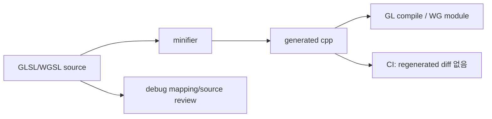

# #3604 — GPU shader source minification

- **Link:** https://github.com/thorvg/thorvg/issues/3604
- **난이도:** 61/100
- **초심자 추천:** 조건부(측정·comment/whitespace prototype부터)
- **관련 영역:** GLSL/WGSL strings, Meson generation, GPU startup/binary size
- **배울 수 있는 것:** shader build pipeline, generated source reproducibility, benchmark
- **조사 기준:** `main@f989b27892bab31f224f810a54782055eba1e3bc`

## 이슈 요약

runtime GPU compiler에 전달하는 GLSL/WGSL source를 compact하게 만들어 binary size와 module/compile 비용을 줄이자는 최적화다. 사람이 직접 source를 난독화하기보다 readable source of truth와 deterministic generator를 두는 편이 유지 가능하다.

## 난이도 산정

| 항목 | 점수 | 근거 |
|---|---:|---|
| 재현·증거 불확실성 (0-20) | 12 | source 크기는 확인되지만 startup/perf 이득은 측정되지 않았다. |
| 변경 범위 (0-25) | 13 | GL/WG source packaging, Meson과 generated-file CI다. |
| 구현 복잡도 (0-25) | 14 | 두 shader 언어와 runtime fragment 조합 경계를 보존해야 한다. |
| 교차 영향 위험 (0-20) | 14 | entry/uniform/macro/#version과 error mapping을 깨뜨릴 수 있다. |
| 검증 부담 (0-10) | 8 | 모든 shader compile, golden, size/startup 비교가 필요하다. |
| **합계** | **61** |  |

- **실현 가능성: 중간.** comment/whitespace-only deterministic pass는 가능하며 identifier rename은 별도 고위험 단계다.

## main 코드 조사

### 확인된 증거

- GL shader source cpp는 약 65,614 bytes, WG source cpp는 약 34,959 bytes다.
- GL은 `glShaderSource/glCompileShader`로 runtime compile하며 여러 fragment를 `snprintf()`로 합친다.
- WG는 raw WGSL string을 module로 만들고 blend source를 16KB buffer에 `strcpy/strcat`으로 합친다.
- backend Meson에는 shader generation/minification step이 없고 `.cpp`를 그대로 compile한다.

```text
readable shader source --deterministic minifier--> generated C++ strings
        |                                          |
        +-- review/debug source                     +-- runtime GL/WG compile
```

### 아직 확인되지 않은 부분

- comments/whitespace가 최종 linked binary와 pipeline creation time에서 얼마를 차지하는지 baseline이 없다.
- 사용할 tool의 GLSL/WGSL grammar coverage, version pin과 cross-build availability가 정해지지 않았다.
- driver compiler가 compact source에서 실제로 빨라지는지는 측정 전 주장할 수 없다.

## 원인 가설

- **확인됨:** source strings의 comments/공백이 binary에 포함되고 runtime compiler에 전달된다.
- **가설:** binary string 감소는 확실히 측정 가능하지만 compile-time 이득은 driver별로 미미할 수 있다.
- **위험 가설:** identifier rename은 host uniform lookup, WGSL entry point와 fragment concatenation interface를 깨뜨릴 수 있다.



## 수정 방향과 실현 가능성

1. backend별 shader byte count, linked library size와 pipeline creation 시간을 baseline으로 기록한다.
2. string/comment 상태를 이해하는 comment+whitespace-only prototype을 만들고 deterministic output을 보장한다.
3. source fragment 경계, `#version`, macro와 public entry/uniform 이름을 보존 목록으로 둔다.
4. Meson에서 tool 발견/재생성 정책과 release tarball의 pre-generated fallback을 정한다.
5. GL/GLES/WG 모든 shader compile과 rendered golden, size/startup 수치를 비교한다.

## 위험과 검증

- 정규식만으로 comment를 지우면 string/전처리기에서 shader를 깨뜨릴 수 있다.
- generated source만 남기지 말고 readable original과 generator version을 함께 관리한다.
- 측정 이득이 작으면 build dependency 비용보다 가치가 낮을 수 있다.

## 참고 자료

- `src/renderer/gpu_engine/gl/tvgGlShaderSrc.cpp`, `tvgGlShader.cpp` — GLSL source/compile
- `src/renderer/gpu_engine/gl/tvgGlRenderer.cpp` — runtime fragment 조합
- `src/renderer/gpu_engine/wg/tvgWgShaderSrc.cpp`, `tvgWgPipelines.cpp` — WGSL module/조합
- `src/renderer/gpu_engine/gl/meson.build`, `wg/meson.build` — 현재 build 입력
