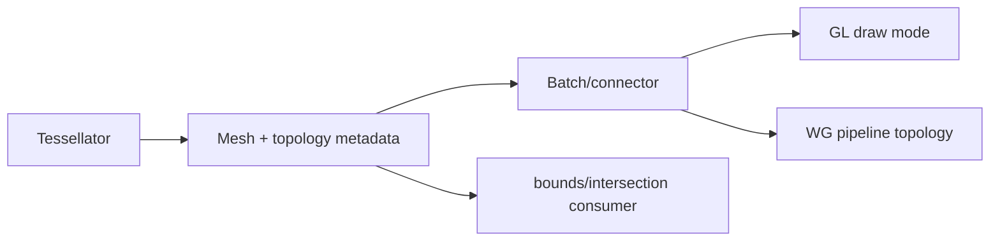

# #3656 — GPU index buffer를 triangle strip으로 최적화

- **Link:** https://github.com/thorvg/thorvg/issues/3656
- **난이도:** 90/100
- **초심자 추천:** 비추천
- **관련 영역:** GL/WG tessellator, primitive topology, batching, bounds/intersection
- **배울 수 있는 것:** strip winding parity, primitive restart, GPU bandwidth
- **조사 기준:** `main@f989b27892bab31f224f810a54782055eba1e3bc`

## 이슈 요약

GPU tessellation 결과를 triangle list에서 strip으로 바꿔 index data를 줄이자는 최적화다. topology flag만 바꾸면 기존 index가 다른 triangle을 뜻하므로 tessellator와 모든 consumer, batch connector를 함께 바꿔야 한다.

## 난이도 산정

| 항목 | 점수 | 근거 |
|---|---:|---|
| 재현·증거 불확실성 (0-20) | 14 | 실제 corpus의 index bandwidth 병목과 strip 절감률이 미측정이다. |
| 변경 범위 (0-25) | 23 | GL/WG tessellator, draw topology, batch, bounds/intersection 전반이다. |
| 구현 복잡도 (0-25) | 24 | contour 간 connector, parity, restart와 stencil fill을 설계해야 한다. |
| 교차 영향 위험 (0-20) | 20 | 잘못된 index는 visual corruption/GPU out-of-bounds로 이어진다. |
| 검증 부담 (0-10) | 9 | geometry invariant, backend golden, upload/FPS benchmark가 필요하다. |
| **합계** | **90** |  |

- **실현 가능성: 낮음.** quad 등 한 primitive의 hybrid strip prototype은 가능하지만 모든 tessellation을 전환하는 전체 이슈는 대규모다.

## main 코드 조사

### 확인된 증거

- GL/WG stroker는 선분 quad를 두 triangle, index 6개로 push하고 round fan도 triangle마다 3개를 push한다.
- GL draw는 `GL_TRIANGLES`, WG pipeline은 `WGPUPrimitiveTopology_TriangleList`로 고정된다.
- GL/WG bounds/intersection 코드는 index count를 `i += 3`으로 순회해 triangle 단위 geometry를 가정한다.
- GL batch는 source index에 base vertex를 더해 단순 연결한다. strip에서는 contour/batch 사이 degenerate connector 또는 primitive restart가 필요하다.

```text
Triangle list quad:  a,b,c, b,d,c          -> 6 indices
Triangle strip quad: a,b,c,d               -> 4 indices

하지만 다음 contour 연결: ...c,d, ?, ?, e,f...  (restart/degenerate 필요)
```

### 아직 확인되지 않은 부분

- real SVG/Lottie corpus에서 vertex/index count, upload time과 GPU bottleneck을 측정하지 않았다.
- GL/GLES/WebGPU target 모두에서 같은 primitive restart/index format 정책을 쓸 수 있는지 결정하지 않았다.
- arbitrary tessellation의 connector 비용이 절감량을 상쇄하는 비율이 없다.

## 원인 가설

- **확인됨:** 현재 producer와 consumer 전체가 triangle-list invariant에 묶여 있다.
- **가설:** line quad/연속 stroke segment처럼 locality가 있는 primitive는 strip 이득이 크지만 서로 떨어진 fill triangle은 작다.
- **설계 가설:** 모든 mesh를 강제 strip으로 바꾸기보다 topology metadata를 두고 list/strip hybrid를 허용하는 편이 현실적이다.



## 수정 방향과 실현 가능성

1. corpus별 triangle/vertex/index count, upload byte, draw time을 baseline으로 수집한다.
2. 한 line quad 또는 round fan을 strip으로 생성하는 prototype과 list 대비 절감률을 만든다.
3. mesh topology metadata, winding parity, contour/batch connector와 restart 지원 정책을 설계한다.
4. bounds/intersection consumer가 strip을 triangle iterator로 안전하게 읽도록 공통화한다.
5. GL/GLES/WG rendered golden과 index bounds validation 후 FPS/upload/binary size를 재측정한다.

## 위험과 검증

- strip은 triangle마다 winding parity가 번갈아 stencil/front-face 의미를 바꿀 수 있다.
- degenerate connector도 일부 bounds/triangle count code가 실제 geometry로 오인할 수 있다.
- 작은 mesh에서는 topology/pipeline 분기와 restart index가 더 비쌀 수 있다.

## 참고 자료

- `src/renderer/gpu_engine/gl/tvgGlTessellator.cpp` — list index producer
- `src/renderer/gpu_engine/gl/tvgGlRenderTask.cpp` — `GL_TRIANGLES`
- `src/renderer/gpu_engine/gl/tvgGlGeometry.cpp`, `tvgGlSolidBatch.cpp` — consumers/batch
- `src/renderer/gpu_engine/wg/tvgWgTessellator.cpp` — WG producer
- `src/renderer/gpu_engine/wg/tvgWgPipelines.cpp` — TriangleList pipeline
- `src/renderer/gpu_engine/wg/tvgWgRenderData.cpp` — triangle consumers
