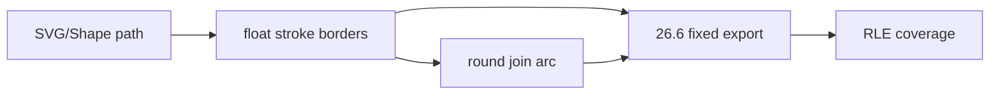

# #3735 — 얇은 SVG stroke의 폭·round join 안정성

- **Link:** https://github.com/thorvg/thorvg/issues/3735
- **난이도:** 78/100
- **초심자 추천:** 조건부(최신 main 재현 분리부터)
- **관련 영역:** SW stroke epsilon, 26.6 fixed quantization, round join
- **배울 수 있는 것:** subpixel raster, scale stability, 증상 분리
- **조사 기준:** `main@f989b27892bab31f224f810a54782055eba1e3bc`

## 이슈 요약

얇은 open polyline에서 폭이 연속적으로 자라지 않고 segment별 두께가 달라 보이며, Round join이 찌그러지고 고배율에서 불안정하다는 세 증상이다. 같은 sample에 보이더라도 quantization, border geometry, join angle의 서로 다른 문제일 수 있다.

## 난이도 산정

| 항목 | 점수 | 근거 |
|---|---:|---|
| 재현·증거 불확실성 (0-20) | 16 | 본문 SVG는 있으나 영상 조건·최신 main 지속 여부와 세 원인 분리가 필요하다. |
| 변경 범위 (0-25) | 15 | SW stroke/export/RLE와 SVG regression에 걸친다. |
| 구현 복잡도 (0-25) | 20 | subpixel quantization과 join geometry를 품질/성능 균형으로 고쳐야 한다. |
| 교차 영향 위험 (0-20) | 18 | 전체 SW stroke visual과 AA coverage에 영향을 준다. |
| 검증 부담 (0-10) | 9 | width/zoom/translation sweep 및 join/cap matrix가 필요하다. |
| **합계** | **78** |  |

- **실현 가능성: 중간.** 세 증상을 독립 fixture로 분리하면 가능하지만 하나의 epsilon 변경으로 함께 해결하려 하면 위험하다.

## main 코드 조사

### 확인된 증거

- SVG builder는 stroke를 일반 `Shape` style로 전달하므로 이후 SW geometry는 C++ Shape와 공통이다.
- SW `_tiny()`는 x/y 각각 `2/64`보다 작은 delta를 절대 threshold로 본다.
- `utilExport()`는 transformed float border를 `int32_t(t * 64)` 26.6 fixed point로 truncate한다.
- RLE는 fixed outline에서 coverage를 계산하므로 작은 width/position 변화가 1/64 grid를 넘을 때 불연속으로 보일 수 있다.
- Round join은 cubic arc control point를 별도로 생성하므로 width quantization과 join deformation은 다른 단계다.

```cpp
constexpr float EPSILON = 2.0f / 64.0f;
return fabsf(pt.x) < EPSILON && fabsf(pt.y) < EPSILON;

outline->out.push({int32_t(t.x * 64.0f),
                   int32_t(t.y * 64.0f)});
```

### 아직 확인되지 않은 부분

- issue 영상의 exact zoom/width sequence와 expected pixel reference를 local에서 재생하지 않았다.
- 폭 step, segment 불균일, round join 불안정의 최초 손실 단계가 각각 미확정이다.
- #1931과 같은 원인인지 단지 외형이 비슷한지 확인하지 않았다.

## 원인 가설

| 증상 | 유력 후보 | 상태 |
|---|---|---|
| 폭이 계단식으로 증가 | 26.6 export quantization | 강한 가설 |
| segment별 폭 차이 | border point truncation 방향/coverage | 가설 |
| Round join 찌그러짐 | `_tiny`/angle/arc control geometry | 별도 가설 |
| 고배율 불안정 | transform 후 fixed 범위/threshold | 재현 필요 |

## 수정 방향과 실현 가능성

1. 본문 SVG를 current main에서 width와 zoom sweep해 세 증상의 지속 여부를 각각 기록한다.
2. float border, fixed exported border, RLE span을 단계별 dump해 최초 차이를 분리한다.
3. quantization rounding, tiny epsilon, round arc를 한 번에 하나씩 실험한다.
4. horizontal/diagonal/open polyline과 Round/Miter/Bevel join을 fixture로 만든다.
5. subpixel translate, scale 0.25~512, AA on/off와 GL/WG visual을 회귀 검사한다.



## 위험과 검증

- fixed precision을 전역 확대하면 memory/performance/overflow 범위가 달라진다.
- epsilon 축소는 degenerate geometry와 point 폭증을 유발할 수 있다.
- “더 부드러워 보임” 대신 width monotonicity와 frame stability 같은 invariant를 정의한다.

## 참고 자료

- `src/loaders/svg/tvgSvgBuilder.cpp` — stroke style→Shape
- `src/renderer/cpu_engine/tvgSwStroke.cpp` — `_tiny`, border/join
- `src/renderer/cpu_engine/tvgSwUtil.cpp` — 26.6 fixed export
- `src/renderer/cpu_engine/tvgSwRle.cpp` — coverage raster
- `test/testSwEngine.cpp`, `test/resources/` — regression 위치
