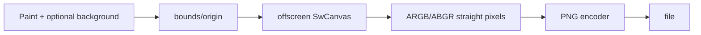

# #3737 — PNG saver 지원

- **Link:** https://github.com/thorvg/thorvg/issues/3737
- **난이도:** 55/100
- **초심자 추천:** 조건부(좋은 vertical slice, ownership 리뷰 필요)
- **관련 영역:** Saver/SaveModule, SW offscreen render, PNG encoder, Meson
- **배울 수 있는 것:** async ownership, bounds→target, channel order, encode module
- **조사 기준:** `main@f989b27892bab31f224f810a54782055eba1e3bc`

## 이슈 요약

ThorVG Paint/Scene을 정적 PNG로 capture할 saver backend를 추가하는 요청이다. `Saver` API, GIF saver와 `svg2png` tool이라는 선례가 있어 범위가 비교적 명확하지만 generic Paint bounds, async ownership과 encoder code sharing을 정해야 한다.

## 난이도 산정

| 항목 | 점수 | 근거 |
|---|---:|---|
| 재현·증거 불확실성 (0-20) | 7 | 요구와 출력 format은 명확하나 bounds/quality 정책이 미정이다. |
| 변경 범위 (0-25) | 14 | saver dispatch, Meson, offscreen task, encoder와 tests를 추가한다. |
| 구현 복잡도 (0-25) | 14 | paint origin/size, alpha/channel conversion과 failure cleanup이 필요하다. |
| 교차 영향 위험 (0-20) | 12 | Saver ownership, optional binary size와 PNG loader code 분리에 영향이 있다. |
| 검증 부담 (0-10) | 8 | alpha/negative bounds/large image와 save→load pixel test가 필요하다. |
| **합계** | **55** |  |

- **실현 가능성: 중간.** synchronous minimal saver는 높고, 기존 Saver의 async 계약과 code-size 정책까지 맞추는 전체 구현은 중간이다.

## main 코드 조사

### 확인된 증거

- public `Saver::save(Paint*, filename, quality)`와 `sync()`가 이미 있고 저장 format은 extension dispatch다.
- `Saver::_find()`와 `src/savers/meson.build`는 현재 GIF만 지원해 `.png`가 `NonSupport`다.
- `SaveModule`은 Paint/Animation 두 overload와 `close()`를 요구한다. PNG는 animation overload를 명시적으로 거부할 수 있다.
- `tools/svg2png`는 `ARGB8888S` SW buffer를 RGBA bytes로 재배열한 뒤 full lodepng encoder로 기록한다.
- engine PNG loader의 lodepng 사본은 decoder-only이며 encoder symbol이 없다. tool 사본은 더 크므로 단순 중복 포함은 binary size를 늘린다.

```text
Paint bounds -> translate to (0,0) -> SwCanvas straight RGBA target
             -> draw/sync -> channel mapping -> PNG encoder -> file
```

### 아직 확인되지 않은 부분

- generic Scene의 negative/fractional bounds를 ceil/floor해 어떤 canvas size/origin으로 저장할지 정책이 없다.
- `quality` 0~100을 PNG compression effort/filter에 어떻게 매핑할지 정해지지 않았다.
- builtin encoder를 loader와 분리할지 external libpng를 사용할지 결정되지 않았다.

## 원인 가설

- **확인됨:** public abstraction은 준비됐지만 PNG module/dispatch/build가 없다.
- **설계 가설:** Paint bounds를 포함하는 최소 target을 만들고 `-min.x/-min.y` translate한 duplicate를 그리는 경로가 generic capture에 적합하다.
- **위험 가설:** original Paint를 직접 transform하면 caller state를 바꾸므로 duplicate 또는 temporary parent transform이 필요하다.



## 수정 방향과 실현 가능성

1. output size/origin, empty/huge bounds와 quality 의미를 API/module 계약으로 고정한다.
2. `PngSaver : SaveModule, Task`가 Paint lifetime을 보유하고 offscreen SW target에 background와 paint를 그리게 한다.
3. encoder 공통 code를 decoder와 분리하거나 external dependency 정책을 정해 tool/engine 중복을 줄인다.
4. `savers=['png']`, config macro, `.png` dispatch와 disabled/static build를 연결한다.
5. solid/transparent/gradient/negative bounds를 save→Picture load→pixel compare한다.

## 위험과 검증

- premultiplied buffer를 PNG straight RGBA로 잘못 쓰면 투명 edge color가 어두워진다.
- Paint ownership/ref와 async error path에서 double release/leak가 없어야 한다.
- width×height×4 overflow, 0 bounds, file write failure와 cleanup을 검사한다.

## 참고 자료

- `inc/thorvg.h` — `Saver` API와 async 계약
- `src/renderer/tvgSaver.cpp`, `tvgSaveModule.h` — dispatch/ownership interface
- `src/savers/gif/tvgGifSaver.*` — async saver 선례
- `tools/svg2png/svg2png.cpp`, `tools/svg2png/lodepng.*` — PNG encode 선례
- `src/loaders/png/tvgLodePng.*` — decoder-only engine 사본
- `meson_options.txt`, `src/savers/meson.build` — saver build 선택
