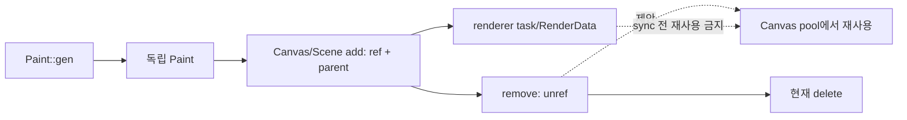

# #3782 api: redesign Canvas Ownership & GC-Based Paint allocation & reuse

- Link: https://github.com/thorvg/thorvg/issues/3782
- 난이도: 97/100
- 실현 가능성: 낮음
- 초심자 추천: 비추천
- 관련 영역: Canvas/Paint API, ownership, ref count, object pool, API/ABI
- 배울 수 있는 것: retained graph 수명, pooling, ownership transfer, asynchronous disposal

## 이슈 요약

독립적으로 생성하는 Paint를 Canvas가 생성·추적하고 해제 객체를 pool에서 재사용하자는 API 재설계다. 기존 ref-count/parent 계약, 독립 Paint 재사용과 renderer task 수명을 동시에 바꾸므로 allocation 최적화 이상의 아키텍처 과제다.

## 난이도 산정

| 항목 | 점수 | 근거 |
|---|---:|---|
| 재현·증거 불확실성 (0-20) | 18 | 결함이 아니며 allocation 병목·목표 수치와 원하는 ownership 모델이 확정되지 않았다. |
| 변경 범위 (0-25) | 25 | 모든 Paint factory, Canvas/Scene, renderer disposal, C++/C API에 걸친다. |
| 구현 복잡도 (0-25) | 25 | ref/parent와 pool generation, sync 이후 재사용을 안전하게 결합해야 한다. |
| 교차 영향 위험 (0-20) | 20 | 기존 pointer·ownership 계약과 모든 loader/backend 사용법을 깨뜨릴 수 있다. |
| 검증 부담 (0-10) | 9 | lifecycle stress, 세 backend, WASM/static과 성능·peak memory 측정이 필요하다. |
| **합계** | **97/100** | public object model을 바꾸는 장기 설계 이슈다. |

## main 코드 조사

**확인된 증거**

- `Shape/Picture/Scene/Text::gen()`은 Canvas와 무관한 heap 객체를 만든다.
- `Canvas::add()`는 내부 root Scene에 위임하며 `SceneImpl::insert()`가 `ref()`하고 parent를 지정한다.
- remove/clear 시 `unref()`하고 count가 0이면 `Paint::Impl::unrefx()`가 즉시 `delete(paint)`한다.
- Canvas별 factory/free-list/generation 표시는 없다. Paint는 renderer의 `RenderData`와 task를 보유하므로 draw/update 중 즉시 재사용할 수 없다.

```cpp
// src/renderer/tvgScene.h
target->ref();
timpl->parent = this;

// src/renderer/tvgPaint.h
if (free && refCnt == 0) delete(paint);
```



## 원인 가설과 확인 방법

- **확정:** 현재 Canvas가 add된 Paint를 소유하지만 allocation 자체는 각 `gen()`에서 일어난다.
- **가설:** 작은 Paint를 반복 생성·삭제하는 workload에서 allocator 비용이 병목이다. 근거 수치는 없다.
- **확인 방법:** Paint 종류별 생성/삭제 횟수·시간·peak allocation을 실제 animation/UI workload에서 계측하고 단순 arena prototype과 비교한다.

## 수정 방향 계획

1. Canvas-owned-only, 기존 독립 생성 병행, 내부 allocator만 pooling하는 세 모델을 API/성능 관점에서 비교한다.
2. release 후 pointer, Canvas 간 이동, Scene child/mask/clip과 duplicate의 ownership을 명세한다.
3. pool entry에 type/generation과 renderer disposal 완료 상태를 두고 `sync()` 전 재사용을 금지하는 prototype을 만든다.
4. pool 상한/trim과 Canvas 파괴 시 순서를 정한 뒤 CAPI/deprecation 계획을 별도로 검토한다.

## 실현 가능성 판단

내부 allocator 실험은 가능하지만 원 이슈는 **낮음**이다. 측정된 필요성과 ownership 정책이 없으며 공개 API를 바꿀 이유가 아직 증명되지 않았다. 초심자는 benchmark만 하위 작업으로 맡을 수 있다.

## 위험/검증

- stale pointer가 새 객체를 가리키는 ABA, Canvas 간 재사용, ref cycle/UAF를 sanitizer로 검사한다.
- mask/clip/Scene child와 async draw/update/remove/sync sequence를 stress-test한다.
- allocation 감소, frame latency, retained peak memory를 모두 측정한다.

## 참고 자료

- `inc/thorvg.h`의 Canvas와 Paint lifetime API
- `src/renderer/tvgCanvas.cpp`, `src/renderer/tvgCanvas.h`
- `src/renderer/tvgScene.h`, `src/renderer/tvgPaint.h`
- `src/renderer/tvgShape.cpp`, `src/renderer/tvgPicture.cpp`, `src/renderer/tvgText.cpp`
- `test/testSwCanvas.cpp`, `test/testGlCanvas.cpp`, `test/testWgCanvas.cpp`
