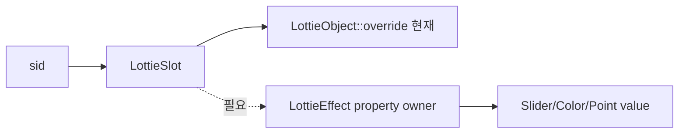

# #3826 lottie: enhance slot overriding for effect properties

- Link: https://github.com/thorvg/thorvg/issues/3826
- 난이도: 79/100
- 실현 가능성: 중간
- 초심자 추천: 비추천
- 관련 영역: Lottie slot registry, effect/property model, parser context, ownership
- 배울 수 있는 것: typed override, owner/property handle, reset lifecycle

## 이슈 요약

slot으로 effect 내부 Slider/Color 등의 실제 value property를 교체하려는 기능이다. 현재 slot은 `LottieObject`가 property override를 수행한다는 전제인데 effect는 그 hierarchy에 속하지 않는다.

## 난이도 산정

| 항목 | 점수 | 근거 |
|---|---:|---|
| 재현·증거 불확실성 (0-20) | 16 | effect-level과 value-level `sid` 중 목표 schema가 확정되지 않았다. |
| 변경 범위 (0-25) | 18 | parser, slot registry, effect model과 apply/reset에 걸친다. |
| 구현 복잡도 (0-25) | 20 | generic owner와 deep/shallow backup을 수명 안전하게 설계해야 한다. |
| 교차 영향 위험 (0-20) | 17 | 기존 slot, expression/keyframe pointer와 custom effect에 영향이 있다. |
| 검증 부담 (0-10) | 8 | type/multi-target/animated/apply-reset-delete 조합이 필요하다. |
| **합계** | **79/100** | 범위는 내부 Lottie지만 ownership 설계가 선행된다. |

## main 코드 조사

**확인된 증거**

- `registerSlot()`은 `LottieObject* obj`와 property type을 `LottieSlot`에 등록한다.
- `LottieSlot::apply/reset()`은 `pair->obj->override(...)`를 호출한다.
- `LottieEffect`는 `LottieObject`를 상속하지 않고 여러 property를 직접 보유한다.
- effect property parse에는 일반 `parseCommon(obj, prop, key)`와 같은 slot registration 연결이 없다.

```cpp
struct LottieSlot::Pair {
    LottieObject* obj;
    LottieProperty* prop;
};
// effect는 LottieObject가 아니므로 이 owner contract에 들어오지 않는다.
```



## 원인 가설과 확인 방법

- **확정:** 현 slot registry의 owner type으로 effect property를 표현할 수 없다.
- **가설:** `sid`는 effect 자체가 아니라 각 effect value의 property object에 속해야 한다.
- **확인 방법:** built-in Slider/Color 하나씩 최소 fixture를 만들어 parser key 위치와 apply/reset 대상 property를 추적한다.

## 수정 방향 계획

1. 지원할 effect value type과 `sid` 위치를 fixture로 확정한다.
2. `LottieObject*` 대신 override/restore callback 또는 tagged owner handle을 쓰는 narrow design을 비교한다.
3. effect property parse에서 slot을 등록하고 원본 keyframe/expression을 보존한 backup/restore를 구현한다.
4. 동일 sid 다중 대상, type mismatch, apply→reset→delete와 reload를 검사한다.

## 실현 가능성 판단

schema가 고정되면 **중간**이지만 초심자 단독 과제로는 부적합하다. fixture와 parser trace는 하위 작업으로 가능하다.

## 위험/검증

- backup의 expression pointer 이중 해제와 dangling effect owner를 sanitizer로 검사한다.
- 기존 shape/image slot과 default slot 동작을 회귀 검사한다.
- 잘못된 type override는 silent cast 없이 실패해야 한다.

## 참고 자료

- `src/loaders/lottie/tvgLottieParser.cpp`, `src/loaders/lottie/tvgLottieParser.h`
- `src/loaders/lottie/tvgLottieModel.h`, `src/loaders/lottie/tvgLottieModel.cpp`
- `src/loaders/lottie/tvgLottieLoader.cpp`
- `src/loaders/lottie/tvgLottieProperty.h`
- `test/testLottie.cpp`, `test/resources/slot.lot`
