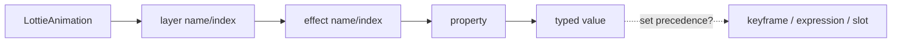

# #3828 lottie: support APIs for control expressions

- Link: https://github.com/thorvg/thorvg/issues/3828
- 난이도: 93/100
- 실현 가능성: 낮음
- 초심자 추천: 비추천
- 관련 영역: LottieAnimation public API, typed controls, lookup, lifetime/ABI
- 배울 수 있는 것: public facade, handle lifetime, override precedence, C ABI

## 이슈 요약

layer/effect/property를 이름 또는 index로 찾아 Number/Bool/Color/Point control을 runtime에 읽고 쓰는 API 제안이다. lookup보다 mutable handle의 lifetime과 keyframe/expression/slot 대비 우선순위가 핵심이다.

## 난이도 산정

| 항목 | 점수 | 근거 |
|---|---:|---|
| 재현·증거 불확실성 (0-20) | 19 | API shape, supported types, ownership과 override 의미가 미정이다. |
| 변경 범위 (0-25) | 23 | public Lottie API, internal property/effect, loader lifecycle과 CAPI에 걸친다. |
| 구현 복잡도 (0-25) | 24 | typed handle, lookup, mutation/reset 및 stale-handle 방지가 필요하다. |
| 교차 영향 위험 (0-20) | 20 | public ABI와 frame evaluation/slot/expression 의미를 고착시킨다. |
| 검증 부담 (0-10) | 7 | type/keypath/lifetime/reload/concurrency와 CAPI test가 필요하다. |
| **합계** | **93/100** | API contract가 결정되지 않은 core feature다. |

## main 코드 조사

**확인된 증거**

- public `LottieAnimation`에는 slot `gen/apply/del`은 있지만 control Property API가 없다.
- 내부 `LottieLayer::effectById/effectByIdx()`와 `LottieFxCustom::property()`가 lookup 기반을 제공한다.
- `LottieProperty`는 keyframes, expression pointer와 slot sid를 보유하는 내부 polymorphic type이다.
- JerryScript binding은 effect/property를 frame별 객체로 노출하지만 C++에서 재사용 가능한 owned handle은 아니다.



```cpp
LottieEffect* effectById(unsigned long id);
LottieEffect* effectByIdx(int16_t ix);
// 내부 pointer를 그대로 public 반환할 lifetime contract는 없다.
```

## 원인 가설과 확인 방법

- **확정:** 내부 lookup은 일부 있지만 public typed ownership/override 계층은 없다.
- **가설:** borrowed internal pointer API는 reload/destruction 뒤 dangling handle을 만든다.
- **확인 방법:** get/set/clear, reload와 animation destruction sequence를 먼저 API test 형태로 작성해 후보 contract를 비교한다.

## 수정 방향 계획

1. keypath grammar, supported control type, name/index ambiguity와 error result를 명세한다.
2. opaque ID+animation generation 검증 또는 animation-owned handle 중 stale access를 막는 모델을 고른다.
3. 원본 keyframe/expression/slot을 보존하는 override layer와 clear/reset precedence를 설계한다.
4. C++ proposal을 확정한 뒤 CAPI opaque handle과 ABI 변경 내역을 함께 설계한다.

## 실현 가능성 판단

기술적으로 가능하지만 현재는 **낮음**이다. #3826 slot 확장과 중복되는 제어 모델을 먼저 통합해야 하며 초심자에게 적합하지 않다.

## 위험/검증

- reload/destroy 후 stale handle, frame worker와 set race, wrong type를 검사한다.
- slot/expression/keyframe과 override/clear 순서를 test한다.
- public C++/C API signature와 symbol/ABI review가 필수다.

## 참고 자료

- `src/loaders/lottie/thorvg_lottie.h`, `src/loaders/lottie/tvgLottieAnimation.cpp`
- `src/loaders/lottie/tvgLottieModel.h`, `src/loaders/lottie/tvgLottieProperty.h`
- `src/loaders/lottie/tvgLottieExpressions.cpp`
- `src/loaders/lottie/tvgLottieLoader.cpp`
- 연관 분석: `docs/issue/3826-79.md`
