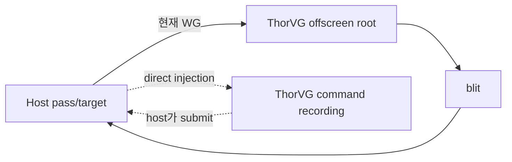

# #3951 gpu: support direct injection mode

- Link: https://github.com/thorvg/thorvg/issues/3951
- 난이도: 94/100
- 실현 가능성: 낮음
- 초심자 추천: 비추천
- 관련 영역: GL/WG target, host pass/encoder, state ownership, zero-copy integration
- 배울 수 있는 것: GPU pass ownership, framebuffer/texture lifetime, state preservation

## 이슈 요약

host application의 현재 GL/WebGPU target/pass에 ThorVG commands를 직접 기록해 RTT/blit 비용을 줄이자는 모드다. 이는 target pointer만 받는 문제가 아니라 pass/encoder/clear/stencil/MSAA/submit 책임을 분리하는 public integration API다.

## 난이도 산정

| 항목 | 점수 | 근거 |
|---|---:|---|
| 재현·증거 불확실성 (0-20) | 18 | 실제 RTT 병목 수치와 host가 제공할 pass contract가 없다. |
| 변경 범위 (0-25) | 23 | Canvas API, GL/WG frame lifecycle, compositor와 platform integration이다. |
| 구현 복잡도 (0-25) | 25 | external pass/encoder와 resource/state ownership을 안전하게 분리해야 한다. |
| 교차 영향 위험 (0-20) | 20 | host state corruption, invalid barriers/pass format과 context loss 위험이 크다. |
| 검증 부담 (0-10) | 8 | host frameworks, mask/effect/MSAA, multi-canvas와 fallback test가 필요하다. |
| **합계** | **94/100** | experimental GPU integration architecture 과제다. |

## main 코드 조사

**확인된 증거**

- GL target은 caller의 context/FBO id로 root target을 초기화해 이미 비교적 직접적이다. 다만 host state 보존 contract는 없다.
- WG target은 surface/texture를 받지만 별도 `mRenderTargetRoot`에 렌더하고 `sync()`에서 destination으로 blit한다.
- WG `postRender()`는 자체 command encoder를 생성·submit·release한다.
- 두 backend 모두 compositor/pass 시작·종료와 clear/stencil/MSAA를 내부에서 소유한다.

| backend | 현재 구조 | direct mode 핵심 |
|---|---|---|
| GL | caller FBO에 root pass | GL state save/restore와 pass 경계 |
| WG | offscreen root 후 blit | external encoder/pass, no internal submit |

## 원인 가설과 확인 방법

- **확정:** WG는 extra offscreen/blit과 자체 encoder submit을 사용한다.
- **가설:** blit 제거가 host workload에서 유의미한 GPU time/bandwidth를 절감한다. 측정되지 않았다.
- **확인 방법:** 같은 scene의 WG root render와 final blit GPU timestamp/bytes를 분리 측정한다.

## 수정 방향 계획

1. GL/WG의 copy/pass 비용을 측정해 우선 backend를 정한다.
2. host/ThorVG가 소유할 encoder/pass/submit, clear와 state contract를 API 문서로 먼저 작성한다.
3. WG external command encoder+target texture의 제한된 prototype을 만들고 RTT fallback을 유지한다.
4. mask/effect/MSAA/format mismatch는 명시적 rejection 또는 internal fallback으로 처리한다.

## 실현 가능성 판단

제한 WG prototype은 가능하지만 portable public 기능은 **낮음**이다. 초심자에게 적합하지 않다.

## 위험/검증

- host GL state, WebGPU resource state/lifetime, format/sample/layout mismatch를 검사한다.
- context/device loss, multi-canvas, nested pass와 failure 중 cleanup을 검증한다.
- RTT fallback과 pixel equality 및 GPU-time 개선을 함께 측정한다.

## 참고 자료

- `inc/thorvg.h`의 GlCanvas/WgCanvas target APIs
- `src/renderer/tvgCanvas.cpp`
- `src/renderer/gpu_engine/gl/tvgGlRenderer.cpp`
- `src/renderer/gpu_engine/wg/tvgWgRenderer.cpp`
- `src/renderer/gpu_engine/wg/tvgWgCompositor.cpp`, `src/renderer/gpu_engine/wg/tvgWgCommon.cpp`
