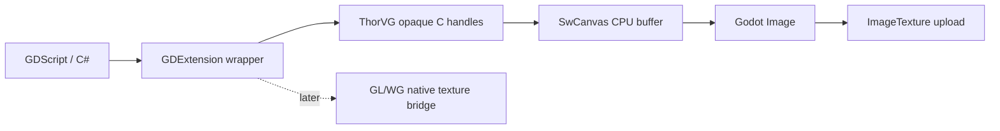

# #4025 — Godot용 ThorVG GDExtension

- **Link:** https://github.com/thorvg/thorvg/issues/4025
- **난이도:** 86/100
- **초심자 추천:** 비추천(CPU-only 별도 저장소 prototype은 분리 가능)
- **관련 영역:** Godot GDExtension, ThorVG C/C++ API, GPU texture bridge, 배포
- **배울 수 있는 것:** foreign-engine binding, ABI/versioning, Godot resource lifecycle
- **조사 기준:** `main@f989b27892bab31f224f810a54782055eba1e3bc`

## 이슈 요약

Godot에 내장된 SVG 용도 외에 ThorVG의 Canvas/Shape/Picture/Animation API를 GDScript/C#에서 직접 사용할 별도 GDExtension을 만들자는 외부 통합 제안이다.

## 난이도 산정

| 항목 | 점수 | 근거 |
|---|---:|---|
| 재현·증거 불확실성 (0-20) | 18 | 지원할 Godot/ThorVG 버전, API 범위, 기존 내장 라이브러리 재사용 가능성이 정해지지 않았다. |
| 변경 범위 (0-25) | 23 | wrapper, 객체 수명, image/texture bridge, build와 여러 플랫폼 배포가 필요하다. |
| 구현 복잡도 (0-25) | 19 | C API mapping 자체보다 Godot main/render thread와 resource lifecycle 연결이 어렵다. |
| 교차 영향 위험 (0-20) | 17 | 이중 ThorVG symbol/version, ABI, extension unload와 GPU 자원 수명 위험이 있다. |
| 검증 부담 (0-10) | 9 | Godot 버전·OS·renderer·GDScript/C# 및 packaging 행렬이 필요하다. |
| **합계** | **86** |  |

- **실현 가능성: 낮음(전체 제안), 중간(CPU MVP).** ThorVG 저장소 밖 별도 extension에서 `SwCanvas + Shape + Image`만 제공하면 prototype은 가능하지만, 전체 API/GPU bridge까지는 장기 통합 프로젝트다.

## main 코드 조사

- ThorVG는 `inc/thorvg.h`의 C++ API와 `src/bindings/capi/thorvg_capi.h`의 opaque-handle C API를 제공한다.
- C API는 언어 바인딩에 유리하지만 Godot Image/Texture와 ThorVG target buffer의 소유권·업로드 연결은 별도 adapter가 필요하다.
- C API에는 opaque handle, 명시적 `tvg_canvas_destroy()`, `tvg_paint_ref()/unref()`와 SW target 함수가 이미 있어 최소 FFI 경계는 갖춰져 있다.
- 현재 저장소에는 Godot headers, godot-cpp, GDExtension manifest/build 파일이 없다.
- Godot가 자체 빌드에 포함한 ThorVG와 extension이 다시 링크하는 ThorVG의 version/symbol 중복 정책도 이 저장소만으로 결정할 수 없다.

## 원인 가설

**추론:** 핵심 난점은 Shape wrapper 자체보다 어느 ThorVG 인스턴스를 링크할지, Godot texture로 zero/copy upload할지, Object 수명을 어떻게 묶을지다. 별도 저장소가 더 적합할 가능성이 높다.

## 수정 방향과 실현 가능성

1. Godot 지원 버전과 extension 배포/라이선스, bundled ThorVG 재사용 가능성을 확인한다.
2. CPU SwCanvas + Shape + Image upload만 제공하는 최소 API surface를 설계한다.
3. C API 기반 wrapper와 godot-cpp C++ wrapper의 ABI/크기를 비교한다.
4. `tvg_paint_ref()/unref()`와 Godot `RefCounted`의 단일 ownership 표를 만들고 extension unload 전에 canvas sync/destroy 순서를 고정한다.
5. CPU MVP가 기능·성능 목표를 충족한 뒤에만 GL/WG zero-copy bridge를 별도 이슈로 연다.

## 위험/검증

Godot main thread/GPU thread, extension unload, ThorVG 버전 충돌과 platform packaging을 검증해야 한다.

## 외부 검증 한계

작업의 대부분이 현재 ThorVG 저장소 밖 Godot SDK·배포 정책에 있고 단일 acceptance criterion도 정해지지 않았다. 이는 점수 산정을 보류할 사유가 아니라 불확실성·범위·검증 점수를 높이는 근거다. 이번에는 전체 제안 기준 86점으로 확정했다.

## 참고 자료

- `src/bindings/capi/thorvg_capi.h` — opaque handle, 수명 및 Canvas/Shape API
- `src/bindings/capi/tvgCapi.cpp` — C handle에서 C++ 객체로의 adapter
- `inc/thorvg.h` — C++ Canvas/Paint 공개 API와 ownership 계약
- `src/renderer/cpu_engine/tvgSwRenderer.cpp` — CPU target 계약
- `README.md`의 Godot integration 항목 — 현재 통합 관계의 저장소 내 기록
- Issue 본문에 저장된 Godot GDExtension·기존 SVG loader 관련 링크 — 외부 SDK 조사 출발점
