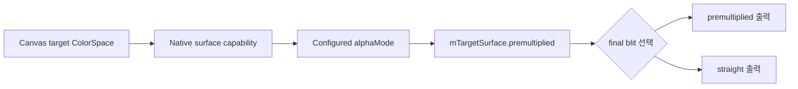

# #4056 — GPU native surface의 premultiplied mode

- **Link:** https://github.com/thorvg/thorvg/issues/4056
- **난이도:** 72/100
- **초심자 추천:** 비추천
- **관련 영역:** GlCanvas/WgCanvas target API, native surface alpha mode, final blit
- **배울 수 있는 것:** compositor vs window canvas, swapchain alpha mode, ABI 호환
- **조사 기준:** `main@f989b27892bab31f224f810a54782055eba1e3bc`

## 이슈 요약

ThorVG를 메인 window canvas로 사용할 때 native GPU surface가 premultiplied alpha 출력을 지원하도록 하자는 요청이다.

## 난이도 산정

| 항목 | 점수 | 근거 |
|---|---:|---|
| 재현·증거 불확실성 (0-20) | 8 | 요구와 GL 제한/WG TODO는 명확하지만 native compositor별 capability는 로컬에서 확인하지 못했다. |
| 변경 범위 (0-25) | 17 | 공개 target 계약, GL/WG surface 설정, final blit와 문서/test가 연결된다. |
| 구현 복잡도 (0-25) | 19 | 내부 합성과 외부 surface의 alpha 의미를 변환 없이 일관되게 유지해야 한다. |
| 교차 영향 위험 (0-20) | 19 | 기존 v1 output 호환, transparent window와 모든 GPU target 호출자에 영향이 있다. |
| 검증 부담 (0-10) | 9 | native surface/offscreen, OS compositor, WebGL과 straight/premultiplied matrix가 필요하다. |
| **합계** | **72** |  |

- **실현 가능성: 중간.** WG 상태 전달은 좁게 고칠 수 있지만 GL 지원과 v1 호환 정책까지 포함하면 API 계약 합의가 선행되어야 한다.

## main 코드 조사

- `GlRenderer::target()`은 현재 `ColorSpace::ABGR8888S`만 받아 premultiplied `ABGR8888` 요청을 거부한다.
- GL sync는 내부 premultiplied blending을 사용하지만 최종 native framebuffer 계약은 straight target으로 고정되어 있다.
- WgRenderer는 두 colorspace를 허용하며 `surfaceConfigure()`에서 `WGPUCompositeAlphaMode_Premultiplied/Unpremultiplied`를 capability와 비교한다.
- 그러나 `WgRenderer::target()`은 이후 `mTargetSurface.premultiplied=true`로 덮는 TODO가 있어 final blit 선택과 실제 surface mode가 어긋날 수 있다.

| backend | 현재 public target | native alpha 처리 | 확인된 간극 |
|---|---|---|---|
| GL | `ABGR8888S`만 허용 | 내부는 premultiplied blend 후 blit | premultiplied target 요청 자체를 거부 |
| WG | 두 colorspace 허용 | capability에 맞춰 composite alpha mode 선택 | `target()`의 기본 `true`와 configure 결과 수명 정리 필요 |
| SW | 여러 CPU colorspace | sync 시 buffer format으로 변환 | native swapchain 대상은 아님 |

## 원인 가설

**확인된 범위:** GL public target 지원 범위가 요청을 막고, WG는 API는 허용하지만 상태 전달이 완전히 정리되지 않았다. native context의 alpha capability까지 포함한 계약을 일관되게 만들어야 한다.

## 수정 방향과 실현 가능성

1. straight/premultiplied 입력 colorspace와 native surface alpha 의미를 문서화한다.
2. WG의 overwrite를 제거하고 configure 결과를 final blit까지 전달한다.
3. GL에서 ABGR8888 target과 final conversion 없이 premultiplied 결과를 내는 경로를 추가한다.
4. 지원하지 않는 surface alpha mode에서 명시적 fallback 또는 `NonSupport` 중 어느 계약을 택할지 공개 문서로 고정한다.
5. 기존 `ABGR8888S` 호출자의 pixel 결과가 바뀌지 않는 ABI/API 회귀 테스트를 추가한다.

## 위험/검증

기존 앱의 시각 결과와 C/C++ API 호환성을 지켜야 한다. transparent window, offscreen FBO, WebGL/WASM, unsupported alpha mode fallback을 테스트해야 한다.

## 참고 자료

- `inc/thorvg.h` — `ColorSpace`, GlCanvas/WgCanvas target 문서
- `src/renderer/gpu_engine/gl/tvgGlRenderer.cpp` — GL target 제한, blend와 final blit
- `src/renderer/gpu_engine/wg/tvgWgRenderer.cpp` — surface capability/configure와 target state
- `src/renderer/gpu_engine/wg/tvgWgPipelines.cpp` — 두 final blit pipeline
- `src/renderer/tvgRender.h` — `RenderSurface::premultiplied`
- `test/testGlEngine.h`, `test/testWgEngine.h` — target fixture
- Issue 본문에 저장된 두 출력 비교 이미지
